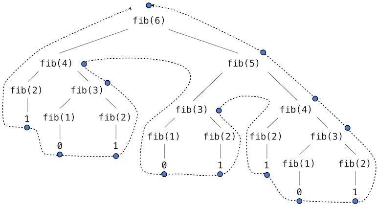

# 2.8 Efficiency

Decisions of how to represent and process data are often influenced by the
efficiency of alternatives. Efficiency refers to the computational resources
used by a representation or process, such as how much time and memory are
required to compute the result of a function or represent an object. These
amounts can vary widely depending on the details of an implementation.

## 2.8.1 Measuring Efficiency

Measuring exactly how long a program requires to run or how much memory it
consumes is challenging, because the results depend upon many details of how a
computer is configured. A more reliable way to characterize the efficiency of a
program is to measure how many times some event occurs, such as a function
call.

Let's return to our first tree-recursive function, the `fib` function for
computing numbers in the Fibonacci sequence.

```python
>>> def fib(n):
        if n == 0:
            return 0
        if n == 1:
            return 1
        return fib(n-2) + fib(n-1)
```

```python
>>> fib(5)
5
```

Consider the pattern of computation that results from evaluating `fib(6)`,
depicted below. To compute `fib(5)`, we compute `fib(3)` and `fib(4)`.
To compute `fib(3)`, we compute `fib(1)` and `fib(2)`. In general, the
evolved process looks like a tree. Each blue dot indicates a completed
computation of a Fibonacci number in the traversal of this tree.



This function is instructive as a prototypical tree recursion, but it is a
terribly inefficient way to compute Fibonacci numbers because it does so much
redundant computation. The entire computation of `fib(3)` is duplicated.

We can measure this inefficiency. The higher-order `count` function returns
an equivalent function to its argument that also maintains a `call_count`
attribute. In this way, we can inspect just how many times `fib` is called.

```python
>>> def count(f):
        def counted(*args):
            counted.call_count += 1
            return f(*args)
        counted.call_count = 0
        return counted
```

By counting the number of calls to `fib`, we see that the calls required
grows faster than the Fibonacci numbers themselves. This rapid expansion of
calls is characteristic of tree-recursive functions.

```python
>>> fib = count(fib)
>>> fib(19)
4181
>>> fib.call_count
13529
```

**Space.** To understand the space requirements of a function, we must specify
generally how memory is used, preserved, and reclaimed in our environment model
of computation. In evaluating an expression, the interpreter preserves all
*active* environments and all values and frames referenced by those
environments. An environment is active if it provides the evaluation context
for some expression being evaluated. An environment becomes inactive whenever
the function call for which its first frame was created finally returns.

For example, when evaluating `fib`, the interpreter proceeds to compute each
value in the order shown previously, traversing the structure of the tree. To
do so, it only needs to keep track of those nodes that are above the current
node in the tree at any point in the computation. The memory used to evaluate
the rest of the branches can be reclaimed because it cannot affect future
computation. In general, the space required for tree-recursive functions will
be proportional to the maximum depth of the tree.

The diagram below depicts the environment created by evaluating `fib(3)`. In
the process of evaluating the return expression for the initial application of
`fib`, the expression `fib(n-2)` is evaluated, yielding a value of 0.
Once this value is computed, the corresponding environment frame (grayed out)
is no longer needed: it is not part of an active environment. Thus, a
well-designed interpreter can reclaim the memory that was used to store this
frame. On the other hand, if the interpreter is currently
evaluating `fib(n-1)`, then the environment created by this application of
`fib` (in which `n` is 2) is active. In turn, the environment
originally created to apply `fib` to 3 is active because its return value
has not yet been computed.

```python

def fib(n):
    if n == 0:
        return 0
    if n == 1:
        return 1
    return fib(n-2) + fib(n-1)

result = fib(2)
```

The higher-order `count_frames` function tracks `open_count`, the number of
calls to the function `f` that have not yet returned. The `max_count`
attribute is the maximum value ever attained by `open_count`, and it
corresponds to the maximum number of frames that are ever simultaneously
active during the course of computation.

```python
>>> def count_frames(f):
        def counted(*args):
            counted.open_count += 1
            counted.max_count = max(counted.max_count, counted.open_count)
            result = f(*args)
            counted.open_count -= 1
            return result
        counted.open_count = 0
        counted.max_count = 0
        return counted
```

```python
>>> fib = count_frames(fib)
>>> fib(19)
4181
>>> fib.open_count
0
>>> fib.max_count
19
>>> fib(24)
46368
>>> fib.max_count
24
```

To summarize, the space requirement of the `fib` function, measured in
active frames, is one less than the input, which tends to be small. The time
requirement measured in total recursive calls is larger than the output, which
tends to be huge.

## 2.8.2 Memoization

Tree-recursive computational processes can often be made more efficient through
*memoization*, a powerful technique for increasing the efficiency of recursive
functions that repeat computation. A memoized function will store the return
value for any arguments it has previously received. A second call to
`fib(25)` would not re-compute the return value recursively, but instead
return the existing one that has already been constructed.

Memoization can be expressed naturally as a higher-order function, which can
also be used as a decorator. The definition below creates a *cache* of
previously computed results, indexed by the arguments from which they were
computed. The use of a dictionary requires that the argument to the memoized
function be immutable.

```python
>>> def memo(f):
        cache = {}
        def memoized(n):
            if n not in cache:
                cache[n] = f(n)
            return cache[n]
        return memoized
```

If we apply `memo` to the recursive computation of Fibonacci numbers, a
new pattern of computation evolves, depicted below.


In this computation of `fib(5)`, the results for `fib(2)` and `fib(3)`
are reused when computing `fib(4)` on the right branch of the tree. As a
result, much of the tree-recursive computation is not required at all.

Using `count`, we can see that the `fib` function is actually only called
once for each unique input to `fib`.

```python
>>> counted_fib = count(fib)
>>> fib  = memo(counted_fib)
>>> fib(19)
4181
>>> counted_fib.call_count
20
>>> fib(34)
5702887
>>> counted_fib.call_count
35
```

## 2.8.3 Orders of Growth

Processes can differ massively in the rates at which they consume the
computational resources of space and time, as the previous examples illustrate.
However, exactly determining just how much space or time will be used when
calling a function is a very difficult task that depends upon many factors.
A useful way to analyze a process is to categorize it along with a group of
processes that all have similar requirements. A useful categorization is the
*order of growth* of a process, which expresses in simple terms how the
resource requirements of a process grow as a function of the input.

As an introduction to orders of growth, we will analyze the function
`count_factors` below, which counts the number of integers that evenly divide
an input `n`. The function attempts to divide `n` by every integer less
than or equal to its square root. The implementation takes advantage of the
fact that if $k$ divides $n$ and $k <
\sqrt{n}$ , then there is another factor $j = n / k$ such that
$j > \sqrt{n}$.

```python

from math import sqrt
def count_factors(n):
    sqrt_n = sqrt(n)
    k, factors = 1, 0
    while k < sqrt_n:
        if n % k == 0:
            factors += 2
        k += 1
    if k * k == n:
        factors += 1
    return factors

result = count_factors(576)
```

How much time is required to evaluate `count_factors`? The exact answer will
vary on different machines, but we can make some useful general
observations about the amount of computation involved. The total number of
times this process executes the body of the `while` statement is the greatest
integer less than $\sqrt{n}$. The statements before and after this
`while` statement are executed exactly once. So, the total number of
statements executed is $w \cdot \sqrt{n} + v$, where
$w$ is the number of statements in the `while` body and
$v$ is the number of statements outside of the `while` statement.
Although it isn't exact, this formula generally characterizes how much time
will be required to evaluate `count_factors` as a function of the input
`n`.

A more exact description is difficult to obtain. The constants $w$
and $v$ are not constant at all, because the assignment statements
to `factors` are sometimes executed but sometimes not. An order of growth
analysis allows us to gloss over such details and instead focus on the general
shape of growth. In particular, the order of growth for `count_factors`
expresses in precise terms that the amount of time required to compute
`count_factors(n)` scales at the rate $\sqrt{n}$, within a margin
of some constant factors.

**Theta Notation.** Let $n$ be a parameter that measures the
size of the input to some process, and let $R(n)$ be the amount of
some resource that the process requires for an input of size $n$.
In our previous examples we took $n$ to be the number for which a
given function is to be computed, but there are other possibilities. For
instance, if our goal is to compute an approximation to the square root of a
number, we might take $n$ to be the number of digits of accuracy
required.

$R(n)$ might measure the amount of memory used, the number of
elementary machine steps performed, and so on. In computers that do only
a fixed number of steps at a time, the time required to evaluate an
expression will be proportional to the number of elementary steps performed in
the process of evaluation.

We say that $R(n)$ has order of growth $\Theta(f(n))$,
written $R(n) = \Theta(f(n))$ (pronounced "theta of
$f(n)$"), if there are positive constants $k_1$ and
$k_2$ independent of $n$ such that

\begin{equation*}
k_1 \cdot f(n) \leq R(n) \leq k_2 \cdot f(n)
\end{equation*}

for any value of $n$ larger than some minimum $m$. In
other words, for large $n$, the value $R(n)$ is always
sandwiched between two values that both scale with $f(n)$:

- A lower bound $k_1 \cdot f(n)$ and
- An upper bound $k_2 \cdot f(n)$

We can apply this definition to show that the number of steps required to
evaluate `count_factors(n)` grows as $\Theta(\sqrt{n})$ by
inspecting the function body.

First, we choose $k_1=1$ and $m=0$, so that the lower
bound states that `count_factors(n)` requires at least $1 \cdot
\sqrt{n}$ steps for any $n>0$. There are at least 4 lines executed
outside of the `while` statement, each of which takes at least 1 step to
execute. There are at least two lines executed within the `while` body, along
with the while header itself. All of these require at least one step. The
`while` body is evaluated at least $\sqrt{n}-1$ times. Composing
these lower bounds, we see that the process requires at least $4 + 3
\cdot (\sqrt{n}-1)$ steps, which is always larger than $k_1 \cdot
\sqrt{n}$.

Second, we can verify the upper bound. We assume that any single line in
the body of `count_factors` requires at most `p` steps. This assumption
isn't true for every line of Python, but does hold in this case.
Then, evaluating `count_factors(n)` can require at most $p \cdot
(5 + 4 \sqrt{n})$, because there are 5 lines outside of the `while`
statement and 4 within (including the header). This upper bound holds even if
every `if` header evaluates to true. Finally, if we choose
$k_2=5p$, then the steps required is always smaller than
$k_2 \cdot \sqrt{n}$. Our argument is complete.

## 2.8.4 Example: Exponentiation

Consider the problem of computing the exponential of a given number. We would
like a function that takes as arguments a base `b` and a positive integer
exponent `n` and computes $b^n$. One way to do this is via the
recursive definition

\begin{align*}
b^n &= b \cdot b^{n-1} \\
b^0 &= 1
\end{align*}

which translates readily into the recursive function

```python
>>> def exp(b, n):
        if n == 0:
            return 1
        return b * exp(b, n-1)
```

This is a linear recursive process that requires $\Theta(n)$ steps
and $\Theta(n)$ space. Just as with factorial, we can
readily formulate an equivalent linear iteration that requires a similar number
of steps but constant space.

```python
>>> def exp_iter(b, n):
        result = 1
        for _ in range(n):
            result = result * b
        return result
```

We can compute exponentials in fewer steps by using successive squaring. For
instance, rather than computing $b^8$ as

\begin{equation*}
b \cdot (b \cdot (b \cdot (b \cdot (b \cdot (b \cdot (b \cdot b))))))
\end{equation*}

we can compute it using three multiplications:

\begin{align*}
b^2 &= b \cdot b \\
b^4 &= b^2 \cdot b^2 \\
b^8 &= b^4 \cdot b^4
\end{align*}

This method works fine for exponents that are powers of 2. We can also take
advantage of successive squaring in computing exponentials in general if we use
the recursive rule

\begin{equation*}
b^n = \begin{cases} (b^{\frac{1}{2} n})^2 & \text{if $n$ is even} \\
b \cdot b^{n-1} & \text{if $n$ is odd}
\end{cases}
\end{equation*}

We can express this method as a recursive function as well:

```python
>>> def square(x):
        return x*x
```

```python
>>> def fast_exp(b, n):
        if n == 0:
            return 1
        if n % 2 == 0:
            return square(fast_exp(b, n//2))
        else:
            return b * fast_exp(b, n-1)
```

```python
>>> fast_exp(2, 100)
1267650600228229401496703205376
```

The process evolved by `fast_exp` grows logarithmically with `n` in both
space and number of steps. To see this, observe that computing
$b^{2n}$ using `fast_exp` requires only one more multiplication
than computing $b^n$. The size of the exponent we can compute
therefore doubles (approximately) with every new multiplication we are allowed.
Thus, the number of multiplications required for an exponent of `n` grows
about as fast as the logarithm of `n` base 2. The process has
$\Theta(\log n)$ growth. The difference between
$\Theta(\log n)$ growth and $\Theta(n)$ growth becomes
striking as $n$ becomes large. For example, `fast_exp` for `n`
of 1000 requires only 14 multiplications instead of 1000.

## 2.8.5 Growth Categories

Orders of growth are designed to simplify the analysis and comparison of
computational processes. Many different processes can all have equivalent
orders of growth, which indicates that they scale in similar ways. It is an
essential skill of a computer scientist to know and recognize common orders
of growth and identify processes of the same order.

**Constants.** Constant terms do not affect the order of growth of a process.
So, for instance, $\Theta(n)$ and $\Theta(500 \cdot
n)$ are the same order of growth. This property follows from the definition
of theta notation, which allows us to choose arbitrary constants
$k_1$ and $k_2$ (such as $\frac{1}{500}$)
for the upper and lower bounds. For simplicity, constants are always omitted
from orders of growth.

**Logarithms.** The base of a logarithm does not affect the order of growth of
a process. For instance, $\log_2 n$ and $\log_{10} n$
are the same order of growth. Changing the base of a logarithm is equivalent to
multiplying by a constant factor.

**Nesting.** When an inner computational process is repeated for each step in
an outer process, then the order of growth of the entire process is a product
of the number of steps in the outer and inner processes.

For example, the function `overlap` below computes the number of elements in
list `a` that also appear in list `b`.

```python
>>> def overlap(a, b):
        count = 0
        for item in a:
            if item in b:
                count += 1
        return count
```

```python
>>> overlap([1, 3, 2, 2, 5, 1], [5, 4, 2])
3
```

The `in` operator for lists requires $\Theta(n)$ time, where
$n$ is the length of the list `b`. It is applied
$\Theta(m)$ times, where $m$ is the length of the list
`a`. The `item in b` expression is the inner process, and the `for item in
a` loop is the outer process. The total order of growth for this function is
$\Theta(m \cdot n)$.

**Lower-order terms.** As the input to a process grows, the fastest growing
part of a computation dominates the total resources used. Theta notation
captures this intuition. In a sum, all but the fastest growing term can be
dropped without changing the order of growth.

For instance, consider the `one_more` function that returns how many elements
of a list `a` are one more than some other element of `a`. That is, in the
list `[3, 14, 15, 9]`, the element 15 is one more than 14, so `one_more`
will return 1.

```python
>>> def one_more(a):
        return overlap([x-1 for x in a], a)
```

```python
>>> one_more([3, 14, 15, 9])
1
```

There are two parts to this computation: the list comprehension and the call
to `overlap`. For a list `a` of length $n$, list comprehension
requires $\Theta(n)$ steps, while the call to `overlap` requires
$\Theta(n^2)$ steps. The sum of steps is $\Theta(n +
n^2)$, but this is not the simplest way of expressing the order of growth.

$\Theta(n^2 + k \cdot n)$ and $\Theta(n^2)$ are
equivalent for any constant $k$ because the $n^2$ term
will eventually dominate the total for any $k$. The fact that
bounds must hold only for $n$ greater than some minimum
$m$ establishes this equivalence. For simplicity, lower-order terms
are always omitted from orders of growth, and so we will never see a sum within
a theta expression.

**Common categories.** Given these equivalence properties, a small set of
common categories emerge to describe most computational processes. The most
common are listed below from slowest to fastest growth, along with descriptions
of the growth as the input increases. Examples for each category follow.

| **Category** | **Theta Notation** | **Growth Description** | **Example** |
| --- | --- | --- | --- |
| Constant | $\Theta(1)$ | Growth is independent of the input | `abs` |
| Logarithmic | $\Theta(\log{n})$ | Multiplying input increments resources | `fast_exp` |
| Linear | $\Theta(n)$ | Incrementing input increments resources | `exp` |
| Quadratic | $\Theta(n^2)$ | Incrementing input adds n resources | `one_more` |
| Exponential | $\Theta(b^n)$ | Incrementing input multiplies resources | `fib` |

Other categories exist, such as the $\Theta(\sqrt{n})$ growth of
`count_factors`. However, these categories are particularly common.

Exponential growth describes many different orders of growth, because changing
the base $b$ does affect the order of growth. For instance,
the number of steps in our tree-recursive Fibonacci computation `fib` grows
exponentially in its input $n$. In particular, one can show that
the nth Fibonacci number is the closest integer to

\begin{equation*}
\frac{\phi^{n-2}}{\sqrt{5}}
\end{equation*}

where $\phi$ is the golden ratio:

\begin{equation*}
\phi = \frac{1 + \sqrt{5}}{2} \approx 1.6180
\end{equation*}

We also stated that the number of steps scales with the resulting value, and so
the tree-recursive process requires $\Theta(\phi^n)$ steps, a function
that grows exponentially with $n$.

*Continue*:
[2.9 Recursive Objects](2.9.md)
