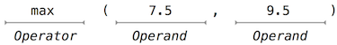
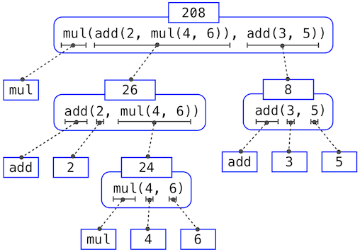
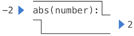
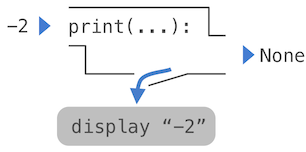

# 1.2 编程的要素

编程语言不仅仅是指示计算机执行任务的工具。它还充当一个框架，我们在其中组织关于计算过程的种种想法。程序的作用是在编程社区的成员之间交流这些想法。因此，程序必须为供人阅读而写，让机器执行只是顺带的事。

当我们描述一门语言时，应当特别注意它为把简单想法组合成更复杂想法所提供的机制。每一门强大的语言都有三种这样的机制：

- **primitive expression 与 statement**，它们表示语言所提供的最简单的构建块，
- **means of combination**，由它可以从更简单的元素构造出复合元素，以及
- **means of abstraction**，由它可以把复合元素命名并当作单元来操作。

在编程中，我们处理两类元素：function 和数据。（很快我们就会发现，它们其实并没有那么泾渭分明。）通俗地说，数据是我们想要操作的东西，而 function 描述了操作这些数据的规则。因此，任何强大的编程语言都应该能够描述原始数据和原始 function，并且有一些方法用来组合和抽象 function 与数据。

## 1.2.1 Expression

> **Video:** [Watch on YouTube](https://www.youtube.com/watch?v=vguCdBIHQmI)

在上一节中用完整的 Python interpreter 做过实验之后，我们现在重新开始，有条不紊地逐个元素地展开 Python 语言。如果例子看起来过于简单，请耐心一些——更精彩的内容马上就来。

我们从 primitive expression 开始。一种 primitive expression 是数字。更准确地说，你输入的 expression 由表示十进制数的数字组成。

```python
>>> 42
42
```

表示数字的 expression 可以与数学 operator 组合成复合 expression，interpreter 将对它求值：

```python
>>> -1 - -1
0
>>> 1/2 + 1/4 + 1/8 + 1/16 + 1/32 + 1/64 + 1/128
0.9921875
```

这些数学 expression 使用*中缀*记法，其中 *operator*（例如 `+`、`-`、`*` 或 `/`）出现在 *operand*（数字）之间。Python 包含许多构造复合 expression 的方式。与其试图立刻把它们全部列举出来，不如随着我们的推进，在介绍它们所支持的语言特性的同时，逐一引入新的 expression 形式。

## 1.2.2 Call Expression

> **Video:** [Watch on YouTube](https://www.youtube.com/watch?v=2SopsFYlGr4)

最重要的一种复合 expression 是 *call expression*，它把一个 function 应用于一些 argument。回想代数中的知识：数学意义上的 function 是从一些输入 argument 到输出值的映射。例如，`max` function 把它的输入映射为单个输出，即输入中最大的那个。Python 表达 function 应用的方式与传统数学相同。

```python
>>> max(7.5, 9.5)
9.5
```

这个 call expression 有子 expression：*operator* 是位于括号之前的 expression，括号内是用逗号分隔的 *operand* expression 列表。



*operator* 指定一个 *function*。当这个 call expression 被求值时，我们说 function `max` 被以 *argument* 7.5 和 9.5 *调用*，并*返回*一个 *value* 9.5。

call expression 中 argument 的顺序很重要。例如，function `pow` 会把它的第一个 argument 提升到第二个 argument 的幂。

```python
>>> pow(100, 2)
10000
>>> pow(2, 100)
1267650600228229401496703205376
```

与数学中惯用的中缀记法相比，function 记法有三个主要优点。第一，function 可以接受任意数量的 argument：

```python
>>> max(1, -2, 3, -4)
3
```

不会产生任何歧义，因为 function 名总是出现在它的 argument 之前。

第二，function 记法可以直接扩展到*嵌套* expression，其中各个元素本身就是复合 expression。在嵌套的 call expression 中，与复合中缀 expression 不同，嵌套结构完全显式地体现在括号里。

```python
>>> max(min(1, -2), min(pow(3, 5), -4))
-2
```

这样的嵌套深度以及 Python interpreter 能求值的 expression 的整体复杂度（原则上）是没有限制的。然而，人类很快就会被多层嵌套弄糊涂。作为程序员，你的一个重要职责就是安排好 expression 的结构，使它们对你、你的编程伙伴以及将来可能阅读你 expression 的其他人来说都仍然可解释。

第三，数学记法形式繁多：乘法出现在项与项之间，指数写成上标，除法写成横线，平方根写成带斜边的屋顶。其中一些记法很难输入！然而，所有这些复杂性都可以通过 call expression 的记法统一起来。虽然 Python 用中缀记法支持常见的数学 operator（如 `+` 和 `-`），但任何 operator 都可以表示为有名字的 function。

## 1.2.3 导入库 function

Python 定义了数量极多的 function，包括上一节提到的 operator function，但默认并不让它们所有的名字都可用。取而代之的是，它把已知的 function 和其他量组织成模块，这些模块共同构成 Python 库。要使用这些元素，就得导入它们。例如，`math` 模块提供了各种熟悉的数学 function：

```python
>>> from math import sqrt
>>> sqrt(256)
16.0
```

而 `operator` 模块提供了访问与中缀 operator 相对应的 function 的途径：

```python
>>> from operator import add, sub, mul
>>> add(14, 28)
42
>>> sub(100, mul(7, add(8, 4)))
16
```

一条 `import` statement 指定一个模块名（例如 `operator` 或 `math`），然后列出要导入的该模块的具名 attribute（例如 `sqrt`）。一个 function 一旦被导入，就可以被多次调用。

使用这些 operator function（例如 `add`）与使用 operator 符号本身（例如 `+`）没有区别。按照惯例，大多数程序员用符号和中缀记法来表达简单的算术。

[Python 3 库文档](http://docs.python.org/py3k/library/index.html)列出了每个模块定义的 function，例如 [math 模块](http://docs.python.org/py3k/library/math.html)。然而，这份文档是写给精通整门语言的开发者看的。目前，你可能会发现，亲手试验一个 function 比阅读文档更能让你了解它的行为。当你逐渐熟悉 Python 语言及其词汇后，这份文档将成为宝贵的参考资料。

## 1.2.4 名字与 environment

> **Video:** [Watch on YouTube](https://www.youtube.com/watch?v=JinchX1Vn-I)

编程语言的一个关键方面，是它提供的用名字来指代计算 object 的手段。如果一个值被赋予了一个名字，我们就说这个名字*绑定*到该值。

在 Python 中，我们可以用赋值 statement 来建立新的绑定，它把名字放在 `=` 左边，把值放在右边：

```python
>>> radius = 10
>>> radius
10
>>> 2 * radius
20
```

名字也可以通过 `import` statement 来绑定。

```python
>>> from math import pi
>>> pi * 71 / 223
1.0002380197528042
```

`=` 符号在 Python（以及许多其他语言）中称为 *assignment* operator。赋值是我们最简单的*抽象*手段，因为它让我们可以用简单的名字来指代复合运算的结果，例如上面算出的 `area`。这样一来，复杂程序就是通过一步一步地构建复杂度递增的计算 object 而构造出来的。

能够把名字绑定到值、之后又通过名字取回这些值，这意味着 interpreter 必须维护某种内存来跟踪这些名字、值和绑定。这种内存称为 *environment*。

名字也可以绑定到 function。例如，名字 `max` 就绑定到我们一直在使用的 max function。与数字不同，function 很难渲染成文本，所以当你要求 Python 描述一个 function 时，它会打印一段用于标识的描述：

```python
>>> max
<built-in function max>
```

我们可以用赋值 statement 给已有的 function 起新名字。

```python
>>> f = max
>>> f
<built-in function max>
>>> f(2, 3, 4)
4
```

而且连续的赋值 statement 可以把一个名字重新绑定到新值。

```python
>>> f = 2
>>> f
2
```

在 Python 中，名字常常被称为 *variable name* 或 *variable*，因为在程序执行过程中它们可以被绑定到不同的值。当一个名字通过赋值被绑定到新值时，它就不再绑定到之前的任何值。人们甚至可以给内置名字绑定新值。

```python
>>> max = 5
>>> max
5
```

把 `max` 赋值为 5 之后，名字 `max` 不再绑定到一个 function，因此试图调用 `max(2, 3, 4)` 会导致错误。

在执行赋值 statement 时，Python 会先对 `=` 右边的 expression 求值，然后才改变左边名字的绑定。因此，你可以在右边的 expression 中引用某个名字，即使它正是这条赋值 statement 要绑定的名字。

```python
>>> x = 2
>>> x = x + 1
>>> x
3
```

我们也可以在一条 statement 中把多个值赋给多个名字，其中 `=` 左边的名字和 `=` 右边的 expression 用逗号分隔。

```python
>>> area, circumference = pi * radius * radius, 2 * pi * radius
>>> area
314.1592653589793
>>> circumference
62.83185307179586
```

改变一个名字的值不会影响其他名字。下面，尽管名字 `area` 被绑定到最初用 `radius` 定义的值，`area` 的值并没有改变。更新 `area` 的值需要另一条赋值 statement。

```python
>>> radius = 11
>>> area
314.1592653589793
>>> area = pi * radius * radius
380.132711084365
```

使用多重赋值时，`=` 右边的*所有* expression 都会先被求值，然后左边的*任何*名字才会被绑定到这些值上。由于这条规则，交换两个名字所绑定的值可以在一条 statement 中完成。

```python
>>> x, y = 3, 4.5
>>> y, x = x, y
>>> x
4.5
>>> y
3
```

## 1.2.5 对嵌套 expression 求值

本章的目标之一，是把关于过程式思维的问题单独拿出来讨论。作为例子，让我们考虑：在对嵌套的 call expression 求值时，interpreter 本身就在遵循一个过程。

要对一个 call expression 求值，Python 会做以下事情：

1. 对 operator 和 operand 子 expression 求值，然后
2. 把作为 operator 子 expression 的值的 function，应用于作为 operand 子 expression 的值的 argument。

即便是这个简单的过程，也说明了关于过程的一些要点。第一步规定，为了完成一个 call expression 的求值过程，我们必须先对其他 expression 求值。因此，求值过程在本质上是*递归*的；也就是说，它把需要调用规则本身这一点，作为自己的步骤之一。

例如，对

```python
>>> sub(pow(2, add(1, 10)), pow(2, 5))
2016
```

求值需要把这个求值过程应用四次。如果我们把求值过的每个 expression 都画出来，就能把这一过程的层次结构可视化。



这幅图称为 *expression tree*。在计算机科学中，tree 习惯上是从上往下生长的。tree 上每个点处的 object 称为 node；在这里，它们是与各自的值配对的 expression。

对它的 root（也就是最顶端的完整 expression）求值，需要先对作为其子 expression 的各条分支求值。leaf expression（也就是没有分支从其延伸出去的 node）要么表示 function，要么表示数字。内部 node 有两个部分：应用我们求值规则的那个 call expression，以及该 expression 的结果。以这棵 tree 的视角来看求值，我们可以想象，operand 的值从末端 node 开始向上渗透，在越来越高的层级上汇合。

接下来注意，反复应用第一步会让我们走到需要求值的不是 call expression、而是 primitive expression（例如数字 2 和名字 `add`）的地步。我们通过规定以下两条来处理这些基本情形：

- 一个数字求值为它所表示的数，
- 一个名字求值为当前 environment 中与该名字关联的值。

注意 environment 在确定 expression 中符号的含义时所起的重要作用。在 Python 中，如果不指明任何关于 environment 的信息，谈论诸如

```python
>>> add(x, 1)
```

这样的 expression 的值是没有意义的，因为 environment 会为名字 `x`（甚至为名字 `add`）提供含义。多个 environment 提供了求值发生的上下文，这对我们理解程序执行起着重要作用。

这个求值过程并不足以对所有 Python 代码求值，它只能处理 call expression、数字和名字。例如，它不处理赋值 statement。执行

```python
>>> x = 3
```

既不返回值，也不对某些 argument 求值一个 function，因为赋值的目的是把名字绑定到值。一般来说，statement 不求值，而是被*执行*；它们不产生值，而是做出某种改变。每种 expression 或 statement 都有自己的求值或执行过程。

一个迂腐的说明：当我们说“一个数字求值为一个数”时，我们实际上是指 Python interpreter 把一个数字求值为一个数。是 interpreter 赋予编程语言以含义。既然 interpreter 是一个行为始终一致的固定程序，我们就可以说，在 Python 程序的上下文中，数字（以及 expression）本身就求值为值。

## 1.2.6 非 pure 的 print function

> **Video:** [Watch on YouTube](https://www.youtube.com/watch?v=jNYc5Gdwo3c)

贯穿本书，我们将区分两种 function。

**Pure functions。** Function 有一些输入（它们的 argument），并返回一些输出（应用它们的结果）。内置 function

```python
>>> abs(-2)
2
```

可以描绘成一台接收输入、产生输出的小机器。



`abs` function 是 *pure* 的。pure function 有这样的性质：应用它除了返回一个值之外没有任何其他效果。此外，pure function 用相同的 argument 调用两次时必须总是返回相同的值。

**Non-pure functions。** 除了返回一个值之外，应用一个非 pure function 还会产生 *side effect*，即对 interpreter 或计算机的状态做出某种改变。一种常见的 side effect 是使用 `print` function 在 return value 之外产生额外的输出。

```python
>>> print(1, 2, 3)
1 2 3
```

虽然在这些例子中 `print` 和 `abs` 看起来可能相似，但它们的工作方式根本不同。`print` 返回的值总是 `None`，一个表示“什么都没有”的特殊 Python 值。交互式 Python interpreter 不会自动打印值 `None`。就 `print` 而言，是 function 本身在打印输出，作为被调用的一种 side effect。



一个对 `print` 的嵌套调用 expression 凸显了这个 function 的非 pure 特性。

```python
>>> print(print(1), print(2))
1
2
None None
```

如果你发现这个输出出乎意料，就画一棵 expression tree，弄清楚为什么对这个 expression 求值会产生这样奇特的输出。

小心 `print`！它返回 `None` 这一点意味着它*不应该*作为赋值 statement 中的 expression。

```python
>>> two = print(2)
2
>>> print(two)
None
```

pure function 受到限制：它们不能有 side effect，也不能随时间改变行为。施加这些限制会带来可观的收益。第一，pure function 可以更可靠地组合成复合 call expression。从上面非 pure function 的例子中可以看到，`print` 用在 operand expression 中时不会返回有用的结果。另一方面，我们已经看到 `max`、`pow` 和 `sqrt` 这样的 function 可以有效地用在嵌套 expression 中。

第二，pure function 往往更易于测试。一组 argument 总是会得到相同的 return value，可以与期望的 return value 相比较。测试稍后将在本章中更详细地讨论。

第三，第 4 章将说明，pure function 对于编写*并发*程序是必不可少的，在并发程序中，多个 call expression 可能被同时求值。

与此相对，第 2 章考察了一系列非 pure function 并描述了它们的用途。

出于这些原因，在本章余下的部分中，我们着重于创建和使用 pure function。使用 `print` function 只是为了让我们能看到计算的中间结果。

*继续*：
[1.3 定义新 function](1.3.md)
