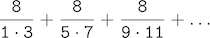
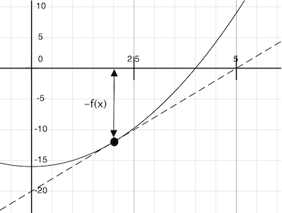
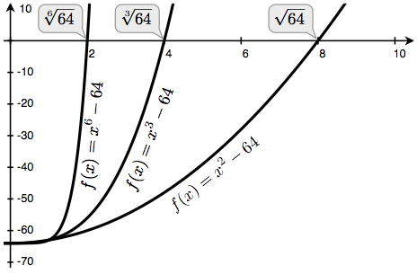

# 1.6 Higher-Order Functions

> **Video:** [Watch on YouTube](https://www.youtube.com/watch?v=UlXvz-34Me0)

我们已经看到，function 是一种 abstraction 手段，它描述的是复合运算，而与 argument 的具体值无关。也就是说，在 `square` 中，

```python
>>> def square(x):
        return x * x
```

我们讨论的并不是某个特定数的平方，而是一种求任意数的平方的方法。当然，我们也可以完全不定义这个 function，而总是写出这样的 expression：

```python
>>> 3 * 3
9
>>> 5 * 5
25
```

从不明确提及 `square`。对于 `square` 这样简单的计算，这种做法就够了，但对于 `abs` 或 `fib` 这类更复杂的例子，它就会变得十分繁琐。一般而言，缺少 function definition 会使我们处于不利地位：我们被迫始终在语言中恰好作为 primitive 的那些特定运算（此例中是乘法）的层面上工作，而无法用更高层的运算来表述。我们的程序仍然能够计算平方，但我们的语言将缺少表达“求平方”这一概念的能力。

我们应当要求一门强大的编程语言具备这样的能力：通过为常见模式赋予名字来构建 abstraction，然后直接以这些名字来工作。Function 提供了这种能力。正如我们将在下面的例子中看到的，有些常见的编程模式在代码中反复出现，却被用于许多不同的 function。只要给这些模式命名，它们同样可以被抽象化。

为了把某些通用模式表达为有名字的概念，我们需要构造这样的 function：它们可以接受其他 function 作为 argument，或者把 function 作为 return value 返回。操作 function 的 function 称为 higher-order function。本节将展示 higher-order function 如何充当强大的 abstraction 机制，极大地增强我们语言的表达能力。

## 1.6.1 Functions as Arguments

考虑下面三个 function，它们都计算求和。第一个是 `sum_naturals`，它计算自然数累加到 `n` 的和：

```python
>>> def sum_naturals(n):
        total, k = 0, 1
        while k <= n:
            total, k = total + k, k + 1
        return total
```

```python
>>> sum_naturals(100)
5050
```

第二个是 `sum_cubes`，它计算自然数立方累加到 `n` 的和。

```python
>>> def sum_cubes(n):
        total, k = 0, 1
        while k <= n:
            total, k = total + k*k*k, k + 1
        return total
```

```python
>>> sum_cubes(100)
25502500
```

第三个是 `pi_sum`，它计算以下级数中各项的累加和



该级数收敛到 pi 的速度非常慢。

```python
>>> def pi_sum(n):
        total, k = 0, 1
        while k <= n:
            total, k = total + 8 / ((4*k-3) * (4*k-1)), k + 1
        return total
```

```python
>>> pi_sum(100)
3.1365926848388144
```

这三个 function 显然共享一个共同的底层模式。它们大部分是相同的，区别仅在于名字，以及用来计算待累加项的、关于 `k` 的 function。我们可以在同一个模板中填入不同的“空位”，从而生成每一个 function：

```

def <name>(n):
    total, k = 0, 1
    while k <= n:
        total, k = total + <term>(k), k + 1
    return total
```

存在这样一个共同模式，是有力证据，说明有一个有用的 abstraction 正等待被发掘出来。这些 function 中的每一个都是若干项之和。作为程序的设计者，我们希望自己的语言足够强大，使我们能写出的 function 表达的是“求和”这一概念本身，而不仅仅是计算特定和的 function。在 Python 中，这很容易做到：取上面展示的共同模板，把其中的“空位”变成 formal parameter：

在下面的例子中，`summation` 以两个 argument 作为输入：上界 `n`，以及计算第 k 项的 function `term`。我们可以像使用任何 function 一样使用 `summation`，它能简洁地表达求和。请花些时间逐步走一遍这个例子，注意把 `cube` 绑定到局部名字 `term` 之后，结果 `1*1*1 + 2*2*2 + 3*3*3 = 36` 是如何被正确计算出来的。在这个例子中，不再需要的 frame 会被移除以节省空间。

```python

def summation(n, term):
    total, k = 0, 1
    while k <= n:
        total, k = total + term(k), k + 1
    return total

def cube(x):
    return x*x*x

def sum_cubes(n):
    return summation(n, cube)

result = sum_cubes(3)
```

使用一个返回其 argument 的 `identity` function，我们同样可以用完全相同的 `summation` function 来累加自然数。

```python
>>> def summation(n, term):
        total, k = 0, 1
        while k <= n:
            total, k = total + term(k), k + 1
        return total
```

```python
>>> def identity(x):
        return x
```

```python
>>> def sum_naturals(n):
        return summation(n, identity)
```

```python
>>> sum_naturals(10)
55
```

`summation` function 也可以直接调用，而不必为特定序列再定义另一个 function。

```python
>>> summation(10, square)
385
```

我们可以借助 `summation` 这一 abstraction 来定义 `pi_sum`：只要定义一个计算每一项的 function `pi_term`。我们传入 argument `1e6`，它是 `1 * 10^6 = 1000000` 的简写，以生成对 pi 的一个相当接近的近似值。

```python
>>> def pi_term(x):
        return 8 / ((4*x-3) * (4*x-1))
```

```python
>>> def pi_sum(n):
        return summation(n, pi_term)
```

```python
>>> pi_sum(1e6)
3.141592153589902
```

## 1.6.2 Functions as General Methods

> **Video:** [Watch on YouTube](https://www.youtube.com/watch?v=71Vp90zsSds)

前面我们把 user-defined function 引入为一种机制，用来抽象数值运算的模式，使其与所涉及的特定数值无关。有了 higher-order function，我们开始看到一种更强大的 abstraction：有些 function 表达的是通用的计算方法，与它们所调用的具体 function 无关。

尽管这在概念上扩展了 function 的含义，但我们关于如何 evaluate call expression 的 environment model 可以无缝地扩展到 higher-order function 的情形，无需任何改动。当一个 user-defined function 被应用于某些 argument 时，formal parameter 会在一个新的 local frame 中被绑定到这些 argument 的值（这些值可能是 function）。

考虑下面的例子，它实现了一种用于迭代改进的通用方法，并用它来计算[黄金比](http://www.geom.uiuc.edu/~demo5337/s97b/art.htm)。黄金比常被称为 “phi”，是一个接近 1.6 的数，在自然、艺术和建筑中频繁出现。

迭代改进算法从方程解的一个 `guess` 开始。它反复应用 `update` function 来改进这个猜测值，并应用 `close` 比较来检查当前的 `guess` 是否“足够接近”，可以被认为正确。

```python
>>> def improve(update, close, guess=1):
        while not close(guess):
            guess = update(guess)
        return guess
```

这个 `improve` function 是“反复细化”这一做法的通用 expression。它不指定正在求解的是哪个问题：这些细节留给作为 argument 传入的 `update` 和 `close` function。

黄金比有几条著名的性质：它可以通过反复地用 1 加上任意正数的倒数来计算，并且它比自己的平方小 1。我们可以把这些性质表示为与 `improve` 配合使用的 function。

```python
>>> def golden_update(guess):
        return 1/guess + 1
```

```python
>>> def square_close_to_successor(guess):
        return approx_eq(guess * guess, guess + 1)
```

上面我们引入了一个对 `approx_eq` 的调用，它意在当其 argument 彼此近似相等时返回 `True`。要实现 `approx_eq`，我们可以把两个数之差的绝对值与一个很小的 tolerance 值作比较。

```python
>>> def approx_eq(x, y, tolerance=1e-15):
        return abs(x - y) < tolerance
```

用 argument `golden_update` 和 `square_close_to_successor` 调用 `improve`，将计算黄金比的一个有限近似值。

```python
>>> improve(golden_update, square_close_to_successor)
1.6180339887498951
```

通过追踪 evaluation 的各个步骤，我们可以看到这个结果是如何计算出来的。首先，为 `improve` 构造一个 local frame，其中包含 `update`、`close` 和 `guess` 的 binding。在 `improve` 的函数体中，名字 `close` 被绑定到 `square_close_to_successor`，后者在 `guess` 的初始值上被调用。请追踪其余步骤，看看计算过程如何逐步演化出黄金比。

```python

def improve(update, close, guess=1):
    while not close(guess):
        guess = update(guess)
    return guess

def golden_update(guess):
    return 1/guess + 1

def square_close_to_successor(guess):
    return approx_eq(guess * guess,
                     guess + 1)

def approx_eq(x, y, tolerance=1e-3):
    return abs(x - y) < tolerance

phi = improve(golden_update,
              square_close_to_successor)
```

这个例子展示了计算机科学中两个相关的重要思想。第一，命名和 function 让我们能够把大量的复杂性抽象掉。虽然每个 function definition 都微不足道，但由我们的 evaluation 过程所启动的计算过程却相当错综复杂。第二，正是因为我们拥有一个极其通用的、针对 Python 语言的 evaluation 过程，微小的组件才能组合成复杂的过程。理解解释程序的这一过程，使我们能够验证并检查自己创造出来的过程。

一如既往，我们新的通用方法 `improve` 需要一个 test 来检查其正确性。黄金比可以提供这样一个 test，因为它还有一个精确的闭式解，我们可以把它与这个迭代结果作比较。

```python
>>> from math import sqrt
>>> phi = 1/2 + sqrt(5)/2
>>> def improve_test():
        approx_phi = improve(golden_update, square_close_to_successor)
        assert approx_eq(phi, approx_phi), 'phi differs from its approximation'
```

```python
>>> improve_test()
```

对这个 test 而言，没有消息就是好消息：`assert` statement 成功执行后，`improve_test` 返回 `None`。

## 1.6.3 定义 function III：嵌套定义

上面的例子表明，把 function 作为 argument 传递的能力，显著增强了我们编程语言的表达能力。每个通用的概念或方程都对应到自己那个简短的 function。这种做法的一个负面后果是，global frame 中塞满了小 function 的名字，而这些名字必须全都唯一。另一个问题是，我们受到特定 function signature 的约束：传给 `improve` 的 `update` argument 必须恰好接受一个 argument。嵌套的 function definition 可以同时解决这两个问题，但要求我们扩充 environment model。

让我们考虑一个新问题：计算一个数的平方根。在编程语言中，“平方根”常常缩写为 `sqrt`。反复应用下面的 update 会收敛到 `a` 的平方根：

```python
>>> def average(x, y):
        return (x + y)/2
```

```python
>>> def sqrt_update(x, a):
        return average(x, a/x)
```

这个接受两个 argument 的 update function 与 `improve` 不兼容（它接受两个 argument，而不是一个），而且它只提供一次 update，而我们真正想要的是通过反复的 update 来求平方根。解决这两个问题的办法，是把 function definition 放进其他定义的函数体中。

```python
>>> def sqrt(a):
        def sqrt_update(x):
            return average(x, a/x)
        def sqrt_close(x):
            return approx_eq(x * x, a)
        return improve(sqrt_update, sqrt_close)
```

与局部赋值一样，局部 `def` statement 只影响当前的 local frame。这些 function 只在 `sqrt` 被 evaluate 期间处于 scope 之内。与我们的 evaluation 过程一致，这些局部 `def` statement 直到 `sqrt` 被调用时才会被 evaluate。

**Lexical scope.** 局部定义的 function 也能够访问其被定义所在 scope 中的名字 binding。在这个例子中，`sqrt_update` 引用了名字 `a`，它是其外层 function `sqrt` 的一个 formal parameter。这种在嵌套定义之间共享名字的做法称为 *lexical scoping*。关键在于，内层 function 能够访问它们被定义时所在 environment 中的名字（而不是它们被调用时所在的 environment）。

为了让 lexical scoping 成为可能，我们需要对 environment model 做两处扩展。

1. 每个 user-defined function 都有一个 parent environment：即它被定义时所在的 environment。
2. 当一个 user-defined function 被调用时，它的 local frame 扩展其 parent environment。

在 `sqrt` 之前，所有 function 都定义在 global environment 中，因此它们的 parent 都相同：global environment。相比之下，当 Python evaluate `sqrt` 的前两个子句时，它创建与某个 local environment 相关联的 function。在下面这个调用中

```python
>>> sqrt(256)
16.0
```

environment 首先为 `sqrt` 添加一个 local frame，并 evaluate `sqrt_update` 和 `sqrt_close` 的 `def` statement。

```python

def average(x, y):
    return (x + y)/2

def improve(update, close, guess=1):
    while not close(guess):
        guess = update(guess)
    return guess

def approx_eq(x, y, tolerance=1e-3):
    return abs(x - y) < tolerance

def sqrt(a):
    def sqrt_update(x):
        return average(x, a/x)
    def sqrt_close(x):
        return approx_eq(x * x, a)
    return improve(sqrt_update, sqrt_close)

result = sqrt(256)
```

从此以后，function value 在 environment diagram 中都会带上一个新的标注，即 *parent*。一个 function value 的 parent，就是该 function 被定义时所在 environment 的第一个 frame。没有 parent 标注的 function 是在 global environment 中定义的。当一个 user-defined function 被调用时，所创建的 frame 与那个 function 拥有相同的 parent。

随后，名字 `sqrt_update` 解析到这个新定义的 function，它作为 argument 被传给 `improve`。在 `improve` 的函数体内，我们必须把 `update` function（此时绑定到 `sqrt_update`）应用于初始猜测值 `x`，即 1。这最后一次应用为 `sqrt_update` 创建了一个 environment，其起始 local frame 中只包含 `x`，但 parent frame `sqrt` 中仍然包含 `a` 的 binding。

```python

def average(x, y):
    return (x + y)/2

def improve(update, close, guess=1):
    while not close(guess):
        guess = update(guess)
    return guess

def approx_eq(x, y, tolerance=1e-3):
    return abs(x - y) < tolerance

def sqrt(a):
    def sqrt_update(x):
        return average(x, a/x)
    def sqrt_close(x):
        return approx_eq(x * x, a)
    return improve(sqrt_update, sqrt_close)

result = sqrt(256)
```

这个 evaluation 过程中最关键的部分，是把 `sqrt_update` 的 parent 传递给调用 `sqrt_update` 时所创建的 frame。这个 frame 也会被标注为 `[parent=f1]`。

**Extended Environments**。一个 environment 可以由任意长的 frame 链组成，而这条链总是以 global frame 结束。在这个 `sqrt` 例子之前，environment 至多包含两个 frame：一个 local frame 和 global frame。通过嵌套的 `def` statement 调用定义在其他 function 内部的 function，我们可以创建更长的链。这次调用 `sqrt_update` 的 environment 由三个 frame 组成：`sqrt_update` 的 local frame、定义 `sqrt_update` 的 `sqrt` frame（标注为 `f1`），以及 global frame。

`sqrt_update` 函数体中的 return expression 可以沿着这条 frame 链为 `a` 解析出一个 value。查找一个名字，会找到当前 environment 中第一个绑定到该名字的 value。Python 首先检查 `sqrt_update` frame——其中不存在 `a`。Python 接着检查 parent frame `f1`，找到 `a` 绑定到 256 的 binding。

由此我们看到 Python 中 lexical scoping 的两个关键优势。

- 局部 function 的名字不会干扰其定义所在 function 外部的名字，因为该局部 function 名字会被绑定在它被定义时所在的当前 local environment 中，而不是 global environment 中。
- 局部 function 可以访问外层 function 的 environment，因为局部 function 的函数体是在一个扩展了其定义时所在 evaluation environment 的 environment 中被 evaluate 的。

`sqrt_update` function 随身携带了一些数据：在其被定义时所在 environment 中引用的 `a` 的 value。由于它们以这种方式“封闭”了信息，局部定义的 function 常常被称为 *closures*。

## 1.6.4 Functions as Returned Values

> **Video:** [Watch on YouTube](https://www.youtube.com/watch?v=Q9ztlG4ezVs)

如果让 function 的 return value 本身也是 function，我们就能在程序中获得更强的表达能力。具有 lexical scope 的编程语言有一个重要特性：局部定义的 function 在被返回时会保留它们的 parent environment。下面的例子说明了这一特性的用处。

当许多简单的 function 定义好之后，function *composition* 就是一种很自然、值得纳入我们编程语言的组合方式。也就是说，给定两个 function `f(x)` 和 `g(x)`，我们可能想要定义 `h(x) = f(g(x))`。我们可以用现有的工具来定义 function composition：

```python
>>> def compose1(f, g):
        def h(x):
            return f(g(x))
        return h
```

这个例子的 environment diagram 展示了名字 `f` 和 `g` 如何被正确解析，即使存在名字冲突也是如此。

```python

def square(x):
    return x * x

def successor(x):
    return x + 1

def compose1(f, g):
    def h(x):
        return f(g(x))
    return h

def f(x):
    """Never called."""
    return -x

square_successor = compose1(square, successor)
result = square_successor(12)
```

`compose1` 中的 1 意在表示被组合的所有 function 都只接受一个 argument。这一命名约定并不由 interpreter 强制执行；这个 1 只是 function 名字的一部分。

此时，我们开始看到精确定义计算的 environment model 所带来的好处。要解释我们何以能这样返回 function，无需对 environment model 做任何修改。

## 1.6.5 示例：牛顿法

> **Video:** [Watch on YouTube](https://www.youtube.com/watch?v=zJlcbEOw1VU)

这个较长的示例展示了 function 的 return value 与局部定义如何协同工作，简洁地表达通用的思想。我们将实现一个在机器学习、科学计算、硬件设计和优化中被广泛使用的算法。

牛顿法是一种经典的迭代方法，用于找出使数学 function 的 return value 为 0 的那些 argument。这些值称为该 function 的 *zeros*。求一个 function 的 zero，通常等价于求解另一个我们关心的问题，例如计算平方根。

在继续之前，先说一句引人思考的话：我们很容易把“知道如何计算平方根”这件事视为理所当然。不只是 Python，你的手机、网页浏览器或袖珍计算器都能替你做这件事。然而，学习计算机科学的一部分内容，就是理解像这样的量是如何被计算出来的；而这里介绍的通用方法，适用于求解远超 Python 内置范围的一大类方程。

牛顿法是一种迭代改进算法：对于任何 *differentiable* 的 function，它都会改进对 zero 的猜测值；*differentiable* 意味着该 function 在任意点都可以用一条直线来近似。牛顿法沿着这些线性近似来寻找 function 的 zero。

想象一条经过点 $(x, f(x))$ 的直线，其斜率与 function $f(x)$ 的曲线在该点处的斜率相同。这样一条直线称为 *tangent*，它的斜率称为 $f$ 在 $x$ 处的 *derivative*。

这条直线的斜率，是 function value 的变化量与 function argument 的变化量之比。因此，把 $x$ 平移 $f(x)$ 除以斜率，就得到这条 tangent 线与 0 相交处的 argument 值。



`newton_update` 表达了对于 function `f` 及其 derivative `df`，沿着这条 tangent 线走到 0 的计算过程。

```python
>>> def newton_update(f, df):
        def update(x):
            return x - f(x) / df(x)
        return update
```

最后，我们可以用 `newton_update`、我们的 `improve` 算法，以及一个判断 $f(x)$ 是否接近 0 的比较，来定义 `find_root` function。

```python
>>> def find_zero(f, df):
        def near_zero(x):
            return approx_eq(f(x), 0)
        return improve(newton_update(f, df), near_zero)
```

**Computing Roots.** 使用牛顿法，我们可以计算任意次数 $n$ 的根。$a$ 的 $n$ 次根，是满足 $x \cdot x \cdot x \dots x = a$（其中 $x$ 重复 $n$ 次）的 $x$。例如，

- 64 的平方（二次）根是 8，因为 $8 \cdot 8 = 64$。
- 64 的立方（三次）根是 4，因为 $4 \cdot 4 \cdot 4 = 64$。
- 64 的六次根是 2，因为 $2 \cdot 2 \cdot 2 \cdot 2 \cdot 2 \cdot 2 = 64$。

借助以下观察，我们可以用牛顿法计算根：

- 64 的平方根（写作 $\sqrt{64}$）就是使 $x^2 - 64 = 0$ 成立的那个值 $x$
- 更一般地，$a$ 的 $n$ 次根（写作 $\sqrt[n]{a}$）就是使 $x^n - a = 0$ 成立的那个值 $x$

如果我们能找到最后一个方程的 zero，我们就能计算 $n$ 次根。把 $n$ 取 2、3、6 而 $a$ 取 64 时的曲线画出来，我们就能直观地看出这种关系。



> **Video:** [Watch on YouTube](https://www.youtube.com/watch?v=OtNBPOKpB30)

我们首先通过定义 `f` 及其 derivative `df` 来实现 `square_root`。我们使用微积分中的事实：$f(x) = x^2 - a$ 的 derivative 是线性 function $df(x) = 2x$。

```python
>>> def square_root_newton(a):
        def f(x):
            return x * x - a
        def df(x):
            return 2 * x
        return find_zero(f, df)
```

```python
>>> square_root_newton(64)
8.0
```

推广到任意次数 $n$ 的根，我们计算 $f(x) = x^n - a$ 及其 derivative $df(x) = n \cdot x^{n-1}$。

```python
>>> def power(x, n):
        """Return x * x * x * ... * x for x repeated n times."""
        product, k = 1, 0
        while k < n:
            product, k = product * x, k + 1
        return product
```

```python
>>> def nth_root_of_a(n, a):
        def f(x):
            return power(x, n) - a
        def df(x):
            return n * power(x, n-1)
        return find_zero(f, df)
```

```python
>>> nth_root_of_a(2, 64)
8.0
>>> nth_root_of_a(3, 64)
4.0
>>> nth_root_of_a(6, 64)
2.0
```

把 `approx_eq` 中的 `tolerance` 改成更小的数，就可以减小所有这些计算中的近似误差。

在你用牛顿法做实验时，请注意它并不总是收敛。`improve` 的初始猜测值必须足够接近 zero，而且关于该 function 的各种条件也必须得到满足。尽管有这一缺点，牛顿法仍然是一种强大的通用计算方法，可用于求解可微方程。现代计算机中，用于计算对数和大型整数除法的极快算法都采用了这一技术的变体。

## 1.6.6 Currying

> **Video:** [Watch on YouTube](https://www.youtube.com/watch?v=6HMa5hfhRVc)

我们可以用 higher-order function 把一个接受多个 argument 的 function 转换成一条由各自接受单个 argument 的 function 组成的链。更具体地说，给定一个 function `f(x, y)`，我们可以定义一个 function `g`，使得 `g(x)(y)` 等价于 `f(x, y)`。这里，`g` 是一个 higher-order function，它接受单个 argument `x`，并返回另一个接受单个 argument `y` 的 function。这种变换称为 *currying*。

举例来说，我们可以定义 `pow` function 的一个 curried 版本：

```python
>>> def curried_pow(x):
        def h(y):
            return pow(x, y)
        return h
```

```python
>>> curried_pow(2)(3)
8
```

有些编程语言（例如 Haskell）只允许接受单个 argument 的 function，因此程序员必须对所有多 argument 的 procedure 进行 curry。在 Python 这类更通用的语言中，当我们需要的 function 只接受单个 argument 时，currying 就很有用。例如，*map* 模式把一个单 argument 的 function 应用到一个 value 的 sequence 上。在后面的章节中，我们会看到 map 模式更一般的例子；不过现在，我们可以把这个模式实现为一个 function：

```python
>>> def map_to_range(start, end, f):
        while start < end:
            print(f(start))
            start = start + 1
```

我们可以用 `map_to_range` 和 `curried_pow` 来计算 2 的前十次幂，而不必专门为此写一个 function：

```python
>>> map_to_range(0, 10, curried_pow(2))
1
2
4
8
16
32
64
128
256
512
```

我们同样可以用这两个 function 来计算其他数的幂。currying 让我们无需为每个想求幂的数都写一个专门的 function。

在上面的例子中，我们手动对 `pow` function 做了 currying 变换，得到 `curried_pow`。我们也可以定义 function 来自动完成 currying，以及它的逆变换 *uncurrying*：

```python
>>> def curry2(f):
        """Return a curried version of the given two-argument function."""
        def g(x):
            def h(y):
                return f(x, y)
            return h
        return g
```

```python
>>> def uncurry2(g):
        """Return a two-argument version of the given curried function."""
        def f(x, y):
            return g(x)(y)
        return f
```

```python
>>> pow_curried = curry2(pow)
>>> pow_curried(2)(5)
32
>>> map_to_range(0, 10, pow_curried(2))
1
2
4
8
16
32
64
128
256
512
```

`curry2` function 接受一个双 argument 的 function `f`，并返回一个单 argument 的 function `g`。当 `g` 被应用于一个 argument `x` 时，它返回一个单 argument 的 function `h`。当 `h` 被应用于 `y` 时，它调用 `f(x, y)`。因此，`curry2(f)(x)(y)` 等价于 `f(x, y)`。`uncurry2` function 逆转 currying 变换，使得 `uncurry2(curry2(f))` 等价于 `f`。

```python
>>> uncurry2(pow_curried)(2, 5)
32
```

## 1.6.7 Lambda Expressions

> **Video:** [Watch on YouTube](https://www.youtube.com/watch?v=vCeNq_P3akI)

到目前为止，每当我们想要定义一个新的 function 时，都需要给它起一个名字。但对于其他类型的 expression，我们并不需要把中间 value 与名字关联起来。也就是说，我们可以计算 `a*b + c*d`，而无须为子 expression `a*b` 或 `c*d`，乃至整个 expression 命名。在 Python 中，我们可以用 `lambda` expression 即时创建 function value，它会 evaluate 为一个无名的 function。一个 lambda expression 会 evaluate 为一个 function，其函数体是单个 return expression。不允许使用赋值 statement 和控制 statement。

```python
>>> def compose1(f, g):
        return lambda x: f(g(x))
```

通过构造一个对应的英文句子，我们可以理解 `lambda` expression 的结构：

```

     lambda            x            :          f(g(x))
"A function that    takes x    and returns     f(g(x))"
```

lambda expression 的结果称为 lambda function。它没有固有的名字（因此 Python 会把名字打印为 `<lambda>`），但在其他方面，它的行为与任何其他 function 一样。

```python
>>> s = lambda x: x * x
>>> s
<function <lambda> at 0xf3f490>
>>> s(12)
144
```

在 environment diagram 中，lambda expression 的结果同样是一个 function，用希腊字母 λ（lambda）来命名。我们的 compose 示例可以用 lambda expression 表达得相当紧凑。

```python

def compose1(f, g):
    return lambda x: f(g(x))

f = compose1(lambda x: x * x,
             lambda y: y + 1)
result = f(12)
```

有些程序员觉得，使用来自 lambda expression 的无名 function 更简短、更直接。然而，复合的 `lambda` expression 虽然简短，却出了名地难以辨认。下面的定义是正确的，但许多程序员难以很快理解它。

```python
>>> compose1 = lambda f,g: lambda x: f(g(x))
```

总的来说，Python 的风格偏好显式的 `def` statement 而非 lambda expression，但在需要一个简单的 function 作为 argument 或 return value 的场合，也允许使用它们。

这类风格规则只是指导原则；你可以按自己喜欢的方式编程。不过，在你写程序时，想一想将来可能阅读你程序的那群读者。当你能让自己的程序更容易理解时，你就是在帮那些人的忙。

*lambda* 这个术语是历史上的一个偶然产物，源于书面数学记号与早期排版系统限制之间的不相容。

> 用 lambda 来引入一个 procedure/function 似乎有违常理。
> 这种记号可以追溯到 Alonzo Church，他在 20 世纪 30 年代从“帽子”符号开始；
> 他把 square function 写作 “ŷ . y × y”。但沮丧的排字工人把帽子移到了 parameter 的左边，
> 并把它改成大写 lambda：“Λy . y × y”；随后大写 lambda 又被改成小写，
> 现在我们看到数学书里的 “λy . y × y”，以及 Lisp 中的 `(lambda (y) (* y y))`。
>
> ——Peter Norvig (norvig.com/lispy2.html)

尽管词源颇为奇特，`lambda` expression 以及与之对应的、用于 function application 的形式语言 *lambda calculus*，都是计算机科学中的基础概念，其影响远远超出 Python 编程社区。我们将在第 3 章学习 interpreter 的设计时重新讨论这个话题。

## 1.6.8 Abstractions and First-Class Functions

> **Video:** [Watch on YouTube](https://www.youtube.com/watch?v=bi_2gAetCiI)

本节开头我们指出，user-defined function 是一种至关重要的 abstraction 机制，因为它们让我们能把通用的计算方法表达为编程语言中显式的元素。现在我们看到，higher-order function 如何让我们操作这些通用方法，从而创造出更多 abstraction。

作为程序员，我们应当敏锐地留意机会，去辨识程序中底层的 abstraction，在其之上构建，并将它们推广，以创造出更强大的 abstraction。这并不是说人们总应该以尽可能抽象的方式写程序；专家级程序员懂得如何选择适合自己任务的 abstraction 层次。但重要的是，要能够以这些 abstraction 为单位来思考，这样我们才能随时把它们应用到新的情境中。higher-order function 的意义在于，它们使我们能把这些 abstraction 显式地表示为编程语言中的元素，从而可以像处理其他计算元素一样处理它们。

一般而言，编程语言会对计算元素可以被操作的方式施加限制。限制最少的元素被称为具有 first-class 地位。first-class 元素的某些“权利与特权”包括：

1. 它们可以被绑定到名字。
2. 它们可以作为 argument 传给 function。
3. 它们可以作为 function 的结果被返回。
4. 它们可以被包含在 data structure 中。

Python 赋予 function 完全的 first-class 地位，由此带来的表达能力提升是巨大的。

## 1.6.9 Function Decorators

> **Video:** [Watch on YouTube](https://www.youtube.com/watch?v=th_SlHfhlBo)

Python 提供了特殊的语法，可以在执行 `def` statement 的过程中应用 higher-order function，这种语法称为 decorator。也许最常见的例子就是 trace。

```python
>>> def trace(fn):
        def wrapped(x):
            print('-> ', fn, '(', x, ')')
            return fn(x)
        return wrapped
```

```python
>>> @trace
    def triple(x):
        return 3 * x
```

```python
>>> triple(12)
->  <function triple at 0x102a39848> ( 12 )
36
```

在这个例子中，定义了一个 higher-order function `trace`，它返回一个 function，该 function 在调用其 argument 之前，先用一条 `print` statement 输出这个 argument。`triple` 的 `def` statement 带有一个标注 `@trace`，它会影响 `def` 的执行规则。和往常一样，function `triple` 被创建出来。然而，名字 `triple` 并没有被绑定到这个 function。相反，名字 `triple` 被绑定到把 `trace` 应用于新定义的 `triple` function 后所返回的 function value。在代码中，这个 decorator 等价于：

```python
>>> def triple(x):
        return 3 * x
```

```python
>>> triple = trace(triple)
```

在与本教材配套的项目中，decorator 被用于跟踪，以及在从命令行运行程序时选择要调用哪些 function。

**Extra for experts.** decorator 符号 `@` 后面也可以跟一个 call expression。`@` 后面的 expression 首先被 evaluate（正如上面 `trace` 这个名字被 evaluate 一样），其次是 `def` statement，最后，把 evaluate decorator expression 得到的结果应用于新定义的 function，并把结果绑定到 `def` statement 中的名字上。Ariel Ortiz 写的[decorator 简明教程](http://programmingbits.pythonblogs.com/27_programmingbits/archive/50_function_decorators.html)为感兴趣的同学提供了更多例子。

*继续*：
[1.7 Recursive Functions](1.7.md)
