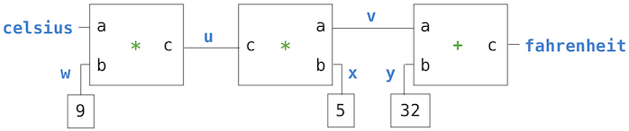

# 2.4 Mutable 数据

我们已经看到 abstraction 在帮助我们应对大型系统的复杂性方面有多么重要。有效的编程还需要一些组织原则，来指导我们制定程序的整体设计。特别是，我们需要一些策略来帮助我们构造大型系统，使它们模块化，也就是说，它们自然地划分为相互连贯的部分，这些部分可以被分别开发和维护。

创建模块化程序的一种强大技术，是让数据可以随时间改变状态。这样，单个数据 object 就能表示某个独立于程序其余部分而演化的东西。一个不断变化的 object 的行为可能受其历史的影响，就像世界中的一个实体一样。为数据添加状态，是一种称为 object-oriented programming 的范式的核心要素。

## 2.4.1 Object 隐喻

在本书的开头，我们区分了 function 与数据：function 执行操作，数据被操作。当我们把 function 值也纳入数据之列时，我们承认了数据也可以有行为。function 可以作为数据被操作，但也可以被调用来执行计算。

*Object* 把数据值和行为结合在一起。Object 表示信息，但也像它们所表示的事物那样 *behave*。一个 object 如何与其他 object 交互的逻辑，与编码该 object 的值的信息捆绑在一起。当一个 object 被打印时，它知道如何在文本中把自己拼写出来。如果一个 object 由若干部分组成，它知道如何按需展示这些部分。Object 既是信息也是过程，二者捆绑在一起，用来表示复杂事物的属性、交互和行为。

在 Python 中，object 的行为是通过专门的 object 语法以及相关术语来实现的，我们可以通过例子来介绍这些术语。日期就是一种 object。

```python
>>> from datetime import date
```

名字 `date` 被绑定到一个 *class*。正如我们已经看到的，class 表示一种值。一个个具体的日期被称为该 class 的 *instance*。Instance 可以通过在刻画该 instance 的 argument 上调用 class 来 *构造*。

```python
>>> tues = date(2014, 5, 13)
```

虽然 `tues` 是由 primitive 数字构造出来的，但它的行为就像一个日期。例如，用另一个日期减它会得到一个时间差，我们可以把它打印出来。

```python
>>> print(date(2014, 5, 19) - tues)
6 days, 0:00:00
```

Object 有 *attribute*，也就是作为 object 一部分的具名值。在 Python 中，和许多其他编程语言一样，我们用点号表示法来指定一个 object 的 attribute。

> <expression> . <name>

在上面的形式中，`<expression>` 求值为一个 object，而 `<name>` 是该 object 的某个 attribute 的名字。

与我们到目前为止考虑过的名字不同，这些 attribute 名字在一般的 environment 中并不可用。相反，attribute 名字专属于点号前面的那个 object instance。

```python
>>> tues.year
2014
```

Object 还有 *method*，也就是取值为 function 的 attribute。打个比方，我们说这个 object “知道”如何执行这些 method。从实现上看，method 是既根据自身 argument、也根据自己所属的 object 来计算结果的 function。例如，`tues` 的 `strftime` method（一个经典的 function 名，意在唤起“string format of time”之意）接受单个 argument，用来指定日期如何显示（比如 `%A` 表示星期几应当完整拼写出来）。

```python
>>> tues.strftime('%A, %B %d')
'Tuesday, May 13'
```

计算 `strftime` 的 return value 需要两项输入：描述输出格式的 string，以及捆绑在 `tues` 中的日期信息。这个 method 内部应用了特定于日期的逻辑，从而得出这个结果。我们从未说明过 2014 年 5 月 13 日是星期二，但知道与之对应的星期几，正是“是一个日期”这件事的含义的一部分。通过把行为与信息捆绑在一起，这个 Python object 为我们提供了一个有说服力的、自成一体的日期 abstraction。

日期是 object，但数字、string、list 和 range 也都是 object。它们表示值，同时也以与所表示的值相称的方式行事。它们也有 attribute 和 method。例如，string 拥有一系列便于文本处理的 method。

```python
>>> '1234'.isnumeric()
True
>>> 'rOBERT dE nIRO'.swapcase()
'Robert De Niro'
>>> 'eyes'.upper().endswith('YES')
True
```

事实上，Python 中的所有值都是 object。也就是说，所有值都有行为和 attribute。它们的行为就像它们所表示的值一样。

## 2.4.2 Sequence Objects

像数字这样的 primitive 内置值的 instance 是 *immutable* 的。这些值本身在程序执行的过程中不会改变。而 list 则是 *mutable* 的。

Mutable object 用来表示随时间变化的值。一个人从一天到下一天还是同一个人，尽管他变老了、理了发，或者以其他方式发生了变化。类似地，一个 object 也可能由于 *mutating* 操作而具有不断变化的属性。例如，可以改变一个 list 的内容。大多数改动都是通过在 list object 上调用 method 来完成的。

我们可以用一个例子来介绍许多 list 修改操作，这个例子展示了打扑克牌的历史（做了大幅简化）。示例中的注释描述了每次 method 调用的效果。

扑克牌是在中国发明的，也许是在 9 世纪前后。早期的牌有三种花色，与货币的面额相对应。

```python
>>> chinese = ['coin', 'string', 'myriad']  # A list literal
>>> suits = chinese                         # Two names refer to the same list
```

随着纸牌传入欧洲（也许途经埃及），西班牙的牌中只剩下“金币”这一种花色（*oro*）。

```python
>>> suits.pop()             # Remove and return the final element
'myriad'
>>> suits.remove('string')  # Remove the first element that equals the argument
```

后来又加上了三种花色（它们的名称和设计随时间演变），

```python
>>> suits.append('cup')              # Add an element to the end
>>> suits.extend(['sword', 'club'])  # Add all elements of a sequence to the end
```

而意大利人把剑称为 *spades*。

```python
>>> suits[2] = 'spade'  # Replace an element
```

这样便得到了传统意大利牌组的花色。

```python
>>> suits
['coin', 'cup', 'spade', 'club']
```

今天在美国使用的法国变体改动了前两种花色：

```python
>>> suits[0:2] = ['heart', 'diamond']  # Replace a slice
>>> suits
['heart', 'diamond', 'spade', 'club']
```

此外还有用于插入、排序和反转 list 的 method。所有这些 mutation 操作都会改变 list 的值；它们不会创建新的 list object。

**共享与同一性。** 因为我们一直在改动同一个 list，而不是创建新的 list，所以绑定到名字 `chinese` 的 object 也变了，因为它与绑定到 `suits` 的是同一个 list object！

```python
>>> chinese  # This name co-refers with "suits" to the same changing list
['heart', 'diamond', 'spade', 'club']
```

这种行为是新的。以前，如果一个名字没有出现在某条 statement 中，那么它的值就不会被那条 statement 影响。有了 mutable 数据之后，在一个名字上调用的 method 可以同时影响另一个名字。

这个例子的 environment diagram 展示了绑定到 `chinese` 的值是如何被那些只涉及 `suits` 的 statement 改变的。逐行执行下面例子中的每一行，观察这些变化。

```python

chinese = ['coin', 'string', 'myriad']
suits = chinese
suits.pop()
suits.remove('string')
suits.append('cup')
suits.extend(['sword', 'club'])
suits[2] = 'spade'
suits[0:2] = ['heart', 'diamond']
```

List 可以用 `list` constructor function 来复制。对一个 list 的改动不会影响另一个 list，除非它们共享结构。

```python
>>> nest = list(suits)  # Bind "nest" to a second list with the same elements
>>> nest[0] = suits     # Create a nested list
```

按照这个 environment，改变 `suits` 所引用的 list，会影响作为 `nest` 第一个 element 的那个嵌套 list，但不会影响其他 element。

```python
>>> suits.insert(2, 'Joker')  # Insert an element at index 2, shifting the rest
>>> nest
[['heart', 'diamond', 'Joker', 'spade', 'club'], 'diamond', 'spade', 'club']
```

同样地，撤销对 `nest` 第一个 element 的这一改动，也会改变 `suit`。

```python
>>> nest[0].pop(2)
'Joker'
>>> suits
['heart', 'diamond', 'spade', 'club']
```

逐行执行这个例子，可以看到嵌套 list 的表示。

```python

suits = ['heart', 'diamond', 'spade', 'club']
nest = list(suits)
nest[0] = suits
suits.insert(2, 'Joker')
joke = nest[0].pop(2)
```

因为两个 list 可能内容相同但实际上是不同的 list，所以我们需要一种手段来测试两个 object 是否相同。Python 包含两个比较 operator，名为 `is` 和 `is not`，它们测试两个 expression 是否实际上求值为同一个 object。如果两个 object 在当前值上相等，并且对其中一个的任何改动总会反映在另一个中，那么这两个 object 就是同一的。同一性是比相等性更强的条件。

```python
>>> suits is nest[0]
True
>>> suits is ['heart', 'diamond', 'spade', 'club']
False
>>> suits == ['heart', 'diamond', 'spade', 'club']
True
```

最后两个比较说明了 `is` 与 `==` 的区别。前者检查同一性，后者检查内容的相等性。

**List comprehension。** 一个 list comprehension 总是创建一个新的 list。例如，`unicodedata` 模块记录了 Unicode 字母表中每个字符的官方名称。我们可以根据名称查出对应的字符，包括扑克牌花色的那些字符。

```python
>>> from unicodedata import lookup
>>> [lookup('WHITE ' + s.upper() + ' SUIT') for s in suits]
['♡', '♢', '♤', '♧']
```

这样得到的 list 与 `suits` 不共享任何内容，而且求值这个 list comprehension 不会修改 `suits` list。

关于表示文本的 Unicode 标准，你可以在 Dive into Python 3 的 [Unicode 章节](http://getpython3.com/diveintopython3/strings.html#one-ring-to-rule-them-all) 中读到更多内容。

**Tuple。** 一个 tuple 是内置 `tuple` 类型的 instance，它是一种 immutable 的 sequence。Tuple 使用 tuple literal 创建，其中各 element expression 之间用逗号分隔。括号是可选的，但在实践中常被使用。任何 object 都可以放进 tuple 中。

```python
>>> 1, 2 + 3
(1, 5)
>>> ("the", 1, ("and", "only"))
('the', 1, ('and', 'only'))
>>> type( (10, 20) )
<class 'tuple'>
```

空 tuple 和单 element tuple 有特殊的 literal 语法。

```python
>>> ()    # 0 elements
()
>>> (10,) # 1 element
(10,)
```

和 list 一样，tuple 有有限的长度，并支持 element 选择。它们也有一些对 list 同样可用的 method，比如 `count` 和 `index`。

```python
>>> code = ("up", "up", "down", "down") + ("left", "right") * 2
>>> len(code)
8
>>> code[3]
'down'
>>> code.count("down")
2
>>> code.index("left")
4
```

然而，用于操作 list 内容的那些 method 不能用于 tuple，因为 tuple 是 immutable 的。

虽然无法改变 tuple 中包含哪些 element，但可以改变 tuple 内部某个 mutable element 的值。

```python

nest = (10, 20, [30, 40])
nest[2].pop()
```

Tuple 在多重赋值中被隐式使用。把两个值赋给两个名字，会创建一个含两个 element 的 tuple，然后将其解包。

## 2.4.3 字典

字典是 Python 内置的用于存储和操作对应关系的数据类型。一个字典包含 key-value 对，其中 key 和值都是 object。字典的用途是提供一种 abstraction，用来存储和检索那些不用连续整数、而是用描述性的 key 来索引的值。

String 通常用作 key，因为 string 是我们表示事物名称的常规方式。下面这个字典 literal 给出了各种罗马数字的值。

```python
>>> numerals = {'I': 1.0, 'V': 5, 'X': 10}
```

按 key 查找值使用的是我们之前应用于 sequence 的 element 选择 operator。

```python
>>> numerals['X']
10
```

一个字典对每个 key 至多只能有一个值。添加新的 key-value 对以及修改某个 key 已有的值，都可以通过赋值 statement 来实现。

```python
>>> numerals['I'] = 1
>>> numerals['L'] = 50
>>> numerals
{'I': 1, 'X': 10, 'L': 50, 'V': 5}
```

注意上面输出中并没有把 `'L'` 加到最后。字典是 key-value 对的无序集合。当我们打印一个字典时，key 和值会以某种顺序呈现，但作为这门语言的使用者，我们无法预测这个顺序是什么。程序多次运行时，这个顺序可能会改变。

字典也可以出现在 environment diagram 中。

```python

numerals = {'I': 1, 'V': 5, 'X': 10}
numerals['L'] = 50
```

字典类型还支持多种整体遍历字典内容的方式。`keys`、`values` 和 `items` 这几个 method 都返回 iterable 值。

```python
>>> sum(numerals.values())
66
```

一个由 key-value 对组成的 list 可以通过调用 `dict` constructor function 转换成字典。

```python
>>> dict([(3, 9), (4, 16), (5, 25)])
{3: 9, 4: 16, 5: 25}
```

字典确实有一些限制：

- 字典的 key 不能是、也不能包含 mutable 的值。
- 对于给定的 key，至多只能有一个值。

第一条限制与字典在 Python 中的底层实现有关。这种实现的细节不是本书的主题。直观地说，可以认为 key 告诉 Python 在内存中去哪里找这个 key-value 对；如果 key 变了，这个对的位置可能就找不到了。Tuple 常在字典中用作 key，因为 list 不能用作 key。

第二条限制是字典 abstraction 的一个推论，这种 abstraction 的设计目的就是按 key 存储和检索值。只有当字典中至多存在一个这样的值时，我们才能检索出某个 key 的 *那个* 值。

字典实现的一个有用的 method 是 `get`，它返回某个 key 对应的值（如果该 key 存在），或者返回一个默认值。传给 `get` 的 argument 是 key 和默认值。

```python
>>> numerals.get('A', 0)
0
>>> numerals.get('V', 0)
5
```

字典还有一种与 list 类似的 comprehension 语法。key expression 和值 expression 之间用冒号分隔。求值一个字典 comprehension 会创建一个新的字典 object。

```python
>>> {x: x*x for x in range(3,6)}
{3: 9, 4: 16, 5: 25}
```

## 2.4.4 局部状态

List 和字典拥有 *local state*：它们是不断变化的值，在程序执行的任何一个时刻都有某种特定的内容。“state” 一词暗示着一个不断演化的过程，在这个过程中状态可能改变。

Function 也可以有 local state。例如，让我们定义一个 function 来模拟从银行账户取钱的过程。我们将创建一个名为 `withdraw` 的 function，它接受要取出的金额作为 argument。如果账户里的钱足够支付这次取款，那么 `withdraw` 会返回取款后剩余的余额。否则，`withdraw` 会返回消息 `'Insufficient funds'`。例如，如果账户里一开始有 100 美元，我们希望通过调用 withdraw 得到下面这一系列 return value：

```python
>>> withdraw(25)
75
>>> withdraw(25)
50
>>> withdraw(60)
'Insufficient funds'
>>> withdraw(15)
35
```

上面，expression `withdraw(25)` 被求值两次，却得到不同的值。因此，这个用户定义的 function 是 non-pure 的。调用这个 function 不仅返回一个值，还带有以某种方式改变这个 function 的 side effect，以至于下一次用相同的 argument 调用会返回不同的结果。这一 side effect 是 `withdraw` 对当前 frame 之外的某个 name-value binding 做出改动所导致的结果。

为了让 `withdraw` 有意义，它必须在创建时带有一个初始账户余额。function `make_withdraw` 是一个 higher-order function，接受起始余额作为 argument。function `withdraw` 是它的 return value。

```python
>>> withdraw = make_withdraw(100)
```

实现 `make_withdraw` 需要一种新的 statement：`nonlocal` statement。当我们调用 `make_withdraw` 时，我们把名字 `balance` 绑定到初始金额。然后我们定义并返回一个局部 function `withdraw`，它在被调用时更新并返回 `balance` 的值。

```python
>>> def make_withdraw(balance):
        """Return a withdraw function that draws down balance with each call."""
        def withdraw(amount):
            nonlocal balance                 # Declare the name "balance" nonlocal
            if amount > balance:
                return 'Insufficient funds'
            balance = balance - amount       # Re-bind the existing balance name
            return balance
        return withdraw
```

`nonlocal` statement 声明：每当我们改变名字 `balance` 的 binding 时，改动都发生在 `balance` 已经被绑定的第一个 frame 中。回忆一下，如果没有 `nonlocal` statement，赋值 statement 总是会在当前 environment 的第一个 frame 中绑定名字。`nonlocal` statement 表明，这个名字出现在 environment 中第一个（局部）frame 或最后一个（全局）frame 之外的其他地方。

下面的 environment diagram 展示了多次调用由 `make_withdraw` 创建的 function 所产生的效果。

```python

def make_withdraw(balance):
    def withdraw(amount):
        nonlocal balance
        if amount > balance:
            return 'Insufficient funds'
        balance = balance - amount
        return balance
    return withdraw

wd = make_withdraw(20)
wd(5)
wd(3)
```

第一个 def statement 具有通常的效果：它创建一个新的用户定义的 function，并把名字 `make_withdraw` 绑定到全局 frame 中的这个 function。随后对 `make_withdraw` 的调用创建并返回一个局部定义的 function `withdraw`。名字 `balance` 绑定在这个 function 的父 frame 中。关键在于，在这个例子的其余部分中，名字 `balance` 都只有这一个 binding。

接下来，我们求值一个 expression，它在金额 5 上调用绑定到名字 `wd` 的这个 function。`withdraw` 的 body 在一个新的 environment 中执行，该 environment 扩展了定义 `withdraw` 时所处的 environment。追踪求值 `withdraw` 的效果，可以说明 Python 中 `nonlocal` statement 的作用：第一个局部 frame 之外的名字可以被赋值 statement 改变。

```python

def make_withdraw(balance):
    def withdraw(amount):
        nonlocal balance
        if amount > balance:
            return 'Insufficient funds'
        balance = balance - amount
        return balance
    return withdraw

wd = make_withdraw(20)
wd(5)
wd(3)
```

`nonlocal` statement 改变了 `withdraw` 定义中所有其余的赋值 statement。在执行 `nonlocal balance` 之后，任何在 `=` 左侧带 `balance` 的赋值 statement 都不会在当前 environment 的第一个 frame 中绑定 `balance`。相反，它会找到 `balance` 已经被定义的第一个 frame，并在那个 frame 中重新绑定这个名字。如果 `balance` 之前没有被绑定到任何值，那么 `nonlocal` statement 会报错。

凭借改变 `balance` 的 binding，我们也就改变了 `withdraw` function。下一次它被调用时，名字 `balance` 会求值为 15 而不是 20。因此，当我们第二次调用 `withdraw` 时，会看到它的 return value 是 12 而不是 17。第一次调用对 `balance` 的改动影响了第二次调用的结果。

```python

def make_withdraw(balance):
    def withdraw(amount):
        nonlocal balance
        if amount > balance:
            return 'Insufficient funds'
        balance = balance - amount
        return balance
    return withdraw

wd = make_withdraw(20)
wd(5)
wd(3)
```

第二次调用 `withdraw` 确实像往常一样创建了第二个局部 frame。然而，两个 `withdraw` frame 具有相同的父 frame。也就是说，它们都扩展了 `make_withdraw` 的 environment，而这个 environment 包含 `balance` 的 binding。因此，它们共享那个特定的 name binding。调用 `withdraw` 会产生改变 environment 的 side effect，而未来对 `withdraw` 的调用将会扩展这个 environment。`nonlocal` statement 使得 `withdraw` 能够改变 `make_withdraw` frame 中的 name binding。

自从我们第一次遇到嵌套的 `def` statement 以来，我们就观察到，局部定义的 function 可以查找其局部 frame 之外的名字。要 *访问* 一个 non-local 名字并不需要 `nonlocal` statement。相比之下，只有在 `nonlocal` statement 之后，一个 function 才能 *改变* 这些 frame 中名字的 binding。

通过引入 `nonlocal` statement，我们让赋值 statement 具有了双重角色。它们要么改变局部 binding，要么改变 non-local binding。事实上，赋值 statement 本来就具有双重角色：它们要么创建新的 binding，要么重新绑定已有的名字。赋值还可以改变 list 和字典的内容。Python 赋值的诸多角色可能会掩盖执行一条赋值 statement 的效果。作为程序员，你有责任清楚地记录你的代码，好让他人能够理解赋值的效果。

**Python 细节。** 这种 non-local 赋值模式是带有 higher-order function 和 lexical scope 的编程语言的一个普遍特性。大多数其他语言根本不需要 `nonlocal` statement。相反，non-local 赋值往往是赋值 statement 的默认行为。

Python 在名字的查找方面还有一条不寻常的限制：在一个 function 的 body 内，一个名字的所有出现都必须指向同一个 frame。因此，Python 不能先在 non-local frame 中查找某个名字的值，再把同一个名字绑定在局部 frame 中，因为这样同一个名字就会在同一个 function 的两个不同 frame 中被访问。这条限制使 Python 能够在执行 function 的 body 之前预先计算每个名字位于哪个 frame 中。当这条限制被违反时，会产生一条令人困惑的错误消息。为了演示，下面把 `make_withdraw` 的例子重来一遍，去掉了 `nonlocal` statement。

```python

def make_withdraw(balance):
    def withdraw(amount):
        if amount > balance:
            return 'Insufficient funds'
        balance = balance - amount
        return balance
    return withdraw

wd = make_withdraw(20)
wd(5)
```

这个 `UnboundLocalError` 之所以出现，是因为 `balance` 在第 5 行被局部赋值，于是 Python 假定所有对 `balance` 的引用也必须出现在局部 frame 中。这个错误发生在第 5 行执行 *之前*，这意味着 Python 在执行第 3 行之前就已经以某种方式考虑了第 5 行。在学习 interpreter 设计时，我们会看到，在执行 function 的 body 之前预先计算关于它的一些事实是相当常见的。在这个例子中，Python 的预处理限制了 `balance` 可以出现的 frame，从而使这个名字无法被找到。加上一条 `nonlocal` statement 就能纠正这个错误。`nonlocal` statement 在 Python 2 中并不存在。

## 2.4.5 非局部赋值的益处

Non-local 赋值是我们把程序视为一组相互独立、自主的 *object* 的道路上的重要一步，这些 object 彼此交互，但每一个都管理着自己的内部状态。

特别地，non-local 赋值使我们能够维护某种局部于某个 function、但在对该 function 的一次次调用中不断演化的状态。与某个特定的 withdraw function 相关联的 `balance` 被该 function 的所有调用共享。然而，与某个 withdraw instance 相关联的 balance binding 对程序的其余部分是不可访问的。只有 `wd` 与定义它的那个 `make_withdraw` frame 相关联。如果再次调用 `make_withdraw`，它会创建一个单独的 frame，其中有单独的 `balance` binding。

我们可以扩展这个例子来说明这一点。第二次调用 `make_withdraw` 会返回第二个 `withdraw` function，它有一个不同的父 frame。我们把第二个 function 绑定到全局 frame 中的名字 `wd2`。

```python

def make_withdraw(balance):
    def withdraw(amount):
        nonlocal balance
        if amount > balance:
            return 'Insufficient funds'
        balance = balance - amount
        return balance
    return withdraw

wd = make_withdraw(20)
wd2 = make_withdraw(7)
wd2(6)
wd(8)
```

现在，我们看到实际上有两个名字 `balance` 的 binding，位于两个不同的 frame 中，而且每个 `withdraw` function 都有不同的父 frame。名字 `wd` 绑定到一个 balance 为 20 的 function，而 `wd2` 绑定到一个不同的 function，其 balance 为 7。

调用 `wd2` 会改变它的 non-local `balance` 名字的 binding，但不会影响绑定到名字 `withdraw` 的那个 function。未来对 `wd` 的调用不受 `wd2` 不断变化的 balance 影响；它的 balance 仍然是 20。

```python

def make_withdraw(balance):
    def withdraw(amount):
        nonlocal balance
        if amount > balance:
            return 'Insufficient funds'
        balance = balance - amount
        return balance
    return withdraw

wd = make_withdraw(20)
wd2 = make_withdraw(7)
wd2(6)
wd(8)
```

这样一来，每个 `withdraw` instance 都维护着自己的 balance 状态，但该状态对程序中任何其他 function 都是不可访问的。从更高的层次来看这种情况，我们创建了一个银行账户的 abstraction，它管理自己的内部事务，但其行为方式模拟了现实世界中的账户：它根据自己的取款请求历史随时间变化。

## 2.4.6 非局部赋值的代价

我们的 environment 计算模型可以干净地扩展，用来解释 non-local 赋值的效果。然而，non-local 赋值在我们思考名字和值的方式上引入了一些重要的细微之处。

以前，我们的值不会改变；改变的只是名字和 binding。当两个名字 `a` 和 `b` 都绑定到值 4 时，它们是绑定到同一个 4 还是不同的 4 并不重要。就我们所能分辨的而言，只存在一个从未改变过的 4 object。

然而，带状态的 function 并不是这样表现的。当两个名字 `wd` 和 `wd2` 都绑定到一个 `withdraw` function 时，它们是绑定到同一个 function，还是该 function 的不同 instance，就 *确实* 很重要了。考虑下面这个例子，它与我们刚刚分析的那个例子形成对比。在这个例子中，调用由 `wd2` 命名的 function 确实改变了由 `wd` 命名的 function 的值，因为两个名字引用的是同一个 function。

```python

def make_withdraw(balance):
    def withdraw(amount):
        nonlocal balance
        if amount > balance:
            return 'Insufficient funds'
        balance = balance - amount
        return balance
    return withdraw

wd = make_withdraw(12)
wd2 = wd
wd2(1)
wd(1)
```

两个名字共同引用世界中的同一个值并不罕见，在我们的程序中也是如此。但是，随着值随时间变化，我们必须非常小心地理解改动对那些可能引用这些值的其他名字所产生的影响。

正确分析带 non-local 赋值的代码，关键在于记住只有 function 调用才能引入新的 frame。赋值 statement 总是改变已有 frame 中的 binding。在这个例子中，除非 `make_withdraw` 被调用两次，否则 `balance` 只能有一个 binding。

**同一性与变化。** 这些微妙之处之所以出现，是因为通过引入改变 non-local environment 的 non-pure function，我们改变了 expression 的性质。一个只包含 pure function 调用的 expression 是 *referentially transparent* 的；如果我们把它的某个子 expression 替换为该子 expression 的值，它的值不会改变。

重新绑定操作违反了 referential transparency 的条件，因为它们所做的不仅仅是返回一个值；它们还改变了 environment。当我们引入任意的重新绑定时，就会遇到一个棘手的认识论问题：两个值相同到底意味着什么。在我们的 environment 计算模型中，两个分别定义的 function 不是同一个，因为对其中一个的改动可能不会反映在另一个中。

一般来说，只要我们从不修改数据 object，我们就可以把一个复合数据 object 看作恰好是它各个部分的总和。例如，一个有理数由给出它的分子和分母来确定。但是，在存在变化的情况下，这种观点不再成立：一个复合数据 object 具有一种“身份”，它不同于构成它的那些部分。即使我们通过取款改变了 balance，一个银行账户仍然是“同一个”银行账户；反过来，我们可能有两个银行账户恰好具有相同的 balance，但它们是不同的 object。

尽管 non-local 赋值带来了这些复杂之处，它仍然是创建模块化程序的强大工具。程序中对应于不同 environment frame 的不同部分，可以在程序执行过程中分别演化。此外，使用带 local state 的 function，我们能够实现 mutable 数据类型。事实上，我们可以实现与上面介绍的内置 `list` 和 `dict` 类型等价的抽象数据类型。

## 2.4.7 实现 list 与字典

Python 语言没有让我们访问 list 的实现，只让我们访问语言内置的 sequence abstraction 和 mutation method。为了理解如何用带 local state 的 function 来表示一个 mutable list，我们现在来开发一个 mutable linked list 的实现。

我们将用一个以 linked list 作为其 local state 的 function 来表示 mutable linked list。List 需要具有同一性，就像任何 mutable 值一样。特别是，我们不能用 `None` 来表示一个空的 mutable list，因为两个空 list 不是同一的值（例如，向其中一个 append 不会向另一个 append），但 `None is None`。另一方面，两个不同的 function，只要各自以 `empty` 作为 local state，就足以区分两个空 list。

如果一个 mutable linked list 是一个 function，它接受什么 argument 呢？答案展示了编程中的一个普遍模式：这个 function 是一个 dispatch function，它的 argument 首先是一条 message，后面跟着为该 method 提供参数的额外 argument。这条 message 是一个 string，命名这个 function 应该做什么。Dispatch function 实际上是多个 function 合一：message 决定 function 的行为，额外的 argument 则用在该行为中。

我们的 mutable list 将响应五条不同的 message：`len`、`getitem`、`push_first`、`pop_first` 和 `str`。前两条实现 sequence abstraction 的行为。接下来两条添加或删除 list 的第一个 element。最后一条 message 返回整个 linked list 的 string 表示。

```python
>>> def mutable_link():
        """Return a functional implementation of a mutable linked list."""
        contents = empty
        def dispatch(message, value=None):
            nonlocal contents
            if message == 'len':
                return len_link(contents)
            elif message == 'getitem':
                return getitem_link(contents, value)
            elif message == 'push_first':
                contents = link(value, contents)
            elif message == 'pop_first':
                f = first(contents)
                contents = rest(contents)
                return f
            elif message == 'str':
                return join_link(contents, ", ")
        return dispatch
```

我们还可以添加一个便利的 function，从任何内置 sequence 构造一个以函数式方式实现的 linked list，只需把每个 element 按逆序添加进去即可。

```python
>>> def to_mutable_link(source):
        """Return a functional list with the same contents as source."""
        s = mutable_link()
        for element in reversed(source):
            s('push_first', element)
        return s
```

在上面的定义中，function `reversed` 接受并返回一个 iterable 值；这是另一个处理 sequence 的 function 的例子。

此时，我们可以构造一个以函数式方式实现的 mutable linked list 了。注意，linked list 本身就是一个 function。

```python
>>> s = to_mutable_link(suits)
>>> type(s)
<class 'function'>
>>> print(s('str'))
heart, diamond, spade, club
```

此外，我们可以向 list `s` 发送 message 来改变它的内容，例如删除第一个 element。

```python
>>> s('pop_first')
'heart'
>>> print(s('str'))
diamond, spade, club
```

原则上，`push_first` 和 `pop_first` 这两个操作就足以对 list 做出任意的改动。我们总是可以把 list 完全清空，然后用期望的结果替换它原来的内容。

**Message passing。** 假以时日，我们可以实现 Python list 的许多有用的 mutation 操作，比如 `extend` 和 `insert`。我们会有两种选择：我们可以把它们全部实现为 function，这些 function 使用已有的 message `pop_first` 和 `push_first` 来做出所有改动。或者，我们也可以向 `dispatch` 的 body 中添加额外的 `elif` 子句，每个子句检查一条 message（例如 `'extend'`），并直接把相应的改动应用到 `contents` 上。

第二种做法把对某个数据值的所有操作的逻辑封装在一个响应不同 message 的 function 之内，这是一种称为 message passing 的规范。使用 message passing 的程序定义 dispatch function，每个 dispatch function 都可以有自己的 local state，并通过把 “message” 作为第一个 argument 传给这些 function 来组织计算。Message 是 string，对应于特定的行为。

**实现字典。** 我们也可以实现一个行为与字典类似的值。在这个例子中，我们用一个 key-value 对的 list 来存储字典的内容。每一对都是一个含两个 element 的 list。

```python
>>> def dictionary():
        """Return a functional implementation of a dictionary."""
        records = []
        def getitem(key):
            matches = [r for r in records if r[0] == key]
            if len(matches) == 1:
                key, value = matches[0]
                return value
        def setitem(key, value):
            nonlocal records
            non_matches = [r for r in records if r[0] != key]
            records = non_matches + [[key, value]]
        def dispatch(message, key=None, value=None):
            if message == 'getitem':
                return getitem(key)
            elif message == 'setitem':
                setitem(key, value)
        return dispatch
```

同样，我们用 message passing 的方式来组织我们的实现。我们支持两条 message：`getitem` 和 `setitem`。要为一个 key 插入值，我们先把 records 中所有具有给定 key 的已有记录过滤掉，然后添加一条。这样，我们就确保每个 key 在 records 中只出现一次。要按 key 查找值，我们过滤出与给定 key 匹配的那条记录。现在我们可以用这个实现来存储和检索值了。

```python
>>> d = dictionary()
>>> d('setitem', 3, 9)
>>> d('setitem', 4, 16)
>>> d('getitem', 3)
9
>>> d('getitem', 4)
16
```

这个字典实现 *并非* 针对快速查找记录做过优化，因为每次调用都必须过滤遍历所有 record。内置的字典类型要高效得多。它的实现方式超出了本书的范围。

## 2.4.8 Dispatch 字典

Dispatch function 是为抽象数据实现 message passing interface 的一种通用方法。到目前为止，为了实现 message dispatch，我们一直使用条件 statement 把 message string 与一组固定的已知 message 相比较。

内置的字典数据类型提供了一种按 key 查找值的通用方法。我们可以用带 string key 的字典来实现 dispatch，而不是用条件语句。

下面这个 mutable 的 `account` 数据类型是用字典实现的。它有一个 constructor `account` 和一个 selector `check_balance`，以及用于 `deposit` 或 `withdraw` 资金的 function。此外，账户的 local state 与实现其行为的那些 function 一起存储在字典中。

```python

def account(initial_balance):
    def deposit(amount):
        dispatch['balance'] += amount
        return dispatch['balance']
    def withdraw(amount):
        if amount > dispatch['balance']:
            return 'Insufficient funds'
        dispatch['balance'] -= amount
        return dispatch['balance']
    dispatch = {'deposit':   deposit,
                'withdraw':  withdraw,
                'balance':   initial_balance}
    return dispatch

def withdraw(account, amount):
    return account['withdraw'](amount)
def deposit(account, amount):
    return account['deposit'](amount)
def check_balance(account):
    return account['balance']

a = account(20)
deposit(a, 5)
withdraw(a, 17)
check_balance(a)
```

`account` constructor 的 body 中的名字 `dispatch` 被绑定到一个字典，该字典以账户接受的各种 message 作为 key。*balance* 是一个数字，而 message *deposit* 和 *withdraw* 则绑定到 function。这些 function 可以访问 `dispatch` 字典，因此它们能够读取和改变 balance。通过把 balance 存储在 dispatch 字典中而不是直接存储在 `account` frame 中，我们就不需要在 `deposit` 和 `withdraw` 中使用 `nonlocal` statement 了。

`+=` 和 `-=` 这两个 operator 在 Python（以及许多其他语言）中是合并的查找与重新赋值的简写形式。下面最后两行是等价的。

```python
>>> a = 2
>>> a = a + 1
>>> a += 1
```

## 2.4.9 传播 constraint

Mutable 数据使我们能够模拟带有变化的系统，同时也使我们能够构建新种类的 abstraction。在这个扩展的例子中，我们结合 nonlocal 赋值、list 和字典，构建一个 *constraint-based system*，它支持多个方向的计算。把程序表达为 constraint 是 *declarative programming* 的一种形式，在这种编程中，程序员声明待求解问题的结构，但把问题解究竟如何计算出来的细节抽象掉。

计算机程序传统上被组织为单向的计算，它们对预先指定的 argument 执行操作，以产生期望的输出。另一方面，我们常常希望按照量与量之间的关系来模拟系统。例如，我们之前考虑过理想气体定律，它通过玻尔兹曼常数（`k`）把理想气体的压强（`p`）、体积（`v`）、物质的量（`n`）和温度（`t`）联系起来：

```

p * v = n * k * t
```

这样的方程不是单向的。给定其中任意四个量，我们都能用这个方程算出第五个。然而，把这个方程翻译成传统的计算机语言，会迫使我们选择其中一个量，用其他四个量来计算它。因此，一个计算压强的 function 无法用来计算温度，尽管这两个量的计算都出自同一个方程。

在本节中，我们勾勒一个线性关系的通用模型的设计。我们定义量与量之间成立的基本 constraint，比如 `adder(a, b, c)` constraint，它强制满足数学关系 `a + b = c`。

我们还定义一种组合手段，这样基本 constraint 就可以组合起来表达更复杂的关系。这样，我们的程序就像一门编程语言。我们通过构造一个网络来组合 constraint，在网络中 constraint 由 connector 连接起来。Connector 是一种 object，它“持有”一个值，并且可以参与一个或多个 constraint。

例如，我们知道华氏温度与摄氏温度之间的关系是：

```

9 * c = 5 * (f - 32)
```

这个方程是 `c` 和 `f` 之间的一个复合 constraint。这样的 constraint 可以被看作一个由基本 `adder`、`multiplier` 和 `constant` constraint 构成的网络。



在这幅图中，左边是一个带三个端子的 multiplier 盒子，三个端子分别标为 `a`、`b` 和 `c`。它们按如下方式把这个 multiplier 与网络的其余部分连接起来：`a` 端子连接到一个 connector `celsius`，它将持有摄氏温度。`b` 端子连接到一个 connector `w`，而它又连接到一个持有 9 的 constant 盒子。`c` 端子（multiplier 盒子约束它等于 `a` 与 `b` 的乘积）连接到另一个 multiplier 盒子的 `c` 端子，那个盒子的 `b` 连接到一个常量 5，它的 `a` 连接到求和 constraint 中的一项。

这样的网络进行计算的过程如下：当一个 connector 被赋予一个值（由用户或由与它相连的某个 constraint 盒子赋予）时，它会唤醒所有与它关联的 constraint（除了刚刚唤醒它的那个 constraint），通知它们自己有了一个值。每个被唤醒的 constraint 盒子随后轮询自己的 connector，看是否有足够的信息来确定某个 connector 的值。如果有，这个盒子就设置那个 connector，后者又唤醒所有与它关联的 constraint，如此继续下去。例如，在摄氏与华氏的换算中，`w`、`x` 和 `y` 会立即由 constant 盒子分别设为 9、5 和 32。这些 connector 唤醒各个 multiplier 和 adder，它们判定信息不足以继续。如果用户（或网络的其他某个部分）把 `celsius` connector 设为一个值（比如 25），最左边的 multiplier 就会被唤醒，它会把 `u` 设为 `25 * 9 = 225`。然后 `u` 唤醒第二个 multiplier，后者把 `v` 设为 45，而 `v` 唤醒 adder，后者把 `fahrenheit` connector 设为 77。

**使用 constraint 系统。** 要用 constraint 系统完成上面概述的温度计算，我们首先通过调用 `connector` constructor 创建两个具名 connector：`celsius` 和 `fahrenheit`。

```python
>>> celsius = connector('Celsius')
>>> fahrenheit = connector('Fahrenheit')
```

然后，我们把这些 connector 连接成一个与上图对应的网络。function `converter` 汇集网络中的各个 connector 和 constraint。

```python
>>> def converter(c, f):
        """Connect c to f with constraints to convert from Celsius to Fahrenheit."""
        u, v, w, x, y = [connector() for _ in range(5)]
        multiplier(c, w, u)
        multiplier(v, x, u)
        adder(v, y, f)
        constant(w, 9)
        constant(x, 5)
        constant(y, 32)
```

```python
>>> converter(celsius, fahrenheit)
```

我们将使用 message passing 系统来协调 constraint 和 connector。Constraint 是字典，它们本身不持有 local state。它们对 message 的响应是 non-pure function，这些 function 会改变它们所约束的 connector。

Connector 是字典，持有一个当前值，并响应对该值进行操作的 message。Constraint 不会直接改变 connector 的值，而是通过发送 message 来做到这一点，这样 connector 就能在响应变化时通知其他 constraint。这样，connector 既表示一个数字，又封装了 connector 的行为。

我们可以发给 connector 的一条 message 是设置它的值。这里，我们（`'user'`）把 `celsius` 的值设为 25。

```python
>>> celsius['set_val']('user', 25)
Celsius = 25
Fahrenheit = 77.0
```

不仅 `celsius` 的值变成了 25，而且它的值通过网络传播，于是 `fahrenheit` 的值也改变了。之所以会打印出这些变化，是因为我们在构造这两个 connector 时给它们起了名字。

现在我们可以试着把 `fahrenheit` 设为一个新值，比如 212。

```python
>>> fahrenheit['set_val']('user', 212)
Contradiction detected: 77.0 vs 212
```

这个 connector 抱怨说自己感知到了一个矛盾：它的值是 77.0，而有人试图把它设为 212。如果我们真的想用新的值复用这个网络，可以让 `celsius` 忘记它的旧值：

```python
>>> celsius['forget']('user')
Celsius is forgotten
Fahrenheit is forgotten
```

connector `celsius` 发现，最初设置它值的 `user` 现在要撤回那个值，于是 `celsius` 同意丢弃自己的值，并把这一事实通知网络的其余部分。这一信息最终传播到 `fahrenheit`，它现在发现自己没有理由继续相信自己的值是 77。因此，它也放弃了自己的值。

既然 `fahrenheit` 没有值了，我们就可以自由地把它设为 212：

```python
>>> fahrenheit['set_val']('user', 212)
Fahrenheit = 212
Celsius = 100.0
```

这个新值在网络中传播时，迫使 `celsius` 取值为 100。我们用同一个网络，既根据 `fahrenheit` 计算 `celsius`，也根据 `celsius` 计算 `fahrenheit`。这种计算的非单向性，正是 constraint-based system 的显著特征。

**实现 constraint 系统。** 正如我们已经看到的，connector 是把 message 名字映射到 function 值和数据值的字典。我们将实现响应以下 message 的 connector：

- `connector['set_val'](source, value)` 表示 `source` 请求该 connector 把当前值设为 `value`。
- `connector['has_val']()` 返回该 connector 是否已经有值。
- `connector['val']` 是该 connector 的当前值。
- `connector['forget'](source)` 告诉该 connector，`source` 请求它忘记自己的值。
- `connector['connect'](source)` 告诉该 connector 参与一个新的 constraint，即 `source`。

Constraint 也是字典，它们通过两条 message 从 connector 接收信息：

- `constraint['new_val']()` 表示连接到该 constraint 的某个 connector 有了新值。
- `constraint['forget']()` 表示连接到该 constraint 的某个 connector 忘记了自己的值。

当 constraint 收到这些 message 时，它们会把这些信息适当地传播给其他 connector。

`adder` function 在三个 connector 上构造一个 adder constraint，其中前两个相加必须等于第三个：`a + b = c`。为了支持多方向的 constraint 传播，adder 还必须指明它用 `c` 减去 `a` 得到 `b`，同样也用 `c` 减去 `b` 得到 `a`。

```python
>>> from operator import add, sub
>>> def adder(a, b, c):
        """The constraint that a + b = c."""
        return make_ternary_constraint(a, b, c, add, sub, sub)
```

我们希望实现一个通用的三元（三向）constraint，它使用 `adder` 中的三个 connector 和三个 function 来创建一个接受 `new_val` 和 `forget` message 的 constraint。对这些 message 的响应是局部 function，它们被放在一个名为 `constraint` 的字典里。

```python
>>> def make_ternary_constraint(a, b, c, ab, ca, cb):
        """The constraint that ab(a,b)=c and ca(c,a)=b and cb(c,b) = a."""
        def new_value():
            av, bv, cv = [connector['has_val']() for connector in (a, b, c)]
            if av and bv:
                c['set_val'](constraint, ab(a['val'], b['val']))
            elif av and cv:
                b['set_val'](constraint, ca(c['val'], a['val']))
            elif bv and cv:
                a['set_val'](constraint, cb(c['val'], b['val']))
        def forget_value():
            for connector in (a, b, c):
                connector['forget'](constraint)
        constraint = {'new_val': new_value, 'forget': forget_value}
        for connector in (a, b, c):
            connector['connect'](constraint)
        return constraint
```

名为 `constraint` 的这个字典是一个 dispatch 字典，但也正是 constraint object 本身。它响应 constraint 收到的两条 message，同时也会作为 `source` argument 传给对它的 connector 的调用。

constraint 的局部 function `new_value` 会在 constraint 被告知它的某个 connector 有值时被调用。这个 function 首先检查 `a` 和 `b` 是否都有值。如果有，它就告诉 `c` 把值设为 function `ab` 的 return value，在 `adder` 的情况下它就是 `add`。constraint 把 *itself*（`constraint`）作为 connector 的 `source` argument 传过去，也就是这个 adder object。如果 `a` 和 `b` 不都有值，那么 constraint 检查 `a` 和 `c`，依此类推。

如果 constraint 被告知它的某个 connector 忘记了自己的值，它就请求它所有的 connector 现在都忘记自己的值。（实际上只有那些由这个 constraint 设置的值才会真正丢失。）

`multiplier` 与 `adder` 非常相似。

```python
>>> from operator import mul, truediv
>>> def multiplier(a, b, c):
        """The constraint that a * b = c."""
        return make_ternary_constraint(a, b, c, mul, truediv, truediv)
```

constant 也是一种 constraint，但它永远不会收到任何 message，因为它只涉及一个 connector，并在构造时就设置好了它。

```python
>>> def constant(connector, value):
        """The constraint that connector = value."""
        constraint = {}
        connector['set_val'](constraint, value)
        return constraint
```

这三种 constraint 就足以实现我们的温度换算网络了。

**表示 connector。** Connector 表示为一个字典，其中包含一个值，但也带有一些拥有 local state 的响应 function。connector 必须跟踪给它当前值的那个 `informant`，以及一个它参与的 `constraints` 的 list。

constructor `connector` 带有用于设置值和忘记值的局部 function，它们是对来自 constraint 的 message 的响应。

```python
>>> def connector(name=None):
        """A connector between constraints."""
        informant = None
        constraints = []
        def set_value(source, value):
            nonlocal informant
            val = connector['val']
            if val is None:
                informant, connector['val'] = source, value
                if name is not None:
                    print(name, '=', value)
                inform_all_except(source, 'new_val', constraints)
            else:
                if val != value:
                    print('Contradiction detected:', val, 'vs', value)
        def forget_value(source):
            nonlocal informant
            if informant == source:
                informant, connector['val'] = None, None
                if name is not None:
                    print(name, 'is forgotten')
                inform_all_except(source, 'forget', constraints)
        connector = {'val': None,
                     'set_val': set_value,
                     'forget': forget_value,
                     'has_val': lambda: connector['val'] is not None,
                     'connect': lambda source: constraints.append(source)}
        return connector
```

connector 同样是一个 dispatch 字典，用于 constraint 与 connector 通信所用的五条 message。四个响应是 function，最后一个响应则是值本身。

局部 function `set_value` 在有请求要设置 connector 的值时被调用。如果 connector 当前没有值，它就会设置自己的值，并记住请求设置该值的源 constraint 作为 `informant`。然后 connector 会通知它参与的所有 constraint，除了请求设置该值的那个 constraint。这通过下面的迭代 function 完成。

```python
>>> def inform_all_except(source, message, constraints):
        """Inform all constraints of the message, except source."""
        for c in constraints:
            if c != source:
                c[message]()
```

如果一个 connector 被要求忘记自己的值，它就会调用局部 function `forget-value`，后者首先检查提出请求的是否正是最初设置该值的那个 constraint。如果是，connector 就会把值的丢失告知与它关联的 constraint。

对 message `has_val` 的响应表明 connector 是否有值。对 message `connect` 的响应把源 constraint 添加到 constraint 的 list 中。

我们设计的这个 constraint 程序引入了许多将在 object-oriented programming 中再次出现的想法。Constraint 和 connector 都是通过 message 来操作的 abstraction。当 connector 的值被改变时，是通过一条 message 改变的，这条 message 不仅改变值，还会验证它（检查 source）并传播它的影响（通知其他 constraint）。事实上，在本章后面，我们将使用一种类似的架构，即带 string key 和 function 值的字典，来实现一个 object-oriented 系统。

*继续*：
[2.5 Object-Oriented Programming](2.5.md)
