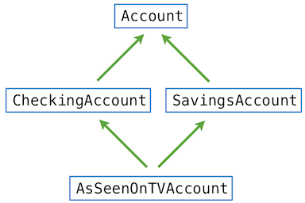

# 2.5 面向对象编程

面向对象编程（OOP）是一种组织程序的方法，它把本章介绍的许多思想汇聚在一起。就像 data abstraction 中的 function 一样，class 在数据的使用与实现之间建立 abstraction barrier。就像 dispatch dictionary 一样，object 会响应行为上的请求。就像 mutable 数据结构一样，object 拥有无法从 global environment 直接访问的局部状态。Python 的 object 系统提供了便捷的语法，用以推广这些组织程序的技术的使用。这些语法中有许多在其他面向对象编程语言中是共通的。

object 系统提供的不仅仅是便利。它开启了一种设计程序的新隐喻：若干独立的 agent 在计算机内部相互作用。每个 object 都把局部状态与行为捆绑在一起，从而把两者的复杂性抽象掉。object 之间相互通信，有用的结果作为它们相互作用的产物被计算出来。object 不仅传递消息，它们还在同类型的其他 object 之间共享行为，并从相关的类型那里继承特性。

面向对象编程这一范式有它自己的词汇，用以支撑 object 隐喻。我们已经看到，object 是一种数据值，它拥有可以通过 dot notation 访问的 method 和 attribute。每个 object 还有一个类型，称为它的 *class*。要创建新的数据类型，我们就实现新的 class。

## 2.5.1 object 与 class

一个 class 充当所有类型为该 class 的 object 的模板。每个 object 都是某个特定 class 的 instance。我们目前用过的 object 都有内建的 class，但也可以创建新的用户自定义 class。class 定义指明该 class 的 object 所共享的 attribute 和 method。我们将通过重新审视银行账户的例子来介绍 class statement。

在介绍局部状态时，我们看到银行账户很自然地建模为拥有 `balance` 的 mutable 值。一个银行账户 object 应当有一个 `withdraw` method，它更新账户 balance，并在数额可用时返回所请求的数额。为了补全这个 abstraction：银行账户应当能够返回它当前的 `balance`、返回账户 `holder` 的名字，以及为 `deposit` 存入的数额。

`Account` class 让我们可以创建多个银行账户 instance。创建新 object instance 的行为称为 *instantiating* 该 class。Python 中实例化 class 的语法与调用 function 的语法完全相同。在这个例子里，我们用 argument `'Kirk'`（账户 holder 的名字）来调用 `Account`。

```python
>>> a = Account('Kirk')
```

object 的 *attribute* 是与该 object 关联的 name-value pair，可以通过 dot notation 访问。只属于某个特定 object（而不是该 class 的所有 object）的 attribute 称为 *instance attribute*。每个 `Account` 都有自己的 balance 和账户 holder 名，它们是 instance attribute 的例子。在更广泛的编程社区中，instance attribute 也可能被称为 *field*、*property* 或 *instance variable*。

```python
>>> a.holder
'Kirk'
>>> a.balance
0
```

作用于 object 或执行 object 专属计算的 function 称为 method。method 的 return value 和 side effect 可以依赖于并改变 object 的其他 attribute。例如，`deposit` 是我们的 `Account` object `a` 的一个 method。它接受一个 argument，即要存入的数额，改变 object 的 `balance` attribute，并返回所得的 balance。

```python
>>> a.deposit(15)
15
```

我们说 method 是在某个特定 object 上被 *invoked* 的。调用 `withdraw` method 的结果，要么是取款获得批准、数额被扣除，要么是请求被拒绝、该方法返回一条错误消息。

```python
>>> a.withdraw(10)  # The withdraw method returns the balance after withdrawal
5
>>> a.balance       # The balance attribute has changed
5
>>> a.withdraw(10)
'Insufficient funds'
```

如上所示，method 的行为可以依赖于 object 不断变化的 attribute。两次用同一个 argument 调用 `withdraw` 会返回不同的结果。

## 2.5.2 定义 class

用户自定义的 class 由 `class` statement 创建，它只由单个子句构成。class statement 定义 class 的名字，随后包含一组 statement 来定义该 class 的 attribute：

```

class <name>:
    <suite>
```

当 class statement 被执行时，会创建一个新 class，并在当前 environment 的第一个 frame 中把它绑定到 `<name>`。随后执行 suite。在 `class` statement 的 `<suite>` 内通过 `def` 或赋值 statement 绑定的任何名字，都会创建或修改该 class 的 attribute。

class 通常围绕操作 instance attribute 来组织，这些 instance attribute 是与该 class 的每个 instance 相关联的 name-value pair。class 通过定义一个初始化新 object 的 method 来指定其 object 的 instance attribute。例如，初始化 `Account` class 的一个 object，其中一部分工作就是给它赋一个起始 balance 0。

`class` statement 的 `<suite>` 中包含若干 `def` statement，它们为该 class 的 object 定义新的 method。在 Python 中，初始化 object 的 method 有一个特殊的名字 `__init__`（单词 “init” 两侧各有两个下划线），它被称为该 class 的 *constructor*。

```python
>>> class Account:
        def __init__(self, account_holder):
            self.balance = 0
            self.holder = account_holder
```

`Account` 的 `__init__` method 有两个 formal parameter。第一个是 `self`，它绑定到新创建的 `Account` object。第二个 parameter 是 `account_holder`，它绑定到调用该 class 进行实例化时传入的 argument。

constructor 把 instance attribute 名 `balance` 绑定到 0。它还把 attribute 名 `holder` 绑定到名字 `account_holder` 的值。formal parameter `account_holder` 是 `__init__` method 中的局部名字。另一方面，通过最后一条赋值 statement 绑定的名字 `holder` 则会一直保留，因为它用 dot notation 存储为 `self` 的一个 attribute。

定义好 `Account` class 之后，我们就可以实例化它了。

```python
>>> a = Account('Kirk')
```

这一次对 `Account` class 的“调用”创建了一个新 object，它是 `Account` 的 instance；随后用两个 argument 调用 constructor function `__init__`：新创建的 object 和 string `'Kirk'`。按照惯例，我们把 constructor 第一个 argument 的 parameter 名取为 `self`，因为它绑定到正在被实例化的 object。几乎所有 Python 代码都采用这一惯例。

现在，我们可以用 dot notation 访问该 object 的 `balance` 和 `holder` 了。

```python
>>> a.balance
0
>>> a.holder
'Kirk'
```

**Identity。** 每个新的 account instance 都有自己的 balance attribute，其值独立于同一 class 的其他 object。

```python
>>> b = Account('Spock')
>>> b.balance = 200
>>> [acc.balance for acc in (a, b)]
[0, 200]
```

为了强制实现这种分离，每个属于用户自定义 class 的 instance 的 object 都有一个唯一的 identity。object identity 用 `is` 和 `is not` operator 来比较。

```python
>>> a is a
True
>>> a is not b
True
```

尽管是由完全相同的调用构造出来的，绑定到 `a` 和 `b` 的 object 也并不相同。和往常一样，用赋值把一个 object 绑定到新名字并不会创建新 object。

```python
>>> c = a
>>> c is a
True
```

拥有用户自定义 class 的新 object，只有在一个 class（例如 `Account`）用 call expression 语法被实例化时才会创建。

**Method。** object 的 method 同样由 `class` statement 的 suite 中的 `def` statement 定义。下面，`deposit` 和 `withdraw` 都被定义为 `Account` class 的 object 上的 method。

```python
>>> class Account:
        def __init__(self, account_holder):
            self.balance = 0
            self.holder = account_holder
        def deposit(self, amount):
            self.balance = self.balance + amount
            return self.balance
        def withdraw(self, amount):
            if amount > self.balance:
                return 'Insufficient funds'
            self.balance = self.balance - amount
            return self.balance
```

虽然 method 定义在声明方式上与 function 定义没有区别，但 method 定义在执行时效果不同。由 `class` statement 中的 `def` statement 创建的 function 值会绑定到所声明的名字，但它是作为 attribute 局部地绑定在 class 之内的。该值通过 dot notation 从 class 的某个 instance 出发，作为 method 被调用。

每个 method 定义同样包含一个特殊的第一 parameter `self`，它绑定到该 method 被调用的那个 object。例如，假设 `deposit` 在某个 `Account` object 上被调用，并传入单个 argument 值：存入的数额。object 本身绑定到 `self`，而 argument 绑定到 `amount`。所有被调用的 method 都能通过 `self` parameter 访问该 object，因此它们都能访问和操作该 object 的状态。

要调用这些 method，我们仍然使用 dot notation，如下所示。

```python
>>> spock_account = Account('Spock')
>>> spock_account.deposit(100)
100
>>> spock_account.withdraw(90)
10
>>> spock_account.withdraw(90)
'Insufficient funds'
>>> spock_account.holder
'Spock'
```

当 method 通过 dot notation 被调用时，object 本身（在这里绑定到 `spock_account`）扮演双重角色。第一，它确定名字 `withdraw` 的含义；`withdraw` 不是 environment 中的名字，而是 `Account` class 局部的名字。第二，当 `withdraw` method 被调用时，它绑定到第一个 parameter `self`。

## 2.5.3 message passing 与 dot expression

method（定义在 class 中）和 instance attribute（通常在 constructor 中赋值）是面向对象编程的基本元素。这两个概念复制了数据值的 message passing 实现中 dispatch dictionary 的大部分行为。object 用 dot notation 接收消息，但这些消息不再是任意以 string 为值的 key，而是 class 局部的名字。object 也拥有具名的局部状态值（即 instance attribute），但这种状态可以用 dot notation 访问和操作，无需在实现中使用 `nonlocal` statement。

message passing 的核心思想是：数据值应当具有行为，即响应与它们所代表的抽象类型相关的消息。dot notation 是 Python 的一项语法特性，它把 message passing 隐喻形式化了。使用带有内建 object 系统的语言，好处在于 message passing 可以与其他语言特性（如赋值 statement）无缝配合。我们不需要用不同的消息来“get”或“set”与某个局部 attribute 名关联的值；语言语法允许我们直接使用消息名。

**Dot expression。** 代码片段 `spock_account.deposit` 称为 *dot expression*。一个 dot expression 由一个 expression、一个点号和一个名字组成：

```

<expression> . <name>
```

`<expression>` 可以是任何合法的 Python expression，但 `<name>` 必须是一个简单名字（而不是一个求值为名字的 expression）。dot expression 求值为：对于作为 `<expression>` 的值的那个 object，具有给定 `<name>` 的 attribute 的值。

内建 function `getattr` 也能按名字返回某个 object 的 attribute。它是与 dot notation 等价的 function。使用 `getattr`，我们可以用 string 查找 attribute，就像用 dispatch dictionary 时那样。

```python
>>> getattr(spock_account, 'balance')
10
```

我们还可以用 `hasattr` 测试某个 object 是否具有具名的 attribute。

```python
>>> hasattr(spock_account, 'deposit')
True
```

一个 object 的 attribute 包括它的所有 instance attribute，以及定义在它所属 class 中的所有 attribute（包括 method）。method 是需要特殊处理的 class attribute。

**Method 与 function。** 当 method 在某个 object 上被调用时，该 object 会被隐式地作为第一个 argument 传给该 method。也就是说，点号左边 `<expression>` 的值所对应的那个 object，会自动作为第一个 argument 传给 dot expression 右侧所指名的 method。结果是，该 object 被绑定到 parameter `self`。

为了实现自动的 `self` 绑定，Python 区分了 *function* 与 *bound method*：前者是我们从本书开头起一直在创建的东西，后者把一个 function 与该方法将在其上被调用的 object 耦合在一起。bound method 值已经与它的第一个 argument 关联，即在它被调用的那个 instance，该 argument 在 method 被调用时会被命名为 `self`。

通过在交互式 interpreter 中对 dot expression 返回的值调用 `type`，我们可以看出这种区别。作为 class 的 attribute，method 只是一个 function；而作为 instance 的 attribute，它是 bound method：

```python
>>> type(Account.deposit)
<class 'function'>
>>> type(spock_account.deposit)
<class 'method'>
```

这两个结果唯一的区别在于：第一个是标准的双 argument function，具有 parameter `self` 和 `amount`；第二个是单 argument 的 method，其中名字 `self` 会在 method 被调用时自动绑定到名为 `spock_account` 的 object，而 parameter `amount` 会绑定到传给该 method 的 argument。这两个值，无论是 function 值还是 bound method 值，都与同一个 `deposit` function body 相关联。

我们可以用两种方式调用 `deposit`：作为 function，以及作为 bound method。在前一种情况下，我们必须显式地为 `self` parameter 提供 argument。在后一种情况下，`self` parameter 会被自动绑定。

```python
>>> Account.deposit(spock_account, 1001)  # The deposit function takes 2 arguments
1011
>>> spock_account.deposit(1000)           # The deposit method takes 1 argument
2011
```

function `getattr` 的行为与 dot notation 完全一致：如果它的第一个 argument 是一个 object，而该名字是 class 中定义的 method，那么 `getattr` 返回 bound method 值。反之，如果第一个 argument 是一个 class，那么 `getattr` 直接返回 attribute 值，那是一个普通的 function。

**命名约定。** class 名按惯例采用 CapWords 约定书写（也叫 CamelCase，因为名字中间的大写字母看起来像驼峰）。method 名遵循给 function 命名的标准约定：用小写单词、以下划线分隔。

在某些情况下，有些 instance variable 和 method 与 object 的维护和一致性有关，我们不希望 object 的使用者看到或使用它们。它们不属于 class 所定义的 abstraction，而属于实现。Python 的约定规定：如果 attribute 名以下划线开头，那么它只应在 class 自身的 method 内访问，而不应由 class 的使用者访问。

## 2.5.4 class attribute

有些 attribute 值由某个 class 的所有 object 共享。这样的 attribute 与 class 本身关联，而不是与 class 的任何单个 instance 关联。例如，假设一家银行按固定利率为账户的 balance 支付利息。这个利率可能变化，但它是所有账户共享的单一值。

class attribute 由 `class` statement 的 suite 中、任何 method 定义之外的赋值 statement 创建。在更广泛的开发者社区中，class attribute 也可能被称为 class variable 或 static variable。下面的 class statement 为 `Account` 创建了一个名为 `interest` 的 class attribute。

```python
>>> class Account:
        interest = 0.02            # A class attribute
        def __init__(self, account_holder):
            self.balance = 0
            self.holder = account_holder
        # Additional methods would be defined here
```

这个 attribute 仍然可以从该 class 的任何 instance 访问。

```python
>>> spock_account = Account('Spock')
>>> kirk_account = Account('Kirk')
>>> spock_account.interest
0.02
>>> kirk_account.interest
0.02
```

然而，对 class attribute 的一次赋值 statement 会改变该 class 所有 instance 的这个 attribute 值。

```python
>>> Account.interest = 0.04
>>> spock_account.interest
0.04
>>> kirk_account.interest
0.04
```

**attribute 名。** 我们给 object 系统引入的复杂性已经足够多，因此必须说明名字如何解析到特定的 attribute。毕竟，我们很容易同时拥有同名的 class attribute 和 instance attribute。

正如我们所见，一个 dot expression 由一个 expression、一个点号和一个名字组成：

```

<expression> . <name>
```

要对一个 dot expression 求值：

1. 对点号左边的 `<expression>` 求值，得到该 dot expression 的 *object*。
2. 把 `<name>` 与该 object 的 instance attribute 进行匹配；如果存在具有该名字的 attribute，则返回它的值。
3. 如果 `<name>` 不在 instance attribute 中出现，那么就在 class 中查找 `<name>`，得到一个 class attribute 值。
4. 返回该值，除非它是一个 function；在后一种情况下，改为返回 bound method。

在这个求值过程中，instance attribute 先于 class attribute 被找到，正如在 environment 中局部名字优先于 global 名字。class 内定义的 method 在这一求值过程的第四步中，与该 dot expression 的 object 组合成 bound method。在 class 中查找名字的过程还有一些额外的细节，等我们介绍 class inheritance 之后很快就会遇到。

**attribute 赋值。** 所有左侧含有 dot expression 的赋值 statement 都会影响该 dot expression 的 object 的 attribute。如果该 object 是一个 instance，那么赋值设置一个 instance attribute。如果该 object 是一个 class，那么赋值设置一个 class attribute。由这条规则可知，对某个 object 的 attribute 赋值不会影响它所属 class 的 attribute。下面的例子说明了这一区别。

如果我们给某个 account instance 的具名 attribute `interest` 赋值，就会创建一个新的 instance attribute，它与已有的 class attribute 同名。

```python
>>> kirk_account.interest = 0.08
```

此后，这个 attribute 值会由 dot expression 返回。

```python
>>> kirk_account.interest
0.08
```

然而，class attribute `interest` 仍然保留它原来的值，所有其他账户返回的都是这个值。

```python
>>> spock_account.interest
0.04
```

对 class attribute `interest` 的修改会影响 `spock_account`，但 `kirk_account` 的 instance attribute 不受影响。

```python
>>> Account.interest = 0.05  # changing the class attribute
>>> spock_account.interest     # changes instances without like-named instance attributes
0.05
>>> kirk_account.interest     # but the existing instance attribute is unaffected
0.08
```

## 2.5.5 inheritance

在使用面向对象编程范式时，我们常常发现不同的类型之间存在关联。特别是，我们发现相似的 class 在专门化的程度上有所差别。两个 class 可能有相似的 attribute，但其中一个代表另一个的特殊情形。

例如，我们可能想实现一个支票账户，它不同于标准账户。支票账户每次取款多收 1 美元，利率也更低。这里我们演示所期望的行为。

```python
>>> ch = CheckingAccount('Spock')
>>> ch.interest     # Lower interest rate for checking accounts
0.01
>>> ch.deposit(20)  # Deposits are the same
20
>>> ch.withdraw(5)  # withdrawals decrease balance by an extra charge
14
```

`CheckingAccount` 是 `Account` 的一种专门化。用 OOP 的术语来说，通用的账户将充当 `CheckingAccount` 的 base class，而 `CheckingAccount` 将是 `Account` 的 subclass。（*parent class* 和 *superclass* 这两个说法也用于 base class，*child class* 也用于 subclass。）

subclass *inherits* 其 base class 的 attribute，但可以 *override* 某些 attribute，包括某些 method。使用 inheritance 时，我们只指明 subclass 与 base class 之间的差异。任何在 subclass 中没有指明的东西，都自动假定其行为与 base class 中的一样。

inheritance 除了是一种有用的组织特性之外，在我们的 object 隐喻中也占有一席之地。inheritance 意在表示 class 之间的 *is-a* 关系，与之相对的是 *has-a* 关系。支票账户 *is-a* 一种特定类型的账户，所以让 `CheckingAccount` 继承 `Account` 是 inheritance 的恰当用法。另一方面，一家银行 *has-a* 一份由它管理的银行账户 list，所以这两者都不应该继承另一个。相反，一个存放 account object 的 list 自然而然地会表达为 bank object 的一个 instance attribute。

## 2.5.6 使用 inheritance

首先，我们给出 `Account` class 的完整实现，其中包括该 class 及其 method 的 docstring。

```python
>>> class Account:
        """A bank account that has a non-negative balance."""
        interest = 0.02
        def __init__(self, account_holder):
            self.balance = 0
            self.holder = account_holder
        def deposit(self, amount):
            """Increase the account balance by amount and return the new balance."""
            self.balance = self.balance + amount
            return self.balance
        def withdraw(self, amount):
            """Decrease the account balance by amount and return the new balance."""
            if amount > self.balance:
                return 'Insufficient funds'
            self.balance = self.balance - amount
            return self.balance
```

`CheckingAccount` 的完整实现如下。我们通过把求值为 base class 的 expression 放在 class 名后面的括号里来指明 inheritance。

```python
>>> class CheckingAccount(Account):
        """A bank account that charges for withdrawals."""
        withdraw_charge = 1
        interest = 0.01
        def withdraw(self, amount):
            return Account.withdraw(self, amount + self.withdraw_charge)
```

这里我们引入了一个为 `CheckingAccount` class 所特有的 class attribute `withdraw_charge`。我们给 `interest` attribute 赋了一个更低的值。我们还定义了一个新的 `withdraw` method，用来 override `Account` class 中定义的行为。由于 class suite 中没有其他 statement，所有其他行为都继承自 base class `Account`。

```python
>>> checking = CheckingAccount('Sam')
>>> checking.deposit(10)
10
>>> checking.withdraw(5)
4
>>> checking.interest
0.01
```

expression `checking.deposit` 求值为一个用于存款的 bound method，它定义在 `Account` class 中。当 Python 解析 dot expression 中一个不属于该 instance 的 attribute 的名字时，它会到 class 中查找该名字。事实上，在 class 中“查找”一个名字的行为，会试图在最初那个 object 所属 class 的 inheritance 链上的每个 base class 中寻找该名字。我们可以递归地定义这个过程。要在 class 中查找一个名字。

1. 如果它是该 class 中某个 attribute 的名字，返回该 attribute 值。
2. 否则，到 base class 中查找该名字（如果存在 base class 的话）。

就 `deposit` 而言，Python 会先在 instance 上查找这个名字，然后在 `CheckingAccount` class 中查找。最后，它会到 `deposit` 所定义的 `Account` class 中查找。按照我们为 dot expression 制定的求值规则，由于 `deposit` 是在 `checking` instance 所属的 class 中查找到的 function，该 dot expression 求值为一个 bound method 值。这个 method 被用 argument 10 调用，也就是调用 deposit method，其中 `self` 绑定到 `checking` object，`amount` 绑定到 10。

一个 object 的 class 始终不变。尽管 `deposit` method 是在 `Account` class 中找到的，调用 `deposit` 时 `self` 绑定到的是 `CheckingAccount` 的 instance，而不是 `Account` 的 instance。

**调用祖先。** 被 override 的 attribute 仍然可以通过 class object 访问。例如，我们实现 `CheckingAccount` 的 `withdraw` method 时，调用了 `Account` 的 `withdraw` method，并在 argument 中加上了 `withdraw_charge`。

注意，我们调用的是 `self.withdraw_charge`，而不是等价的 `CheckingAccount.withdraw_charge`。前者相对于后者的好处在于：继承自 `CheckingAccount` 的 class 可能会 override 取款费用。如果是那样，我们希望自己的 `withdraw` 实现找到的是新值而不是旧值。

**Interface。** 在面向对象程序中，不同类型的 object 共享相同的 attribute 名是极为常见的现象。一个 *object interface* 是一组 attribute 及施加在这些 attribute 上的条件。例如，所有账户都必须有接受数值 argument 的 `deposit` 和 `withdraw` method，以及一个 `balance` attribute。`Account` 和 `CheckingAccount` 这两个 class 都实现了这个 interface。inheritance 恰恰以这种方式促进名字的共享。在某些编程语言（如 Java）中，interface 的实现必须显式声明。而在另一些语言（如 Python、Ruby 和 Go）中，任何具有相应名字的 object 都实现了一个 interface。

你的程序中那些使用 object（而不是实现 object）的部分，如果不对 object 的类型做任何假设，而只对它们的 attribute 名做假设，就最能经受未来的变化。也就是说，它们使用的是 object abstraction，而不对它的实现做任何假设。

例如，假设我们经营一场抽奖，想把 5 美元存入一个 account list 中的每个账户。下面的实现不对这些账户的类型做任何假设，因此对任何拥有 `deposit` method 的 object 类型都能同样良好地工作：

```python
>>> def deposit_all(winners, amount=5):
        for account in winners:
            account.deposit(amount)
```

上面的 `deposit_all` function 只假设每个 `account` 满足 account object abstraction，因此它对任何同样实现这个 interface 的其他 account class 都能工作。假定某一种特定的 account class 则会违反 account object abstraction 的 abstraction barrier。例如，下面的实现不一定能用于新的账户种类：

```python
>>> def deposit_all(winners, amount=5):
        for account in winners:
            Account.deposit(account, amount)
```

我们将在本章后面更详细地讨论这个话题。

## 2.5.7 multiple inheritance

Python 支持 subclass 从多个 base class 继承 attribute 这一概念，这项语言特性称为 *multiple inheritance*。

假设我们有一个 `SavingsAccount`，它继承自 `Account`，但客户每次存款都要收取一小笔费用。

```python
>>> class SavingsAccount(Account):
        deposit_charge = 2
        def deposit(self, amount):
            return Account.deposit(self, amount - self.deposit_charge)
```

于是，一位精明的管理者构想出一个 `AsSeenOnTVAccount` 账户，它兼有 `CheckingAccount` 和 `SavingsAccount` 两者的最佳特性：取款费、存款费和低利率。它把支票账户和储蓄账户合二为一！“只要我们把它做出来，”这位管理者推论道，“总会有人来开户，把这些费用统统付掉。我们甚至可以白送他们一美元。”

```python
>>> class AsSeenOnTVAccount(CheckingAccount, SavingsAccount):
        def __init__(self, account_holder):
            self.holder = account_holder
            self.balance = 1           # A free dollar!
```

事实上，这个实现已经完整了。取款和存款都会产生费用，分别使用 `CheckingAccount` 和 `SavingsAccount` 中的 function 定义。

```python
>>> such_a_deal = AsSeenOnTVAccount("John")
>>> such_a_deal.balance
1
>>> such_a_deal.deposit(20)            # $2 fee from SavingsAccount.deposit
19
>>> such_a_deal.withdraw(5)            # $1 fee from CheckingAccount.withdraw
13
```

没有歧义的引用会如预期那样被正确解析：

```python
>>> such_a_deal.deposit_charge
2
>>> such_a_deal.withdraw_charge
1
```

但如果引用有歧义呢？例如对 `withdraw` method 的引用，它在 `Account` 和 `CheckingAccount` 中都有定义。下图描绘了 `AsSeenOnTVAccount` class 的 *inheritance graph*。每条箭头都从 subclass 指向 base class。



对于这样一个简单的“菱形”结构，Python 先从左到右、再向上解析名字。在这个例子里，Python 按顺序在下列 class 中查找 attribute 名，直到找到具有该名字的 attribute 为止：

```

AsSeenOnTVAccount, CheckingAccount, SavingsAccount, Account, object
```

inheritance 顺序问题没有唯一正确的解，因为有些情况下我们可能更愿意让某些被继承的 class 优先于其他 class。不过，任何支持 multiple inheritance 的编程语言都必须以一致的方式选定某种顺序，这样语言的使用者才能预测自己程序的行为。

**延伸阅读。** Python 使用一种称为 C3 Method Resolution Ordering 的递归算法来解析这个名字。任何 class 的 method resolution order 都可以通过对所有 class 调用 `mro` method 来查询。

```python
>>> [c.__name__ for c in AsSeenOnTVAccount.mro()]
['AsSeenOnTVAccount', 'CheckingAccount', 'SavingsAccount', 'Account', 'object']
```

查找 method resolution order 的精确算法不是本教材的主题，但 Python 的主要作者对它作了[描述](http://python-history.blogspot.com/2010/06/method-resolution-order.html)，并给出了原始论文的参考。

## 2.5.8 object 的角色

Python 的 object 系统旨在让 data abstraction 和 message passing 既方便又灵活。class、method、inheritance 和 dot expression 这些专门的语法，使我们能够在程序中把 object 隐喻形式化，从而提升我们组织大型程序的能力。

特别地，我们希望 object 系统在程序的不同方面之间促成 *separation of concerns*。程序中的每个 object 都封装并管理程序状态的某一部分，而每条 class statement 都定义了实现程序整体逻辑的某一部分的 function。abstraction barrier 则维护大型程序不同方面之间的边界。

面向对象编程特别适合那些为具有独立但相互作用的部件的系统建模的程序。例如，在一个社交网络中不同的用户相互交互，在一个游戏中不同的角色相互交互，在一个物理模拟中不同的形状相互交互。在表示这类系统时，程序中的 object 往往自然而然地对应被建模系统中的 object，而 class 则表示它们的类型和关系。

另一方面，class 未必是实现某些 abstraction 的最佳机制。functional abstraction 为表示输入与输出之间的关系提供了更自然的隐喻。人不应当觉得非得把程序中每一丁点逻辑都塞进某个 class 里，尤其是在为操作数据定义独立的 function 更为自然的时候。Function 同样能够维护 separation of concerns。

像 Python 这样的多范式语言让程序员能够把组织范式与恰当的问题相匹配。学会判断何时应当引入一个新的 class 而不是一个新的 function，从而简化程序或使其模块化，是软件工程中一项重要的设计技能，值得认真对待。

*继续*：
[2.6 实现 class 与 object](2.6.md)
