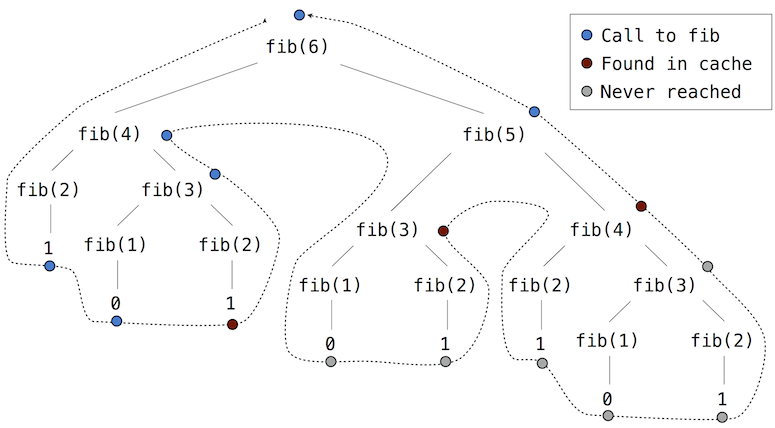

# 2.8 效率

如何表示和处理数据，这类决策常常受到各种备选方案效率的影响。效率指某种表示或过程所使用的计算资源，例如计算一个 function 的结果或表示一个 object 需要多少时间和内存。这些资源的量可能因实现细节的不同而相差悬殊。

## 2.8.1 度量效率

要精确度量一个程序运行需要多长时间、或消耗多少内存，是很有挑战性的，因为结果取决于计算机配置的许多细节。刻画一个程序效率的更可靠方式，是度量某个事件（例如 function 调用）发生了多少次。

让我们回到第一个 tree-recursive function，也就是用来计算 Fibonacci 数列中数字的 `fib` function。

```python
>>> def fib(n):
        if n == 0:
            return 0
        if n == 1:
            return 1
        return fib(n-2) + fib(n-1)
```

```python
>>> fib(5)
5
```

考虑对 `fib(6)` 求值所产生的计算模式，如下图所示。为计算 `fib(5)`，我们要计算 `fib(3)` 和 `fib(4)`。为计算 `fib(3)`，我们要计算 `fib(1)` 和 `fib(2)`。一般来说，演化出的过程看起来像一棵 tree。在遍历这棵 tree 的过程中，每个蓝点表示一次已完成的 Fibonacci 数计算。


这个 function 作为典型的 tree recursion 很有教学意义，但它计算 Fibonacci 数的效率极低，因为它做了太多冗余计算。`fib(3)` 的整个计算过程被重复了一遍。

我们可以度量这种低效。higher-order function `count` 返回一个与其 argument 等价的 function，该 function 还维护一个 `call_count` attribute。这样，我们就能查看 `fib` 究竟被调用了多少次。

```python
>>> def count(f):
        def counted(*args):
            counted.call_count += 1
            return f(*args)
        counted.call_count = 0
        return counted
```

通过统计对 `fib` 的调用次数，我们看到所需的调用数增长得比 Fibonacci 数本身还快。这种调用的迅速膨胀是 tree-recursive function 的特征。

```python
>>> fib = count(fib)
>>> fib(19)
4181
>>> fib.call_count
13529
```

**空间。** 要理解一个 function 的空间需求，我们必须从总体上说明，在我们的计算 environment 模型中，内存是如何被使用、保留和回收的。在对一个 expression 求值时，interpreter 会保留所有 *active* 的 environment，以及这些 environment 所引用的所有值和 frame。如果一个 environment 为某个正在求值的 expression 提供求值上下文，它就是 active 的。当创建其第一个 frame 的那个 function 调用最终返回时，这个 environment 就变为 inactive。

例如，在对 `fib` 求值时，interpreter 按前面所示的顺序逐个计算每个值，遍历 tree 的结构。为此，在计算的任何时刻，它只需要跟踪 tree 中位于当前 node 之上的那些 node。用于计算其余分支的内存可以被回收，因为它们不会影响未来的计算。一般来说，tree-recursive function 所需的空间与 tree 的最大深度成正比。

下图描绘了对 `fib(3)` 求值所创建的 environment。在对 `fib` 的首次应用求值其 return expression 的过程中，expression `fib(n-2)` 被求值，得到值 0。一旦这个值被算出，相应的 environment frame（灰色显示）就不再需要了：它不属于任何 active 的 environment。因此，设计良好的 interpreter 可以回收用于存储这个 frame 的内存。另一方面，如果 interpreter 当前正在对 `fib(n-1)` 求值，那么这次 `fib` 应用所创建的 environment（其中 `n` 为 2）是 active 的。反过来，最初为把 `fib` 应用于 3 而创建的 environment 也是 active 的，因为它的 return value 还没有被算出来。

```python

def fib(n):
    if n == 0:
        return 0
    if n == 1:
        return 1
    return fib(n-2) + fib(n-1)

result = fib(2)
```

higher-order function `count_frames` 跟踪 `open_count`，即对 function `f` 的调用中尚未返回的调用数量。`max_count` attribute 是 `open_count` 曾达到的最大值，它对应于计算过程中同时处于 active 状态的 frame 的最大数量。

```python
>>> def count_frames(f):
        def counted(*args):
            counted.open_count += 1
            counted.max_count = max(counted.max_count, counted.open_count)
            result = f(*args)
            counted.open_count -= 1
            return result
        counted.open_count = 0
        counted.max_count = 0
        return counted
```

```python
>>> fib = count_frames(fib)
>>> fib(19)
4181
>>> fib.open_count
0
>>> fib.max_count
19
>>> fib(24)
46368
>>> fib.max_count
24
```

总结一下，`fib` function 的空间需求（以 active frame 计）比输入小 1，而输入往往很小。以总递归调用次数计的时间需求则大于输出，而输出往往极大。

## 2.8.2 Memoization

tree-recursive 的计算过程往往可以通过 *memoization* 变得更高效，这是一种强大的技术，用于提升那些重复计算的 recursive function 的效率。经过 memoization 的 function 会为它此前收到过的任何 argument 存储 return value。第二次调用 `fib(25)` 时，它不会递归地重新计算 return value，而是直接返回已经构造好的那个。

Memoization 可以自然地表示为一个 higher-order function，它也可以用作 decorator。下面的定义创建了一个 *cache*，用来存放此前计算过的结果，并以算出这些结果的 argument 作为索引。使用 dictionary 要求被 memoization 的 function 的 argument 是 immutable 的。

```python
>>> def memo(f):
        cache = {}
        def memoized(n):
            if n not in cache:
                cache[n] = f(n)
            return cache[n]
        return memoized
```

如果我们把 `memo` 应用于 Fibonacci 数的递归计算，就会演化出一种新的计算模式，如下图所示。



在这次 `fib(5)` 的计算中，在 tree 的右侧分支上计算 `fib(4)` 时，`fib(2)` 和 `fib(3)` 的结果被复用了。结果，大部分 tree-recursive 计算根本不需要进行。

使用 `count`，我们可以看到对于 `fib` 的每个不同输入，`fib` function 实际上只被调用一次。

```python
>>> counted_fib = count(fib)
>>> fib  = memo(counted_fib)
>>> fib(19)
4181
>>> counted_fib.call_count
20
>>> fib(34)
5702887
>>> counted_fib.call_count
35
```

## 2.8.3 增长阶

如前面的例子所示，各个过程消耗空间和时间这类计算资源的速率可能天差地别。然而，要精确判定调用一个 function 会使用多少空间或时间，是一项非常困难的任务，取决于许多因素。分析一个过程的一种有用方式，是把它与一组需求相似的过程归为一类。一种有用的分类方式就是一个过程的 *order of growth*，它用简单的话表达一个过程的资源需求如何随输入增长。

作为 order of growth 的入门，我们来分析下面的 function `count_factors`，它统计能整除输入 `n` 的整数个数。这个 function 尝试用每个小于或等于其平方根的整数去除 `n`。该实现利用了一个事实：如果 $k$ 整除 $n$ 且 $k < \sqrt{n}$，那么就存在另一个因子 $j = n / k$，使得 $j > \sqrt{n}$。

```python

from math import sqrt
def count_factors(n):
    sqrt_n = sqrt(n)
    k, factors = 1, 0
    while k < sqrt_n:
        if n % k == 0:
            factors += 2
        k += 1
    if k * k == n:
        factors += 1
    return factors

result = count_factors(576)
```

对 `count_factors` 求值需要多少时间？确切答案因机器而异，但我们可以就其中涉及的计算量作出一些有用的一般性观察。这个过程执行 `while` statement 主体的总次数是小于 $\sqrt{n}$ 的最大整数。这个 `while` statement 前后的 statement 都恰好执行一次。所以，执行的 statement 总数是 $w \cdot \sqrt{n} + v$，其中 $w$ 是 `while` 主体中的 statement 数量，$v$ 是 `while` statement 之外的 statement 数量。虽然并不精确，但这个公式大体刻画了把 `count_factors` 作为输入 `n` 的 function 来求值需要多少时间。

更精确的描述很难得到。常数 $w$ 和 $v$ 根本不是常数，因为对 `factors` 的赋值 statement 有时执行、有时不执行。order of growth 分析让我们可以忽略这类细节，转而关注增长的大致形态。具体而言，`count_factors` 的 order of growth 精确地表达出：计算 `count_factors(n)` 所需的时间以 $\sqrt{n}$ 的速率增长，误差在若干常数因子的范围内。

**Theta 记号。** 设 $n$ 是一个参数，用来度量某个过程输入的大小；设 $R(n)$ 是该过程在输入大小为 $n$ 时所需的某种资源的量。在前面的例子中，我们取 $n$ 为要计算给定 function 的那个数，但还有别的可能。例如，如果我们的目标是计算某个数平方根的近似值，我们可以取 $n$ 为所需的精度位数。

$R(n)$ 可能度量使用的内存量、执行的机器基本步数，等等。对于每次只执行固定步数的计算机，对一个 expression 求值所需的时间与求值过程中执行的机器基本步数成正比。

我们说 $R(n)$ 的 order of growth 是 $\Theta(f(n))$，记作 $R(n) = \Theta(f(n))$（读作“$f(n)$ 的 theta”），如果存在与 $n$ 无关的正常数 $k_1$ 和 $k_2$，使得

\begin{equation*}
k_1 \cdot f(n) \leq R(n) \leq k_2 \cdot f(n)
\end{equation*}

对任何大于某个最小值 $m$ 的 $n$ 都成立。换句话说，对于很大的 $n$，$R(n)$ 的值总是夹在两个都与 $f(n)$ 同比例增长的值之间：

- 一个下界 $k_1 \cdot f(n)$，以及
- 一个上界 $k_2 \cdot f(n)$

我们可以应用这个定义，通过检查 function 主体来证明对 `count_factors(n)` 求值所需的步数按 $\Theta(\sqrt{n})$ 增长。

首先，我们取 $k_1=1$ 和 $m=0$，于是下界表明：对任何 $n>0$，`count_factors(n)` 至少需要 $1 \cdot \sqrt{n}$ 步。在 `while` statement 之外至少有 4 行被执行，每行至少需要 1 步才能执行完。在 `while` 主体之内至少有 2 行被执行，再加上 while 头部本身。所有这些都至少需要一步。`while` 主体至少被求值 $\sqrt{n}-1$ 次。把这些下界组合起来，我们看到该过程至少需要 $4 + 3 \cdot (\sqrt{n}-1)$ 步，它总是大于 $k_1 \cdot \sqrt{n}$。

其次，我们可以验证上界。我们假设 `count_factors` 主体中的任何一行至多需要 `p` 步。这个假设对每一行 Python 代码并不都成立，但在这里确实成立。那么，对 `count_factors(n)` 求值至多需要 $p \cdot (5 + 4 \sqrt{n})$ 步，因为 `while` statement 之外有 5 行，之内有 4 行（包括头部）。即使每个 `if` 头部都求值为真，这个上界也成立。最后，如果我们取 $k_2=5p$，那么所需的步数总是小于 $k_2 \cdot \sqrt{n}$。我们的论证到此完成。

## 2.8.4 示例：求幂

考虑计算给定数的指数幂这一问题。我们希望有一个 function，它以底数 `b` 和正整数指数 `n` 为 argument，并计算 $b^n$。一种做法是使用递归定义

\begin{align*}
b^n &= b \cdot b^{n-1} \\
b^0 &= 1
\end{align*}

它可以很容易地转写成递归 function

```python
>>> def exp(b, n):
        if n == 0:
            return 1
        return b * exp(b, n-1)
```

这是一个 linear recursive 过程，需要 $\Theta(n)$ 步和 $\Theta(n)$ 空间。和阶乘一样，我们可以很容易地构造出等价的 linear iteration，它需要的步数相近，但空间是常数。

```python
>>> def exp_iter(b, n):
        result = 1
        for _ in range(n):
            result = result * b
        return result
```

通过反复平方，我们可以用更少的步数计算指数幂。例如，不必把 $b^8$ 算成

\begin{equation*}
b \cdot (b \cdot (b \cdot (b \cdot (b \cdot (b \cdot (b \cdot b))))))
\end{equation*}

而可以用三次乘法算出它：

\begin{align*}
b^2 &= b \cdot b \\
b^4 &= b^2 \cdot b^2 \\
b^8 &= b^4 \cdot b^4
\end{align*}

对于 2 的幂次的指数，这个方法很好用。如果在一般情况下也使用递归规则，我们同样可以在计算指数幂时利用反复平方

\begin{equation*}
b^n = \begin{cases} (b^{\frac{1}{2} n})^2 & \text{if $n$ is even} \\
b \cdot b^{n-1} & \text{if $n$ is odd}
\end{cases}
\end{equation*}

我们也可以把这个方法表示为递归 function：

```python
>>> def square(x):
        return x*x
```

```python
>>> def fast_exp(b, n):
        if n == 0:
            return 1
        if n % 2 == 0:
            return square(fast_exp(b, n//2))
        else:
            return b * fast_exp(b, n-1)
```

```python
>>> fast_exp(2, 100)
1267650600228229401496703205376
```

`fast_exp` 所演化的过程在空间和步数上都随 `n` 对数增长。要看到这一点，只需注意：用 `fast_exp` 计算 $b^{2n}$ 只比计算 $b^n$ 多一次乘法。因此，每多允许一次乘法，我们能计算的指数大小就（近似地）翻倍。于是，指数为 `n` 时所需的乘法次数大约按以 2 为底的 `n` 的对数的速度增长。该过程具有 $\Theta(\log n)$ 的增长。当 $n$ 变大时，$\Theta(\log n)$ 增长与 $\Theta(n)$ 增长之间的差异变得十分惊人。例如，`n` 为 1000 时，`fast_exp` 只需要 14 次乘法，而不是 1000 次。

## 2.8.5 增长类别

order of growth 的设计目的是简化计算过程的分析与比较。许多不同的过程可以具有相同的 order of growth，这表明它们以相似的方式伸缩。了解并识别常见的 order of growth、找出同阶的过程，是计算机科学家的一项基本技能。

**常数。** 常数项不影响一个过程的 order of growth。因此，例如 $\Theta(n)$ 和 $\Theta(500 \cdot n)$ 是同阶的。这一性质源自 theta 记号的定义，该定义允许我们为上界和下界选择任意的常数 $k_1$ 和 $k_2$（例如 $\frac{1}{500}$）。为简单起见，order of growth 中总是省略常数。

**对数。** 对数的底不影响一个过程的 order of growth。例如，$\log_2 n$ 和 $\log_{10} n$ 是同阶的。改变对数的底等价于乘以一个常数因子。

**嵌套。** 当一个内层计算过程在外层过程的每一步中都被重复时，整个过程的 order of growth 就是外层与内层过程步数的乘积。

例如，下面的 function `overlap` 计算 list `a` 中有多少 element 也出现在 list `b` 中。

```python
>>> def overlap(a, b):
        count = 0
        for item in a:
            if item in b:
                count += 1
        return count
```

```python
>>> overlap([1, 3, 2, 2, 5, 1], [5, 4, 2])
3
```

对 list 而言，`in` operator 需要 $\Theta(n)$ 时间，其中 $n$ 是 list `b` 的长度。它被应用 $\Theta(m)$ 次，其中 $m$ 是 list `a` 的长度。`item in b` expression 是内层过程，而 `for item in a` 循环是外层过程。这个 function 总的 order of growth 是 $\Theta(m \cdot n)$。

**低阶项。** 随着过程的输入增长，计算中增长最快的部分主导了所使用的总资源。Theta 记号捕捉了这一直觉。在一个和式中，除增长最快的项之外，其余项都可以去掉而不改变 order of growth。

例如，考虑 `one_more` function，它返回 list `a` 中有多少 element 比 `a` 中的另一个 element 大 1。也就是说，在 list `[3, 14, 15, 9]` 中，element 15 比 14 大 1，所以 `one_more` 将返回 1。

```python
>>> def one_more(a):
        return overlap([x-1 for x in a], a)
```

```python
>>> one_more([3, 14, 15, 9])
1
```

这个计算有两个部分：list comprehension 和对 `overlap` 的调用。对于长度为 $n$ 的 list `a`，list comprehension 需要 $\Theta(n)$ 步，而对 `overlap` 的调用需要 $\Theta(n^2)$ 步。步数之和是 $\Theta(n + n^2)$，但这并不是表达 order of growth 的最简方式。

对任何常数 $k$，$\Theta(n^2 + k \cdot n)$ 与 $\Theta(n^2)$ 都是等价的，因为对任何 $k$，$n^2$ 这一项最终都会主导总和。界只需对大于某个最小值 $m$ 的 $n$ 成立，这一事实确立了这种等价性。为简单起见，order of growth 中总是省略低阶项，因此我们永远不会在 theta expression 中看到和式。

**常见类别。** 有了这些等价性质，一小套常见类别就浮现出来，足以描述大多数计算过程。下面按增长从慢到快列出了最常见的那些，并附有输入增大时增长的描述。每个类别后面都给出了示例。

| **类别** | **Theta 记号** | **增长描述** | **示例** |
| --- | --- | --- | --- |
| 常数 | $\Theta(1)$ | 增长与输入无关 | `abs` |
| 对数 | $\Theta(\log{n})$ | 输入乘以倍数，资源按增量增长 | `fast_exp` |
| 线性 | $\Theta(n)$ | 输入按增量增加，资源按增量增长 | `exp` |
| 二次 | $\Theta(n^2)$ | 输入按增量增加，资源增加 n 个单位 | `one_more` |
| 指数 | $\Theta(b^n)$ | 输入按增量增加，资源成倍增长 | `fib` |

还存在其他类别，例如 `count_factors` 的 $\Theta(\sqrt{n})$ 增长。不过，上面这些类别格外常见。

指数增长描述了许多不同的 order of growth，因为改变底数 $b$ 确实会影响 order of growth。例如，我们的 tree-recursive Fibonacci 计算 `fib` 的步数随其输入 $n$ 指数增长。特别地，可以证明第 n 个 Fibonacci 数是与以下值最接近的整数

\begin{equation*}
\frac{\phi^{n-2}}{\sqrt{5}}
\end{equation*}

其中 $\phi$ 是黄金比例：

\begin{equation*}
\phi = \frac{1 + \sqrt{5}}{2} \approx 1.6180
\end{equation*}

我们还说过，步数随结果值同比例增长，因此这个 tree-recursive 过程需要 $\Theta(\phi^n)$ 步，这是一个随 $n$ 指数增长的 function。

*继续*：
[2.9 递归 object](2.9.md)
