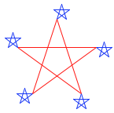
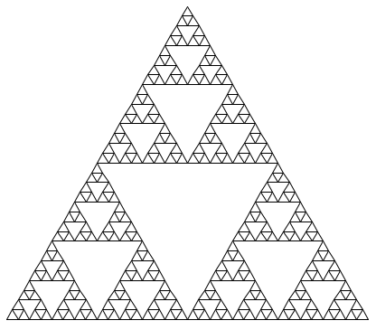

# 3.2 Functional Programming

运行在任何现代计算机上的软件都是用多种不同的编程语言写成的。其中有物理层面的语言，比如特定计算机的机器语言。这些语言关心的是如何用单个存储位和基本机器指令来表示数据与控制。机器语言程序员关心的是如何使用给定的硬件搭建出系统和工具，以便高效地实现受资源限制的计算。搭建在机器语言这一基底之上的高级语言，则把以比特集合表示数据、以基本指令序列表示程序这些顾虑隐藏了起来。这些语言具备组合手段和 abstraction 手段，例如 function 定义，它们适合组织更大规模的软件系统。

在本节中，我们介绍一门鼓励 functional 风格的高级编程语言。我们的研究对象是 Scheme 语言的一个子集，它采用与 Python 非常相似的计算模型，但只使用 expression（没有 statement），专门用于符号计算，并且只使用 immutable 值。

Scheme 是 [Lisp](http://en.wikipedia.org/wiki/Lisp_(programming_language)) 的一种方言，Lisp 是至今仍被广泛使用的第二古老的编程语言（仅次于 [Fortran](http://en.wikipedia.org/wiki/Fortran)）。Lisp 程序员社区几十年来持续繁荣，而像 [Clojure](http://en.wikipedia.org/wiki/Clojure) 这样的 Lisp 新方言，其开发者社区的增长速度在现代编程语言中名列前茅。要跟着本文的例子一起练习，你可以 [下载一个 Scheme interpreter](http://inst.eecs.berkeley.edu/~scheme/)。

## 3.2.1 Expressions

Scheme 程序由 expression 组成，expression 要么是 call expression，要么是特殊形式。一个 call expression 由一个 operator expression 后跟零个或多个 operand 子 expression 组成，与 Python 一样。operator 和 operand 都放在括号内：

```

(quotient 10 2)
```

Scheme 只使用前缀表示法。operator 通常是符号，例如 `+` 和 `*`。call expression 可以嵌套，也可以跨越多行：

```

(+ (* 3 5) (- 10 6))
```

```

(+ (* 3
      (+ (* 2 4)
         (+ 3 5)))
   (+ (- 10 7)
      6))
```

与 Python 一样，Scheme expression 可以是基本元素，也可以是组合式。数字字面量是基本元素，而 call expression 是包含任意子 expression 的组合形式。call expression 的求值过程与 Python 一致：先对 operator 和 operand expression 求值，然后把作为 operator 值的 function 应用到作为 operand 值的 argument 上。

Scheme 中的 `if` expression 是一个*特殊形式*，意思是：虽然它在语法上看起来像 call expression，但它的求值过程不同。`if` expression 的一般形式是：

```

(if <predicate> <consequent> <alternative>)
```

要为一个 `if` expression 求值，interpreter 首先对 expression 中的 `<predicate>` 部分求值。如果 `<predicate>` 求出一个真值，interpreter 接着对 `<consequent>` 求值并返回它的值。否则，它对 `<alternative>` 求值并返回它的值。

数值可以用熟悉的比较运算符来比较，不过这里同样使用前缀表示法：

```

(>= 2 1)
```

Scheme 中的布尔值 `#t`（或 `true`）和 `#f`（或 `false`）可以与布尔特殊形式组合使用，它们的求值过程与 Python 中的类似。

> - `(and <e1> ... <en>)` interpreter 一次一个地对 expression `<e>` 求值，
>   顺序是从左到右。如果任何一个 `<e>` 求值为 `false`，则 `and` expression
>   的值为 `false`，其余 `<e>` 不再求值。如果所有 `<e>` 都求值为真值，
>   则 `and` expression 的值为最后一项的值。
> - `(or <e1> ... <en>)` interpreter 一次一个地对 expression `<e>` 求值，
>   顺序是从左到右。如果任何一个 `<e>` 求值为真值，该值就作为 `or`
>   expression 的值返回，其余 `<e>` 不再求值。如果所有 `<e>` 都求值为
>   `false`，则 `or` expression 的值为 `false`。
> - `(not <e>)` 当 expression `<e>` 求值为 `false` 时，not expression
>   的值为 `true`，否则为 `false`。

## 3.2.2 定义

值可以用 `define` 特殊形式来命名：

```

(define pi 3.14)
(* pi 2)
```

新的 function（在 Scheme 中称为 *过程*）可以用 `define` 特殊形式的第二种形式来定义。例如，要定义平方，我们写：

```

(define (square x) (* x x))
```

一个过程定义的一般形式是：

```

(define (<name> <formal parameters>) <body>)
```

`<name>` 是一个符号，用于在 environment 中与这个过程定义相关联。`<formal parameters>` 是过程体内用来指代该过程对应 argument 的名字。`<body>` 是一个 expression，当 formal parameter 被替换为该过程所应用的实际 argument 时，它将产生这个过程应用的值。`<name>` 和 `<formal parameters>` 被分在一对括号内，正如它们在真正调用所定义的过程时那样。

定义了 square 之后，我们现在可以在 call expression 中使用它：

```

(square 21)
```

```

(square (+ 2 5))
```

```

(square (square 3))
```

用户定义的 function 可以接受多个 argument，并可以包含特殊形式：

```

(define (average x y)
  (/ (+ x y) 2))
```

```

(average 1 3)
```

```

(define (abs x)
    (if (< x 0)
        (- x)
        x))
```

```

(abs -3)
```

Scheme 支持局部定义，其 lexical scoping 规则与 Python 相同。下面，我们用嵌套定义和 recursion 定义一个计算平方根的迭代过程：

```

(define (sqrt x)
  (define (good-enough? guess)
    (< (abs (- (square guess) x)) 0.001))
  (define (improve guess)
    (average guess (/ x guess)))
  (define (sqrt-iter guess)
    (if (good-enough? guess)
        guess
        (sqrt-iter (improve guess))))
  (sqrt-iter 1.0))
(sqrt 9)
```

匿名 function 用 `lambda` 特殊形式创建。`Lambda` 创建过程的方式与 `define` 相同，只是没有为过程指定名字：

```

(lambda (<formal-parameters>) <body>)
```

得到的过程与用 `define` 创建的过程完全一样。唯一的区别是，它没有在 environment 中与任何名字关联。事实上，下面两个 expression 是等价的：

```

(define (plus4 x) (+ x 4))
(define plus4 (lambda (x) (+ x 4)))
```

像任何以过程为值的 expression 一样，lambda expression 可以用作 call expression 中的 operator：

```

((lambda (x y z) (+ x y (square z))) 1 2 3)
```

## 3.2.3 复合值

Pair 是 Scheme 语言内置的。由于历史原因，pair 用内置 function `cons` 创建，pair 的元素用 `car` 和 `cdr` 访问：

```

(define x (cons 1 2))
```

```

x
```

```

(car x)
```

```

(cdr x)
```

递归 list 也是语言内置的，用 pair 构建。一个记为 `nil` 或 `'()` 的特殊值表示空 list。递归 list 的值的呈现方式是把它的元素放在括号内，用空格分隔：

```

(cons 1
      (cons 2
            (cons 3
                  (cons 4 nil))))
```

```

(list 1 2 3 4)
```

```

(define one-through-four (list 1 2 3 4))
```

```

(car one-through-four)
```

```

(cdr one-through-four)
```

```

(car (cdr one-through-four))
```

```

(cons 10 one-through-four)
```

```

(cons 5 one-through-four)
```

一个 list 是否为空，可以用 primitive `null?` 谓词来判断。使用它，我们可以定义用于计算 `length` 和选取元素的标准 sequence 操作：

```

(define (length items)
  (if (null? items)
      0
      (+ 1 (length (cdr items)))))
(define (getitem items n)
  (if (= n 0)
      (car items)
      (getitem (cdr items) (- n 1))))
(define squares (list 1 4 9 16 25))
```

```

(length squares)
```

```

(getitem squares 3)
```

## 3.2.4 符号数据

到目前为止我们使用的所有复合数据对象，最终都是由数字构造出来的。Scheme 的优势之一，就是可以把任意符号当作数据来处理。

为了操作符号，我们需要语言中有一个新元素：*quote* 一个数据对象的能力。假设我们想构造 list `(a b)`。我们无法用 `(list a b)` 做到这一点，因为这个 expression 构造的是 `a` 和 `b` 的值的 list，而不是符号本身。在 Scheme 中，我们在符号 `a` 和 `b` 前面加上单引号，从而指代符号本身而不是它们的值：

```

(define a 1)
(define b 2)
```

```

(list a b)
```

```

(list 'a 'b)
```

```

(list 'a b)
```

在 Scheme 中，任何未被求值的 expression 都称为被 *quoted* 的。这种引用的观念源自一个经典的哲学区分：一个事物，比如一只狗，它会到处跑、会叫；而 “dog” 这个词是一种用来指称这类事物的语言构造。当我们把 “dog” 放在引号里使用时，我们指的不是某只特定的狗，而是一个词。在语言中，引用让我们能够谈论语言本身，在 Scheme 中也是如此：

```

(list 'define 'list)
```

引用还让我们能够直接输入复合对象，使用 list 的常规打印表示：

```

(car '(a b c))
```

```

(cdr '(a b c))
```

完整的 Scheme 语言还包含其他特性，例如 mutation 操作、vector 和 map。不过，我们目前介绍的这个子集已经提供了一门丰富的 functional programming 语言，足以实现本文到目前为止讨论的许多思想。

## 3.2.5 海龟绘图

本文配套的 Scheme 实现包含了海龟绘图，这是一个作为 Logo 语言（另一种 Lisp 方言）的一部分而开发出来的演示环境。这只海龟从画布的中心出发，根据过程移动和转向，并在移动时在身后留下线条。虽然海龟最初是为了让孩子们投入到编程活动中而发明的，但即使对高级程序员来说，它仍然是一个很有吸引力的图形工具。

在 Scheme 程序执行过程中的任意时刻，海龟在画布上都有一个位置和朝向。像 `forward` 和 `right` 这样的单 argument 过程会改变海龟的位置和朝向。常用的过程有缩写：`forward` 也可以写成 `fd`，等等。Scheme 中的 `begin` 特殊形式允许一个 expression 包含多个子 expression。这个形式在发出多条命令时很有用：

```

> (define (repeat k fn) (if (> k 0)
                            (begin (fn) (repeat (- k 1) fn))
                            nil))
> (repeat 5
          (lambda () (fd 100)
                     (repeat 5
                             (lambda () (fd 20) (rt 144)))
                     (rt 144)))
nil
```



海龟过程的完整清单也作为 [turtle library module](http://docs.python.org/py3k/library/turtle.html) 内置在 Python 中。

作为最后一个例子，Scheme 可以用它的海龟绘图以一种极其紧凑的形式表达递归图形。Sierpinski 三角形是一种分形，它把每个三角形画成三个相邻的三角形，这些三角形的顶点位于包含它们的那个三角形的腰的中点处。通过下面这个 Scheme 程序，可以把它画到有限的递归深度：

```

> (define (repeat k fn)
    (if (> k 0)
        (begin (fn) (repeat (- k 1) fn))
        nil))

> (define (tri fn)
    (repeat 3 (lambda () (fn) (lt 120))))

> (define (sier d k)
    (tri (lambda ()
           (if (= k 1) (fd d) (leg d k)))))

> (define (leg d k)
    (sier (/ d 2) (- k 1))
    (penup)
    (fd d)
    (pendown))
```

`triangle` 过程是一种通用方法，用于把一个绘图过程重复三次，每次之后左转。`sier` 过程接受一个长度 `d` 和一个递归深度 `k`。如果深度为 1，它就画一个普通的三角形，否则就画一个由对 `leg` 的调用组成的三角形。`leg` 过程画出递归 Sierpinski 三角形的一条腰：它递归调用 `sier` 填满这条腰长度的一半，然后把海龟移动到下一个顶点。`penup` 和 `pendown` 两个过程通过抬起画笔再把它放下，让海龟在移动时不画线。`sier` 和 `leg` 之间的相互 recursion 产生了这个结果：

```

> (sier 400 6)
```



*继续*：
[3.3 Exceptions](3.3.md)
