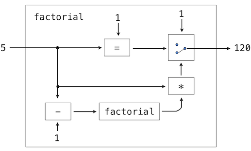

# 3.5 面向具有 abstraction 的语言的 interpreter

Calculator 语言通过嵌套的 call expression 提供了一种组合手段。然而，它无法定义新的 operator、为值命名，也无法表达通用的计算方法。Calculator 完全不支持 abstraction。因此，它并不是一门特别强大或通用的编程语言。现在我们转而定义一门通用编程语言，它通过把名字绑定到值以及定义新的操作来支持 abstraction。

上一节把完整的 interpreter 作为 Python 源代码呈现，与之不同，本节采取描述性的方式。配套项目要求你通过构建一个功能完整的 Scheme interpreter 来实现这里介绍的思路。

## 3.5.1 结构

本节描述 Scheme interpreter 的总体结构。完成该项目后，你将得到一个可运行的、这里所描述的 interpreter 实现。

Scheme interpreter 可以大量沿用 Calculator interpreter 的相同结构。parser 产生一个 expression，再由 evaluator 对它进行解读。evaluation function 检查 expression 的形式，对于 call expression，它会调用一个 function，把某个 procedure 应用到一些 argument 上。evaluator 之间的差异大多与 special form、用户自定义 function 以及 environment model of computation 的实现有关。

**解析。**Calculator interpreter 中的 [scheme_reader](../examples/scalc/scheme_reader.py.html) 和 [scheme_tokens](../examples/scalc/scheme_tokens.py.html) 模块几乎足以解析任何合法的 Scheme expression。不过，它还不支持 quotation 或 dotted list。完整的 Scheme interpreter 应该能够解析下面的输入 expression。

```python
>>> read_line("(car '(1 . 2))")
Pair('car', Pair(Pair('quote', Pair(Pair(1, 2), nil)), nil))
```

你实现 Scheme interpreter 的第一个任务，就是扩展 [scheme_reader](../examples/scalc/scheme_reader.py.html)，使其能正确解析 dotted list 和 quotation。

**evaluation。**Scheme 一次 evaluate 一个 expression。evaluator 的骨架实现定义在配套项目的 `scheme.py` 中。`scheme_read` 返回的每个 expression 都会传给 `scheme_eval` function，由它在当前 environment `env` 中 evaluate expression `expr`。

`scheme_eval` function 负责 evaluate Scheme 中不同形式的 expression：primitive、special form 和 call expression。Scheme 中一个 combination 的形式可以通过检查它的第一个 element 来确定。每个 special form 都有自己的 evaluation 规则。下面给出 `scheme_eval` 的简化实现。为了聚焦讨论，一些错误检查和 special form 处理已被删去。完整的实现见配套项目。

```python
>>> def scheme_eval(expr, env):
        """Evaluate Scheme expression expr in environment env."""
        if scheme_symbolp(expr):
            return env[expr]
        elif scheme_atomp(expr):
            return expr
        first, rest = expr.first, expr.second
        if first == "lambda":
            return do_lambda_form(rest, env)
        elif first == "define":
            do_define_form(rest, env)
            return None
        else:
            procedure = scheme_eval(first, env)
            args = rest.map(lambda operand: scheme_eval(operand, env))
            return scheme_apply(procedure, args, env)
```

**procedure 应用。**上面的最后一种情况调用了第二个过程，即 procedure 应用，它由 function `scheme_apply` 实现。Scheme 中 procedure 应用的过程远比 Calculator 中的 `calc_apply` function 通用。它应用两类 argument：`PrimtiveProcedure` 或 `LambdaProcedure`。`PrimitiveProcedure` 用 Python 实现；它有一个 instance attribute `fn`，绑定到一个 Python function。此外，它可能需要、也可能不需要访问当前 environment。每当该 procedure 被应用时，都会调用这个 Python function。

`LambdaProcedure` 用 Scheme 实现。它有一个 `body` attribute，其值是一个 Scheme expression，在 procedure 每次被应用时 evaluate。要把 procedure 应用到一个 argument 的 list 上，需要在一个新的 environment 中 evaluate body expression。为了构造这个 environment，会向其中加入一个新的 frame，procedure 的 formal parameter 在这个 frame 中被绑定到各个 argument。body 用 `scheme_eval` 来 evaluate。

**Eval/apply recursion。**实现 evaluation 过程的两个 function，`scheme_eval` 和 `scheme_apply`，是相互 recursive 的。只要遇到 call expression，evaluation 就需要 application。Application 又借助 evaluation 把 operand expression evaluate 成 argument，并 evaluate 用户自定义 procedure 的 body。这种相互 recursive 的过程在 interpreter 中非常普遍：evaluation 用 application 来定义，而 application 又用 evaluation 来定义。

这个 recursive 循环终止于语言 primitive。Evaluation 有一个 base case，即 evaluate 一个 primitive expression。有些 special form 也构成不需要 recursive 调用的 base case。Function application 有一个 base case，即应用一个 primitive procedure。这种相互 recursive 的结构——一个处理 expression 形式的 eval function 与一个处理 function 及其 argument 的 apply function 之间——构成了 evaluation 过程的本质。

## 3.5.2 environment

既然已经描述了 Scheme interpreter 的结构，我们接下来实现构成 environment 的 `Frame` class。每个 `Frame` instance 都表示一个 environment，其中符号被绑定到值上。一个 frame 有一个 `bindings` dictionary，还有一个 `parent` frame，对于 global frame 而言它是 `None`。

binding 不是直接访问的，而是通过 `Frame` 的两个 method：`lookup` 和 `define`。前者实现了第 1 章介绍的 environment model of computation 中的查找过程。符号会与当前 frame 的 `bindings` 进行匹配。如果找到，就返回它被绑定到的值。如果没有找到，查找就继续到 `parent` frame。另一方面，`define` method 总是把符号绑定到当前 frame 中的一个值上。

`lookup` 的实现和 `define` 的用法留作练习。为了说明它们的用法，请考虑下面这个 Scheme 程序示例：

```

(define (factorial n)
  (if (= n 0) 1 (* n (factorial (- n 1)))))
```

```

(factorial 5)
```

第一个输入 expression 是一个 `define` special form，由 Python function `do_define_form` evaluate。定义一个 function 有好几个步骤：

1. 检查 expression 的格式，确保它是一张格式良好的 Scheme list，且在关键字 `define` 之后至少有两个 element。
2. 分析第一个 element（这里是一个 `Pair`），找出 function 名 `factorial` 和 formal parameter list `(n)`。
3. 用给定的 formal parameter、body 和 parent environment 创建一个 `LambdaProcedure`。
4. 在当前 environment 的第一个 frame 中，把符号 `factorial` 绑定到这个 function。在本例中，environment 只包含 global frame。

第二个输入是一个 call expression。传给 `scheme_apply` 的 `procedure` 就是刚刚创建并绑定到符号 `factorial` 的那个 `LambdaProcedure`。传入的 `args` 是只含一个 element 的 Scheme list `(5)`。为了应用这个 procedure，会创建一个新 frame，它扩展 global frame（即 `factorial` procedure 的 parent environment）。在这个 frame 中，符号 `n` 被绑定到值 5。随后，在该 environment 中 evaluate `factorial` 的 body，并返回它的值。

## 3.5.3 数据即程序

在思考一个 evaluate Scheme expression 的程序时，打个比方可能会有帮助。关于程序含义的一种操作式观点是：程序是对一台抽象机器的描述。例如，再来看看下面这个计算阶乘的 procedure：

```

(define (factorial n)
  (if (= n 0) 1 (* n (factorial (- n 1)))))
```

我们也可以用 Python 写一个等价的程序，用条件 expression 来表达。

```python
>>> def factorial(n):
        return 1 if n == 1 else n * factorial(n - 1)
```

我们可以把这个程序看作对一台机器的描述：其中包含做减一、乘法和相等判断的部件，还有一个两档开关和另一台阶乘机器。（这台阶乘机器是无限的，因为它内部还包含另一台阶乘机器。）下图是这台阶乘机器的流程图，展示了各部件是如何连接在一起的。



类似地，我们可以把 Scheme interpreter 看作一台非常特殊的机器，它以对某台机器的描述作为输入。有了这个输入，interpreter 就会把自己配置成所描述的那台机器。例如，如果我们把阶乘的定义喂给我们的 evaluator，evaluator 就能计算阶乘。

从这个角度看，我们的 Scheme interpreter 是一台通用机器。当其他机器被描述为 Scheme 程序时，它就能模拟这些机器。它充当编程语言所操作的数据 object 与编程语言本身之间的桥梁。设想用户向正在运行的 Scheme interpreter 输入一个 Scheme expression。从用户的角度看，诸如 `(+ 2 2)` 这样的输入 expression 是编程语言中的一个 expression，interpreter 应当对它 evaluate。然而从 Scheme interpreter 的角度看，这个 expression 不过是一句由若干词组成的句子，需要按照一套定义良好的规则来处理。

用户的程序就是 interpreter 的数据，这一点未必会造成困惑。事实上，有时忽略这一区别反而更方便，从而让用户能够把一个 data object 显式地当作 expression 来 evaluate。在 Scheme 中，每当我们使用 `run` procedure 时，就是在使用这一能力。Python 中也有类似的 function：`eval` function 会 evaluate 一个 Python expression，`exec` function 会执行一个 Python statement。因此，

```python
>>> eval('2+2')
4
```

而

```python
>>> 2+2
4
```

两者返回相同的结果。evaluate 在运行过程中构造出来的 expression，是动态编程语言中常见而强大的特性。很少有语言像 Scheme 这样普遍地采用这种做法，但在程序运行的过程中构造并 evaluate expression 的能力，对任何程序员来说都可能是一件宝贵的工具。
