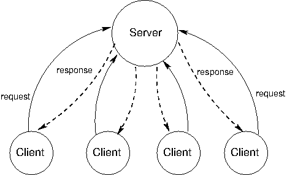

# 4.6 分布式计算

大规模的数据处理应用常常需要协调多台计算机共同工作。分布式计算应用是指多台相互连接但彼此独立的计算机协同完成一项联合计算的应用。

不同计算机之所以彼此独立，是因为它们不直接共享内存。相反，它们使用*消息*相互通信，消息就是在网络上从一台计算机传输到另一台计算机的信息。

## 4.6.1 消息

计算机之间发送的消息是字节序列。消息的用途各不相同：消息可以请求数据、发送数据，或者指示另一台计算机 evaluate 一个 procedure 调用。无论哪种情况，发送方计算机都必须以接收方计算机能够解码并正确解读的方式对信息进行编码。为此，计算机采用一种消息协议，为字节序列赋予含义。

*消息协议*是一套用于编码和解读消息的规则。发送方和接收方计算机必须对消息的语义达成一致，才能成功通信。许多消息协议规定消息遵循某种特定格式，其中固定位置上的某些比特表示固定的条件。另一些协议则使用特殊的字节或字节序列来分隔消息的各个部分，就像标点符号在编程语言的语法中分隔 sub-expressions 一样。

消息协议不是特定的程序或软件库，而是各种程序都能应用的规则，哪怕这些程序是用不同的编程语言编写的。因此，即使软件系统千差万别，计算机只要遵循支配该系统的消息协议，就能加入同一个分布式系统。

**TCP/IP 协议**。在互联网上，消息借助 [Internet Protocol](http://en.wikipedia.org/wiki/Internet_Protocol)（IP）从一台机器传输到另一台机器，该协议规定了如何在不同的网络之间传输数据的*数据包*，从而实现全球范围的互联网通信。IP 是在这样的假设下设计的：网络在任何位置都天然不可靠，且结构是动态变化的。此外，它并不假设存在对通信的集中追踪或监控。每个数据包都包含一个报头，其中有目标 IP 地址以及其他信息。所有数据包都按照简单的路由规则，以尽力而为的方式在网络中朝着目的地转发。

这一设计对通信施加了 constraints。使用现代 IP 实现（IPv4 和 IPv6）传输的数据包最大为 65,535 字节。更大的数据值必须拆分到多个数据包中。IP 并不保证数据包会按照发送时的顺序被接收：有些数据包可能丢失，有些数据包可能被重复传输。

[Transmission Control Protocol](http://en.wikipedia.org/wiki/Transmission_Control_Protocol) 是一种基于 IP 定义的 abstraction，它为任意大的字节流提供可靠、有序的传输。该协议通过正确地排列 IP 传输的数据包、去除重复的数据包，并请求重传丢失的数据包来提供这一保证。这种可靠性的提升以延迟为代价——延迟是指把一条消息从一点发送到另一点所需的时间。

TCP 把数据流切分成*TCP 报文段*，每个报文段都包含一部分数据，数据前面有一个报头，其中含有序列和状态信息，以支持可靠、有序的数据传输。有些 TCP 报文段完全不包含数据，而是用于建立或终止两台计算机之间的连接。

在两台计算机 `A` 和 `B` 之间建立连接需要经过三个步骤：

1. `A` 向 `B` 的某个*端口*发送请求，以建立一条 TCP 连接，并提供用于接收响应的*端口号*。
2. `B` 向 `A` 指定的端口发送响应，并等待该响应得到确认。
3. `A` 发送确认响应，验证数据可以在两个方向上传输。

经过这个三步“握手”之后，TCP 连接就建立了，`A` 和 `B` 可以互相发送数据。终止 TCP 连接同样要经过一系列步骤，其中客户端和服务器双方都要请求并确认连接的结束。

## 4.6.2 客户端/服务器架构

客户端/服务器架构是一种从中心来源提供服务的方式。*服务器*提供服务，多个*客户端*与服务器通信来消费该服务。在这种架构中，客户端和服务器扮演不同的角色。服务器的角色是响应客户端发来的服务请求，而客户端的角色则是发出请求，并利用服务器的响应来完成某项任务。下图展示了这种架构。



这一模型最有影响力的应用是现代万维网。当浏览器显示网页内容时，运行在多台独立计算机上的若干程序会以客户端/服务器架构进行交互。本节描述请求一个网页的过程，以说明客户端/服务器分布式系统中的核心思想。

**角色**。当用户请求网页时，其计算机上的浏览器应用扮演客户端的角色。当要从互联网上的某个域名（例如 www.nytimes.com）请求内容时，它必须至少与两台不同的服务器通信。

客户端首先向 Domain Name Server（DNS）请求该名字所对应计算机的 Internet Protocol（IP）地址。DNS 提供的服务是把域名映射为 IP 地址，IP 地址是互联网上机器的数字标识符。Python 可以使用 `socket` 模块直接发出这样的请求。

```python
>>> from socket import gethostbyname
>>> gethostbyname('www.nytimes.com')
'170.149.172.130'
```

接着，客户端向位于该 IP 地址的 web 服务器请求网页的内容。这里的响应是一份 [HTML](http://en.wikipedia.org/wiki/HTML) 文档，其中包含当日新闻的标题和文章摘录，以及一些 expression，用来说明浏览器客户端应当如何在用户屏幕上排布这些内容。Python 可以使用 `urllib.request` 模块发出获取这些内容所需的两个请求。

```python
>>> from urllib.request import urlopen
>>> response = urlopen('http://www.nytimes.com').read()
>>> response[:15]
b'<!DOCTYPE html>'
```

收到该响应后，浏览器还会发出更多请求，以获取图像、视频以及页面其他辅助组件。之所以发起这些请求，是因为最初的 HTML 文档中包含了其他内容的地址，以及它们如何嵌入页面的说明。

**一个 HTTP 请求**。Hypertext Transfer Protocol（HTTP）是一个基于 TCP 实现的协议，用于规范万维网（WWW）的通信。它假定浏览器与 web 服务器之间采用客户端/服务器架构。HTTP 规定了浏览器与服务器之间交换的消息的格式。所有浏览器都用 HTTP 格式向 web 服务器请求页面，所有 web 服务器也都用 HTTP 格式发回响应。

HTTP 请求有多种类型，最常见的是针对某个网页的 `GET` 请求。`GET` 请求会指定一个位置。例如，把地址 `http://en.wikipedia.org/wiki/UC_Berkeley` 输入浏览器，就会向 `en.wikipedia.org` 处 web 服务器的 80 端口发出一个 HTTP `GET` 请求，索取位置 `/wiki/UC_Berkeley` 处的内容。

服务器发回一个 HTTP 响应：

```

HTTP/1.1 200 OK
Date: Mon, 23 May 2011 22:38:34 GMT
Server: Apache/1.3.3.7 (Unix) (Red-Hat/Linux)
Last-Modified: Wed, 08 Jan 2011 23:11:55 GMT
Content-Type: text/html; charset=UTF-8

... web page content ...
```

第一行中的文本 `200 OK` 表明响应请求时没有出错。报头接下来的几行给出了关于服务器、日期以及返回内容类型的信息。

如果你输入了错误的网址，或者点击了失效的链接，可能见过这样的错误信息：

```

404 Error File Not Found
```

这意味着服务器发回的 HTTP 报头开头是：

```

HTTP/1.1 404 Not Found
```

数字 200 和 404 是 HTTP 响应码。固定的响应码集合是消息协议的一个常见特征。协议的设计者试图预判将通过协议发送的常见消息，并为其分配固定的编码，以减小传输量并建立统一的消息语义。在 HTTP 协议中，响应码 200 表示成功，而 404 表示资源未找到的错误。HTTP 1.1 标准中还定义了各种其他的[响应码](http://en.wikipedia.org/wiki/List_of_HTTP_status_codes)。

**模块化**。*客户端*和*服务器*的概念是强大的 abstraction。服务器提供服务，可能同时服务于多个客户端，而客户端消费该服务。客户端不需要知道服务是如何提供的，也不需要知道它们接收的数据是如何存储或计算的；服务器同样不需要知道它的响应会被如何使用。

在 web 上，我们通常认为客户端和服务器位于不同的机器上，但即使是同一台机器上的系统也可以采用客户端/服务器架构。例如，计算机上输入设备产生的信号需要能被计算机上运行的程序普遍获取。这些程序是客户端，消费鼠标和键盘的输入数据。操作系统的设备驱动程序则是服务器，接收物理信号并把它们作为可用的输入提供出来。此外，中央处理器（CPU）和专用的图形处理器（GPU）也常常构成客户端/服务器架构，其中 CPU 是客户端，GPU 是图像的服务器。

客户端/服务器系统的一个缺点是，服务器是单点故障。它是唯一有能力提供该服务的组件。客户端可以有任意多个，它们彼此可互换，可以根据需要随时来去。

客户端/服务器系统的另一个缺点是，如果客户端过多，计算资源会变得稀缺。客户端只会增加系统的需求，却不会贡献任何计算资源。

## 4.6.3 对等系统

客户端/服务器模型适用于面向服务的场景。然而，对于其他一些计算目标，更均等的分工才是更好的选择。术语*对等*用来描述这样的分布式系统：其中的劳动在系统的所有组件之间分担。所有计算机都发送和接收数据，都贡献一定的处理能力和内存。随着分布式系统规模的增长，其计算资源的容量也随之增加。在对等系统中，系统的所有组件都为分布式计算贡献一定的处理能力和内存。

所有参与者之间的分工是对等系统的标志性特征。这意味着各个对等节点必须能够可靠地相互通信。为了确保消息能到达预期的目的地，对等系统需要有组织良好的网络结构。这些系统中的各个组件协同维护关于其他组件位置的足够信息，以便把消息发送到预期的目的地。

在某些对等系统中，维护网络健康的工作由一组专门的组件承担。这类系统不是纯粹的对等系统，因为它们包含承担不同职责的不同类型的组件。支撑对等网络的这些组件就像脚手架：它们帮助网络保持连通，维护关于不同计算机位置的信息，并帮助新加入者在其邻近区域内找到自己的位置。

对等系统最常见的应用是数据传输和数据存储。在数据传输中，系统中的每台计算机都参与在网络上发送数据。如果目标计算机位于某台计算机的邻近区域内，这台计算机就帮助把数据转发出去。在数据存储中，数据集可能太大，无法装进任何单台计算机，或者太宝贵，不能只存放在一台计算机上。每台计算机存储一小部分数据，同一份数据可能有多个副本分散在不同的计算机上。当某台计算机发生故障时，它上面的数据可以从其他副本恢复，并在替换的机器到位后重新放回。

语音和视频聊天服务 Skype 就是一个采用对等架构的数据传输应用。当两台不同计算机上的两个人进行 Skype 通话时，他们的通信会通过对等网络传输。这个网络由其他运行 Skype 应用的计算机组成。每台计算机都知道其邻近区域内另外几台计算机的位置。一台计算机帮助把数据包发送到目的地的方式是把它转给一台相邻的计算机，后者再把它转给另一些相邻的计算机，如此继续，直到数据包到达预期的目的地。Skype 并不是纯粹的对等系统。一个由*超级节点*组成的脚手架网络负责用户的登录和登出、维护其计算机位置的信息，并在用户进入和离开时修改网络结构。

*继续*：
[4.7 分布式数据处理](4.7.md)
