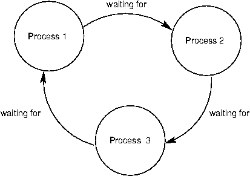

# 4.8 并行计算

从 20 世纪 70 年代到 2000 年代中期，单个处理器核心的速度以指数级增长。这种速度提升的很大一部分是通过提高 *clock frequency* 实现的，即处理器执行基本操作的速率。然而在 2000 年代中期，由于功耗和散热方面的限制，这种指数级增长戛然而止，此后单个处理器核心的速度增长要缓慢得多。取而代之的是，CPU 制造商开始在一个处理器中放入多个核心，使得更多操作可以并发执行。

并行并不是一个新概念。大规模并行机器已经使用了几十年，主要用于科学计算和数据分析。即使在只有一个处理器核心的个人计算机上，操作系统和 interpreter 也提供了并发这一 abstraction。这是通过 *context switching* 实现的，也就是在不同任务之间快速切换，而不等待它们完成。因此，多个程序可以在同一台机器上并发运行，即使这台机器只有一个处理核心。

鉴于处理器核心数量不断增加这一当前趋势，各个应用程序现在必须利用并行才能运行得更快。在单个程序内部，必须安排好计算，使得尽可能多的工作可以并行完成。然而，并行给编写正确的代码带来了新的挑战，尤其是在存在共享的 mutable state 时。

对于可以在 functional 模型中高效求解、且没有共享 mutable state 的问题，并行几乎不构成困难。pure function 提供了 *referential transparency*，意思是 expression 可以被替换为它们的值，反之亦然，而不会影响程序的行为。这使得互不依赖的 expression 可以并行求值。如上一节所述，MapReduce 框架允许以最少的程序员工作量来指定并并行运行 functional 程序。

遗憾的是，并非所有问题都能用 functional programming 高效求解。Berkeley View 项目在科学与工程领域识别出了 [十三种常见的计算模式](http://view.eecs.berkeley.edu/wiki/Dwarf_Mine)，其中只有一种是 MapReduce。其余模式都需要共享状态。

在本节的剩余部分，我们将看到 mutable 的共享状态如何给并行程序引入 bug，以及若干防止这类 bug 的方法。我们将在两个应用的背景下考察这些技术：一个 web [crawler](../examples/parallel/crawler.py.html) 和一个粒子 [simulator](../examples/parallel/particle.py.html)。

## 4.8.1 Python 中的并行

在深入并行的细节之前，我们先来看看 Python 对并行计算的支持。Python 提供了两种并行执行的方式：threading 和 multiprocessing。

**Threading**。在 *threading* 中，单个 interpreter 内存在多个“线程”的执行。每个线程独立于其他线程执行代码，尽管它们共享相同的数据。然而，作为 Python 主要实现的 CPython interpreter 一次只在一个线程中解释代码，通过在线程之间切换来制造并行的假象。另一方面，interpreter 外部的操作，例如写文件或访问网络，则可以并行运行。

`threading` 模块包含的 class 可以创建并同步线程。下面是一个多线程程序的简单例子：

```python
>>> import threading
>>> def thread_hello():
        other = threading.Thread(target=thread_say_hello, args=())
        other.start()
        thread_say_hello()
```

```python
>>> def thread_say_hello():
        print('hello from', threading.current_thread().name)
```

```python
>>> thread_hello()
hello from Thread-1
hello from MainThread
```

`Thread` 构造器创建一个新线程。它需要一个新线程应当运行的 target function，以及传给该 function 的 argument。对一个 `Thread` object 调用 `start`，就把它标记为可以运行。`current_thread` function 返回与当前执行线程关联的 `Thread` object。

在这个例子中，打印可以以任意顺序发生，因为我们没有以任何方式对它们做同步。

**Multiprocessing**。Python 也支持 *multiprocessing*，它允许一个程序生成多个 interpreter，即 *process*，每个 process 都可以独立运行代码。这些 process 通常不共享数据，因此任何共享状态都必须在 process 之间通信。另一方面，process 会根据底层操作系统和硬件提供的并行度并行执行。因此，如果 CPU 有多个处理器核心，Python process 就可以真正并发地运行。

`multiprocessing` 模块包含用于创建和同步 process 的 class。下面是使用 process 的 hello 例子：

```python
>>> import multiprocessing
>>> def process_hello():
        other = multiprocessing.Process(target=process_say_hello, args=())
        other.start()
        process_say_hello()
```

```python
>>> def process_say_hello():
        print('hello from', multiprocessing.current_process().name)
```

```python
>>> process_hello()
hello from MainProcess
>>> hello from Process-1
```

正如这个例子所示，`multiprocessing` 中的许多 class 和 function 都与 `threading` 中的类似。这个例子还展示了缺乏同步会如何影响共享状态，因为显示可以算作共享状态。这里，来自交互式 process 的 interpreter 提示符出现在另一个 process 的打印输出之前。

## 4.8.2 共享状态带来的问题

为了进一步说明共享状态带来的问题，我们来看一个由两个线程共享的计数器的简单例子：

```

import threading
from time import sleep

counter = [0]

def increment():
    count = counter[0]
    sleep(0) # try to force a switch to the other thread
    counter[0] = count + 1

other = threading.Thread(target=increment, args=())
other.start()
increment()
print('count is now: ', counter[0])
```

在这个程序中，两个线程试图递增同一个计数器。CPython interpreter 几乎可以在任何时候在线程之间切换。只有最基本的操作是 *atomic* 的，意思是它们看起来是瞬间发生的，在其求值或执行过程中不可能发生切换。递增一个计数器需要多个基本操作：读取旧值、给它加一、写入新值。interpreter 可以在这些操作中的任何一个之间切换线程。

为了展示当 interpreter 在错误的时机切换线程时会发生什么，我们试图通过 sleep 0 秒来强制切换。当这段代码运行时，interpreter 常常确实会在 `sleep` 调用处切换线程。这可能导致下面这样的操作序列：

```

Thread 0                    Thread 1
read counter[0]: 0
                            read counter[0]: 0
calculate 0 + 1: 1
write 1 -> counter[0]
                            calculate 0 + 1: 1
                            write 1 -> counter[0]
```

最终结果是，尽管计数器被递增了两次，它的值却是 1！更糟的是，interpreter 可能极少在错误的时机切换，这使得问题很难调试。即使有 `sleep` 调用，这个程序有时也会产生正确的计数 2，有时则产生错误的计数 1。

只有当存在这样的共享数据时才会出现这个问题：一个线程可能在其被另一个线程访问的同时修改它。这样的冲突称为 *竞态条件*，它是一个只存在于并行世界中的 bug 的例子。

为了避免竞态条件，可能被多个线程修改和访问的共享数据必须受到保护，以免被并发访问。例如，如果我们能确保线程 1 只在第 0 号线程结束对计数器的访问之后才访问它，反之亦然，我们就能保证算出正确的结果。如果共享数据受到保护、不会被并发访问，我们就说它是 *synchronized* 的。在接下来的几个小节中，我们将看到多种提供同步的机制。

## 4.8.3 何时不需要同步

在某些情况下，如果并发访问不会导致错误的行为，那么对共享数据的访问就不必同步。最简单的例子是只读数据。由于这类数据从不被修改，无论线程何时访问，它们读到的永远是相同的值。

在少数情况下，会被修改的共享数据可能不需要同步。然而，要理解何时属于这种情况，需要深入了解 interpreter 以及底层软件和硬件是如何工作的。考虑下面这个例子：

```

items = []
flag = []

def consume():
    while not flag:
        pass
    print('items is', items)

def produce():
    consumer = threading.Thread(target=consume, args=())
    consumer.start()
    for i in range(10):
        items.append(i)
    flag.append('go')

produce()
```

这里，producer 线程向 `items` 添加元素，而 consumer 一直等到 `flag` 非空。当 producer 完成添加后，它向 `flag` 添加一个元素，从而让 consumer 继续执行。

在大多数 Python 实现中，这个例子都能正确工作。然而，其他编译器和 interpreter 中常见的一种优化——甚至硬件本身也会这样做——是重排单个线程内互不依赖数据的操作。在这样的系统中，`flag.append('go')` 这条 statement 可能被移到 loop 之前，因为两者在数据上互不依赖。一般来说，除非你确定底层系统不会重排相关的操作，否则应当避免这样的代码。

## 4.8.4 同步的数据结构

同步共享数据最简单的方式是使用一个提供同步操作的数据结构。`queue` 模块包含一个 `Queue` class，它提供对数据的同步先进先出访问。`put` method 向 `Queue` 添加一个元素，`get` method 取出一个元素。这个 class 本身保证这些 method 是同步的，因此无论线程操作如何交错，元素都不会丢失。下面是一个使用 `Queue` 的 producer/consumer 例子：

```

from queue import Queue

queue = Queue()

def synchronized_consume():
    while True:
        print('got an item:', queue.get())
        queue.task_done()

def synchronized_produce():
    consumer = threading.Thread(target=synchronized_consume, args=())
    consumer.daemon = True
    consumer.start()
    for i in range(10):
        queue.put(i)
    queue.join()

synchronized_produce()
```

除了 `Queue` 以及 `get` 和 `put` 调用之外，这段代码还有几处改动。我们把 consumer 线程标记为 *daemon*，这意味着程序在退出前不会等待该线程完成。这让我们可以在 consumer 中使用无限循环。不过，我们确实需要确保主线程会退出，而且只在 `Queue` 中的所有元素都被消费之后才退出。consumer 调用 `task_done` method 来通知 `Queue` 它处理完了一个元素，主线程则调用 `join` method，它会一直等到所有元素都被处理完，从而确保程序只在那之后才退出。

一个更复杂的、使用 `Queue` 的例子是一个并行 web [crawler](../examples/parallel/crawler.py.html)，它在网站上搜索失效链接。这个 crawler 会跟踪同一站点托管的所有链接，因此它必须处理许多 URL，不断地把新的 URL 加入 `Queue`，并取出 URL 进行处理。通过使用同步的 `Queue`，多个线程可以安全地并发向这个数据结构添加元素和从中取出元素。

## 4.8.5 锁

当某个数据结构的同步版本不可用时，我们必须自己提供同步。*锁* 就是做到这一点的一种基本机制。它最多只能被一个线程 *获取*，此后在先前获取它的那个线程 *释放* 它之前，其他线程都不能获取它。

在 Python 中，`threading` 模块包含一个提供加锁功能的 `Lock` class。一个 `Lock` 有 `acquire` 和 `release` method，用来获取和释放锁，并且这个 class 保证同一时刻只有一个线程能获取它。当一个锁已经被持有时，所有其他试图获取它的线程都必须等到它被释放。

要让一个锁保护某一组特定的数据，所有线程都必须遵守一条规则：除非拥有那个特定的锁，否则任何线程都不得访问这些共享数据。实际上，所有线程都需要用该锁的 `acquire` 和 `release` 调用，把对共享数据的操作“包裹”起来。

在并行 web [crawler](../examples/parallel/crawler.py.html) 中，用一个 set 来记录任何线程遇到过的所有 URL，以避免重复处理某个 URL（并可能陷入循环）。然而，Python 不提供同步的 set，所以我们必须用一个锁来保护对普通 set 的访问：

```

seen = set()
seen_lock = threading.Lock()

def already_seen(item):
    seen_lock.acquire()
    result = True
    if item not in seen:
        seen.add(item)
        result = False
    seen_lock.release()
    return result
```

这里必须使用锁，以防止另一个线程在本线程检查 URL 是否在 set 中与把它加入 set 之间，把这个 URL 加入 set。此外，向 set 添加元素不是 atomic 的，因此并发的添加尝试可能破坏它的内部数据。

在这段代码中，我们必须小心，在释放锁之后才能 return。一般来说，我们必须确保在不再需要锁时释放它。这非常容易出错，尤其是在有 exception 的情况下，因此 Python 提供了一个 `with` 复合 statement，由它替我们处理锁的获取和释放：

```

def already_seen(item):
    with seen_lock:
        if item not in seen:
            seen.add(item)
            return False
        return True
```

`with` statement 确保 `seen_lock` 在它的 suite 执行之前被获取，并且在 suite 因任何原因退出时被释放。（`with` statement 实际上还可以用于加锁之外的其他操作，不过我们在这里不讨论这些其他用法。）

必须彼此同步的操作必须使用同一个锁。然而，两组互不相交、且只需要与同一组内的操作同步的操作，应当使用两个不同的 lock object，以避免过度同步。

## 4.8.6 屏障

避免对共享数据产生冲突访问的另一种方式，是把程序划分成若干阶段，确保共享数据只在一个没有其他线程访问它的阶段中被修改。*屏障* 通过要求所有线程都到达它之后，任何一个线程才能继续，从而把程序划分成阶段。在屏障之后执行的代码不可能与在屏障之前执行的代码并发。

在 Python 中，`threading` 模块以 `Barrier` instance 的 `wait` method 的形式提供屏障：

```

counters = [0, 0]
barrier = threading.Barrier(2)

def count(thread_num, steps):
    for i in range(steps):
        other = counters[1 - thread_num]
        barrier.wait() # wait for reads to complete
        counters[thread_num] = other + 1
        barrier.wait() # wait for writes to complete

def threaded_count(steps):
    other = threading.Thread(target=count, args=(1, steps))
    other.start()
    count(0, steps)
    print('counters:', counters)

threaded_count(10)
```

在这个例子中，对共享数据的读取和写入发生在由屏障分隔的不同阶段。写入发生在同一个阶段，但它们是互不相交的；这种互不相交是必要的，可以避免在同一个阶段并发写入相同的数据。由于这段代码得到了正确的同步，两个计数器最后总是 10。

多线程的粒子 [simulator](../examples/parallel/particle.py.html) 以类似的方式使用屏障来同步对共享数据的访问。在模拟中，每个线程拥有若干粒子，它们在许多离散的时间步中相互作用。一个粒子有位置、速度和加速度，每个时间步都会根据其他粒子的位置计算出一个新的加速度。粒子的速度必须相应地更新，而它的位置则根据速度更新。

与上面那个简单的例子一样，存在一个读取阶段，所有线程在这个阶段读取所有粒子的位置。每个线程在这个阶段更新自己那些粒子的加速度，但由于这些写入互不相交，它们不需要同步。在写入阶段，每个线程更新自己那些粒子的速度和位置。同样，这些是互不相交的写入，并且通过屏障与读取阶段隔开。

## 4.8.7 消息传递

避免不当地修改共享数据的最后一种机制，是完全避免对同一数据的并发访问。在 Python 中，使用 multiprocessing 而不是 threading 自然会得到这种效果，因为各个 process 运行在拥有自己数据的独立 interpreter 中。多个 process 所需的任何状态都可以通过 process 之间传递消息来通信。

`multiprocessing` 模块中的 `Pipe` class 提供 process 之间的通信通道。默认情况下它是双工的，即一条双向通道，不过传入 `False` 作为 argument 会得到一条单向通道。`send` method 通过通道发送一个 object，而 `recv` method 接收一个 object。后者是 *blocking* 的，意思是调用 `recv` 的 process 会一直等到接收到一个 object。

下面是使用 process 和管道的 producer/consumer 例子：

```

def process_consume(in_pipe):
    while True:
        item = in_pipe.recv()
        if item is None:
            return
        print('got an item:', item)

def process_produce():
    pipe = multiprocessing.Pipe(False)
    consumer = multiprocessing.Process(target=process_consume, args=(pipe[0],))
    consumer.start()
    for i in range(10):
        pipe[1].send(i)
    pipe[1].send(None) # done signal

process_produce()
```

在这个例子中，我们用一条 `None` 消息来表示通信结束。在创建 consumer process 时，我们还把管道的一端作为 argument 传给了 target function。这是必要的，因为状态必须在 process 之间显式地共享。

粒子 [simulator](../examples/parallel/particle.py.html) 的多 process 版本使用管道在每个时间步于 process 之间传递粒子的位置。事实上，它用管道在 process 之间建立起一个完整的环形流水线，以尽量减少通信。每个 process 把自己那些粒子的位置注入到它的流水线阶段中，这些位置最终会绕流水线转完整整一圈。在旋转的每一步，一个 process 会根据当前位于它自己流水线阶段中的位置，把力施加到自己的粒子上，这样转完一圈之后，所有力都已经施加到它的粒子上了。

`multiprocessing` 模块为 process 提供了其他同步机制，包括同步队列、锁，以及从 Python 3.3 开始的屏障。例如，可以用锁或屏障来同步向屏幕打印，避免我们之前看到的那种不正确的显示输出。

## 4.8.8 同步的陷阱

虽然同步方法能有效地保护共享状态，但它们也可能被错误地使用：没能实现正确的同步、过度同步，或者因死锁而导致程序挂起。

**同步不足**。并行计算中一个常见的陷阱是忽视对共享访问的正确同步。在 set 那个例子中，我们需要把成员检查和插入放在一起同步，这样另一个线程就无法在这两个操作之间执行插入。没有把这两个操作放在一起同步是错误的，即使它们各自是同步的。

**过度同步**。另一个常见错误是过度同步一个程序，使得不冲突的操作无法并发进行。举个简单的例子，我们可以在一个线程开始时获取一把主锁、只在该线程完成时释放它，从而避免所有对共享数据的冲突访问。这把我们的整个代码串行化了，于是什么都不会并行运行。在某些情况下，这甚至会让程序无限期挂起。例如，考虑一个 consumer/producer 程序，其中 consumer 获得了锁并且从不释放它。这使 producer 无法生产任何元素，进而使 consumer 由于没有东西可消费而什么也做不了。

虽然这个例子很简单，但在实践中，程序员常常会在某种程度上过度同步他们的代码，使代码无法充分利用可用的并行性。

**死锁**。由于同步机制会让线程或 process 互相等待，它们容易受到 *死锁* 的影响：两个或多个线程或 process 卡住，互相等待对方完成。我们刚刚看到，忘记释放锁会让一个线程无限期地卡住。但是，即使线程或 process 确实正确地释放了锁，程序仍然可能陷入死锁。

死锁的根源是 *循环等待*，下面用 process 来说明。没有任何 process 能继续执行，因为它在等待其他 process，而那些 process 又在等它完成。



作为一个例子，我们将用两个 process 制造一个死锁。假设它们共享一条双工管道，并尝试按下面的方式互相通信：

```

def deadlock(in_pipe, out_pipe):
    item = in_pipe.recv()
    print('got an item:', item)
    out_pipe.send(item + 1)

def create_deadlock():
    pipe = multiprocessing.Pipe()
    other = multiprocessing.Process(target=deadlock, args=(pipe[0], pipe[1]))
    other.start()
    deadlock(pipe[1], pipe[0])

create_deadlock()
```

两个 process 都先尝试接收数据。回想一下，`recv` method 会阻塞，直到有一个元素可用。由于两个 process 都没有发送任何东西，双方都会无限期地等待对方发送数据，从而导致死锁。

同步操作必须正确地对齐，以避免死锁。这可能要求在接收之前先通过管道发送、以相同的顺序获取多个锁，以及确保所有线程都在正确的时刻到达正确的屏障。

## 4.8.9 结论

正如我们所见，并行给编写正确而高效的代码带来了新的挑战。由于硬件层面并行度不断提高的趋势在可预见的未来仍将持续，并行计算在应用编程中会变得越来越重要。围绕如何让并行对程序员来说更简单、更不容易出错，有大量非常活跃的研究。我们这里的讨论只是对计算机科学这一关键领域的基础性介绍。
